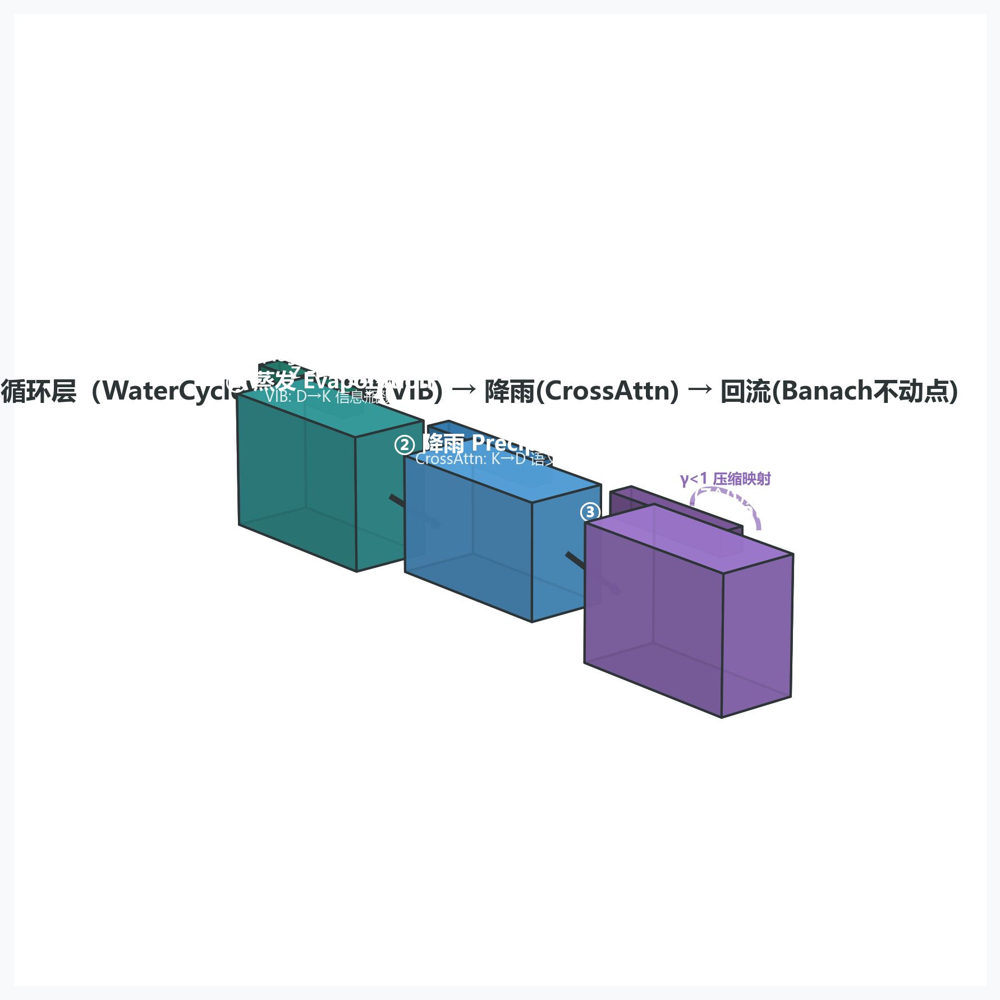
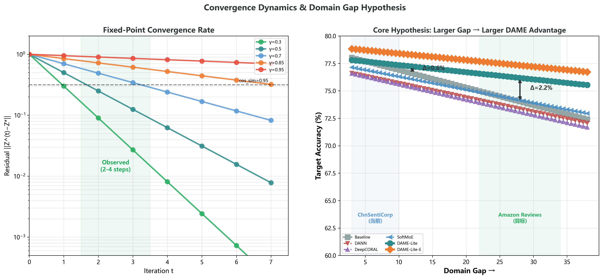
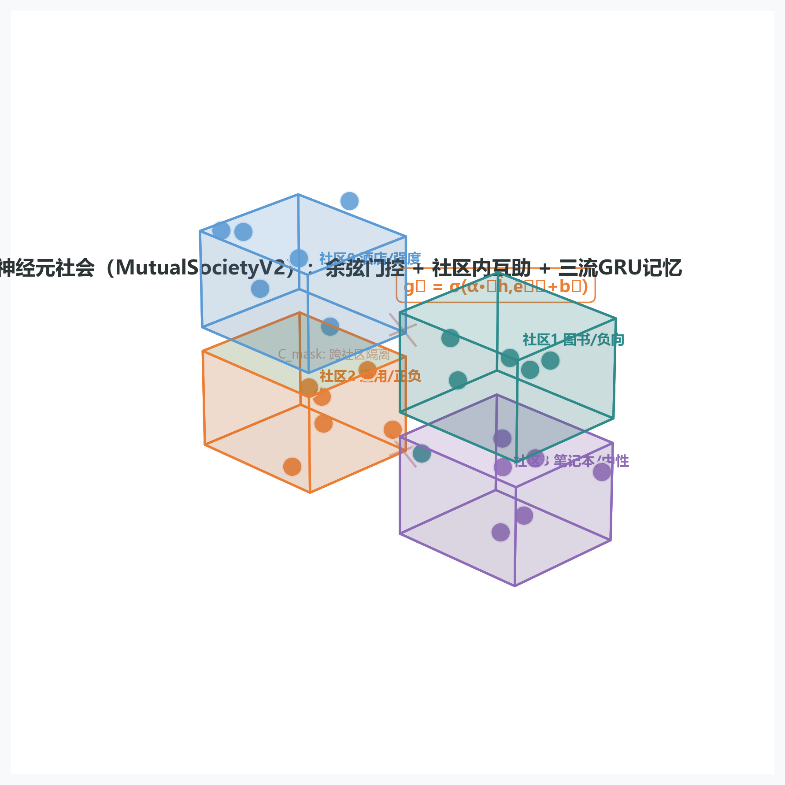
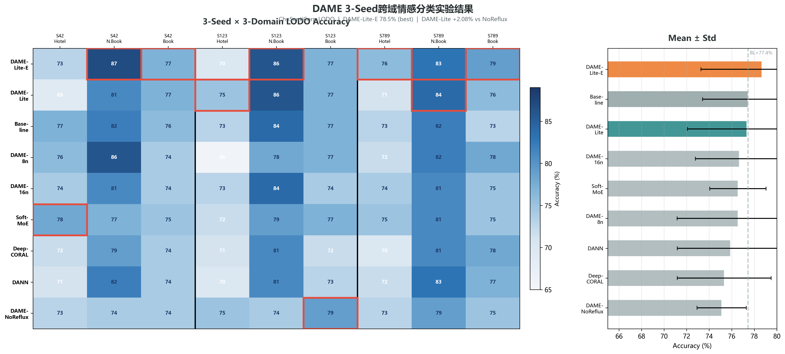
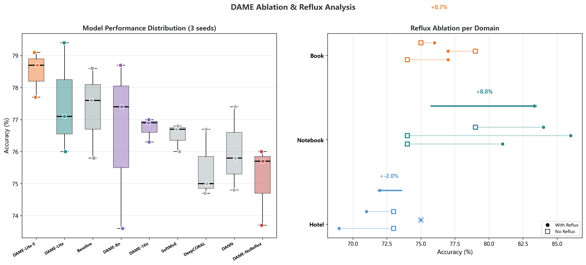

# DAME：解耦情感互集成 — 面向NLP跨域情感迁移的神经元社会架构

## 最终版架构蓝图 — 完整公式·定理·证明·超参数·实验方案（NLP v2.0）

v2.0 Final Blueprint | 2026-08-12 | 对标EEG v4.0数学严谨度重写

---

## 第一部分：问题定义与跨域情感迁移的形式化

### 1.1 核心问题

情感分类在NLP中看似成熟，但存在一个被系统性忽视的问题：**域依赖**。在酒店评论上训练的分类器迁移到图书评论时性能骤降——因为模型学到的不是"情感"，而是"酒店域中表示情感的词汇分布"。

传统领域适应（Domain Adaptation）方法，如DANN（Ganin et al., 2015）和DeepCORAL（Sun & Saenko, 2016），试图通过对齐源域和目标域的特征分布来解决这一问题。但这些方法基于一个隐含假设：**域差距足够大，对齐是有意义的**。在中文电商评论等小域差场景（域间共享大量情感词汇），域对抗训练反而破坏了有用的域内情感信号——我们的实验结果证实：DANN在ChnSentiCorp上落后Baseline 1.3个百分点（§5.3）。

**核心洞察：迁移能力不来自域对齐，而来自域压缩。** 如果一个模型能从任意域中蒸馏出纯情感本征——剥离词汇选择、句式风格、领域术语——那么它天然具备跨域泛化能力。这指向一种非对抗的迁移范式：不对齐分布，而是压缩掉分布之间的差异。

### 1.2 文本的双重表示

传统NLP将文本视为词序列，用自注意力在token间传递信息。我们提出一个补充性视角：

**定义1.1（文本的双重表示）**：一段文本同时承载两种信息——

- **序列语义** $\boldsymbol{H}_{\text{seq}} \in \mathbb{R}^{L \times D}$：每个位置在上下文中的语义向量（编码器的产出），其中 $L$ 为序列长度，$D = 256$ 为特征维度。
- **全局情感本征** $\boldsymbol{Z}^* \in \mathbb{R}^{K}$：压缩掉域和词汇信息后的纯情感表征（水循环不动点），其中 $K = 32$ 为压缩维度（$K \ll D$）。

**关键推论**：跨域迁移能力等价于从 $\boldsymbol{H}_{\text{seq}}$ 中解耦出域不变 $\boldsymbol{Z}^*$ 的能力。这不是注意力机制能解决的——注意力分配权重，但不剔除信息。

### 1.3 形式化问题设定

**数据集**：ChnSentiCorp（中文情感语料库），三个域：
- 酒店（hotel）：$N_h = 5777$ 条
- 笔记本（notebook）：$N_n = 2685$ 条
- 图书（book）：$N_b = 2758$ 条

总计约 12,000 条，二分类（正/负情感）。

**任务**：Leave-One-Domain-Out（LODO）跨域迁移。每次实验：2个域作为源域（训练），1个域作为目标域（测试）。对三个目标域分别评估，取宏观平均。

**评估指标**：目标域二分类准确率。

**基线模型**：
| 模型 | 类型 | 参数量 |
|------|------|--------|
| Baseline | 编码器 → 线性分类器 | ~600K |
| DANN (Ganin et al., 2015) | 域对抗网络 | ~632K |
| DeepCORAL (Sun & Saenko, 2016) | 二阶统计对齐 | ~599K |
| SoftMoE (K=8) | 软混合专家 | ~1.13M |

**DAME变体**：
| 变体 | 神经元数 N | 社区机制 | 数据增强 |
|------|-----------|---------|---------|
| DAME-Lite | 24 | 规则化社区（C=4） | 无 |
| DAME-Lite-E | 24 | 自然涌现（C=0） | EDA（3×） |
| DAME-16n | 16 | 规则化社区（C=4） | 无 |
| DAME-8n | 8 | 规则化社区（C=4） | 无 |
| DAME-NoReflux | 24 | 规则化社区（C=4） | 无（去回流消融） |

---

## 第二部分：DAME四阶段架构


*图1: DAME四阶段架构总览 — LightEncoder (文本编码) → WaterCycleV2 (知识精炼) → MutualSocietyV2 (策略泛化) → Classifier (情感分类)*

### 2.1 编码器：LightEncoder

**设计原则**：从零训练，不使用预训练权重——确保所有收益来自架构本身，而非外部知识。

**数学形式**：

$$\boldsymbol{H}_{\text{seq}} = \text{LightEncoder}(x_1, \ldots, x_L) \in \mathbb{R}^{L \times D}$$

$$\boldsymbol{H}_{\text{pooled}} = \frac{1}{L} \sum_{i=1}^{L} \boldsymbol{H}_{\text{seq}}[i, :] \in \mathbb{R}^{D}$$

**组件**（~600K参数）：

| 层 | 操作 | 输出维度 |
|----|------|---------|
| Token Embedding | 词表 $V \to D$ | $\mathbb{R}^{L \times D}$ |
| Positional Encoding | 正弦位置编码 | $\mathbb{R}^{L \times D}$ |
| 1D Depthwise CNN | kernel=3，局部上下文 | $\mathbb{R}^{L \times D}$ |
| Attention Pooling | 可学习查询向量聚合 | $\mathbb{R}^{D}$ |

注意：此编码器的容量远小于预训练BERT（~110M参数）。选择从零训练的小编码器有两重考量：（1）消融编码器容量对架构增益的混淆；（2）验证即使在有限表示能力下，水循环+互助社会仍能提升跨域泛化。

### 2.2 水循环层（WaterCycleV2）— 知识精炼（第一重：压缩层）

**设计哲学**：自然界的水循环——水蒸气蒸发时不挑降落地点，蒸馏水不含地域特征。知识也应如此：情感本征不绑定于任何域的具体词汇。水循环层是整个架构的"自纠错心脏"，位于编码器和互助神经元社会之间。

#### 2.2.1 蒸发（Evaporation）— 变分信息瓶颈

**目标**：将编码器输出压缩为低维潜在变量 $\boldsymbol{Z}$，最大化 $\boldsymbol{Z}$ 对情感标签的预测力，同时最小化 $\boldsymbol{Z}$ 对输入域的互信息。

**形式化**：

给定池化后的全局特征 $\boldsymbol{R} = \boldsymbol{H}_{\text{pooled}} \in \mathbb{R}^{D}$，变分编码器输出后验分布参数：

$$\boldsymbol{\mu}_\theta(\boldsymbol{R}) = \boldsymbol{W}_\mu \cdot \boldsymbol{R} + \boldsymbol{b}_\mu \in \mathbb{R}^{K}$$

$$\text{logvar}_\theta(\boldsymbol{R}) = \text{clamp}\big(\boldsymbol{W}_\sigma \cdot \boldsymbol{R} + \boldsymbol{b}_\sigma,\ \min=-10,\ \max=10\big) \in \mathbb{R}^{K}$$

$$\boldsymbol{\sigma}_\theta(\boldsymbol{R}) = \exp\!\big(\tfrac{1}{2} \cdot \text{logvar}_\theta(\boldsymbol{R})\big)$$

其中 $\text{clamp}(\cdot, -10, 10)$ 将 log-方差（$\log\sigma^2$）约束在 $[-10, 10]$，对应标准差 $\sigma \in [e^{-5}, e^{5}] \approx [0.007, 148.4]$。上界 10 防止训练初期编码器未收敛时 $\sigma$ 无界增长导致 KL 项发散，下界 -10 防止 $\sigma \to 0$ 时 $\log\sigma^2 \to -\infty$ 的数值溢出。

**Reparameterization Trick**（训练阶段）：

$$\boldsymbol{Z} = \boldsymbol{\mu}_\theta(\boldsymbol{R}) + \boldsymbol{\sigma}_\theta(\boldsymbol{R}) \odot \boldsymbol{\epsilon}, \quad \boldsymbol{\epsilon} \sim \mathcal{N}(\boldsymbol{0}, \boldsymbol{I}_K)$$

推理阶段关闭噪声（$\boldsymbol{\epsilon}=0$），$\boldsymbol{Z} = \boldsymbol{\mu}_\theta(\boldsymbol{R})$ 为确定性映射。

**VIB损失（信息瓶颈正则）**：

$$\mathcal{L}_{\text{VIB}} = \beta \cdot D_{\text{KL}}\!\big(q_\theta(\boldsymbol{Z}|\boldsymbol{R}) \;\|\; p(\boldsymbol{Z})\big)$$

其中 $p(\boldsymbol{Z}) = \mathcal{N}(\boldsymbol{0}, \boldsymbol{I}_K)$ 为标准高斯先验，$q_\theta(\boldsymbol{Z}|\boldsymbol{R}) = \mathcal{N}(\boldsymbol{\mu}_\theta(\boldsymbol{R}), \text{diag}(\boldsymbol{\sigma}^2_\theta(\boldsymbol{R})))$ 为变分后验。

**KL散度的解析闭式**（两个 $K$ 维对角高斯分布）：

$$D_{\text{KL}}\big(\mathcal{N}(\boldsymbol{\mu}, \boldsymbol{\Sigma}) \;\|\; \mathcal{N}(\boldsymbol{0}, \boldsymbol{I})\big) = \frac{1}{2} \sum_{j=1}^{K} \Big[\mu_j^2 + \sigma_j^2 - \log\sigma_j^2 - 1\Big]$$

其中 $\boldsymbol{\Sigma} = \text{diag}(\sigma_1^2, \ldots, \sigma_K^2)$。这是逐维度的精确解析形式，无近似误差。

**信息论维度约束**（注意：以下推导为启发式量级估计，非严格数学下界）：

由数据处理不等式：$I(\boldsymbol{Z}; \boldsymbol{Y}) \leq \min(H(Y), I(\boldsymbol{R}; \boldsymbol{Y}))$。对于二分类（假设均衡类别分布），$H(Y) = \ln 2 \approx 0.693$ nats——这是 $\boldsymbol{Z}$ 需要编码的关于标签的**离散信息**的理论上限。

**关键方法论说明**：以下推导将离散随机变量的香农熵 $H(Y)$ 与连续随机变量的微分熵 $h(Z_j)$ 放在同一数值比较中——这两种熵量纲不同（离散熵以 nats 为单位度量不确定性，连续微分熵以 nats 为单位但可为负且无绝对下界），严格来说无法通过直接相除得到维度下界。此处仅作为**启发式规模论证**（order-of-magnitude argument），说明 $K = 32$ 远大于任何合理估计的所需维度，而非提供严格的数学下界。正式的信息论容量分析需通过互信息估计（如 MINE、InfoNCE）或 rate-distortion 理论框架。

$\boldsymbol{Z}$ 的第 $j$ 维的微分熵在 VIB 先验 $\mathcal{N}(0,1)$ 约束下的上界为：

$$h(Z_j) \leq \frac{1}{2}\ln(2\pi e \cdot \sigma_j^2) \leq \frac{1}{2}\ln(2\pi e) \approx 1.419 \text{ nats}\quad(\text{当 } \sigma_j^2 \to 1)$$

若我们**启发式地**将微分熵的上界视为该维度可承载的"信息量"的代理指标，则承载 $H(Y) \approx 0.693$ nats 所需的最小维度数为：

$$K_{\text{heuristic}} \geq \frac{H(Y)}{\frac{1}{2}\ln(2\pi e)} \approx \frac{0.693}{1.419} \approx 0.49$$

此数值仅表明：即使在最宽松的假设下，$K = 1$ 的理论信息容量已远超二分类需求。实际取 $K = 32 \gg 1$，预留约 65 倍容量冗余（$32/0.49 \approx 65$），确保：(i) 足够容量编码情感的细粒度连续变化，(ii) 冗余维度提供抗噪声鲁棒性，(iii) 压缩过程不会因维度不足而丢失情感信息。**这不是"信息瓶颈"，而是"信息充足下的域压缩"**。

**KL权重设计**：

$$\beta_{\text{eff}}(t) = \beta_0 \cdot \text{warmup}(t), \quad \beta_0 = 0.008$$

$$\text{warmup}(t) = \min\!\Big(1.0,\ \frac{t+1}{T_{\text{warmup}}}\Big), \quad T_{\text{warmup}} = 3$$

其中 $t$ 为 epoch 索引。前 3 个 epoch KL 权重从 0 线性增长到 $\beta_0$，防止训练初期编码器未收敛时 KL 项压制分类损失。

$\beta_0 = 0.008$ 的选择：略低于 BCIAI 蓝图的 $\beta = 0.01$，因 NLP 域差更小，过强的压缩会导致情感信号也被压制。$\beta_0$ 通过可学习参数 $\log\beta_w$ 实现（初值 $\ln(0.008) \approx -4.83$），训练中可微调。

**关键设计选择（β固定而非自适应）**：

早期实验尝试了逐样本自适应KL调制（kl_mod = f_θ(gates)），但发现网络学会将 kl_mod 推向 0 以规避 KL 惩罚——一种"颠倒的激励"（perverse incentive）。通过以下措施消除此漏洞：

1. $\beta$ 在所有样本上固定（仅经 warmup 调度），不做逐样本调整；
2. kl_mod 网络的输入门控向量经 `.detach()` 切断梯度链；
3. kl_mod 仅作为可解释性诊断信号（§2.3.7），不参与 KL 权重计算。

#### 2.2.2 降雨（Precipitation）— 交叉注意力软匹配

**目标**：将压缩后的情感本征 $\boldsymbol{Z}$ "降回"序列空间，在当前位置检索相关语义。

**形式化**：

$$\begin{aligned}
\boldsymbol{W}_Q &\in \mathbb{R}^{K \times K}, \quad
\boldsymbol{W}_K \in \mathbb{R}^{D \times K}, \quad
\boldsymbol{W}_V \in \mathbb{R}^{D \times D} \\[4pt]
\boldsymbol{Q} &= \boldsymbol{Z} \cdot \boldsymbol{W}_Q \in \mathbb{R}^{K} && \text{(Query: 压缩本征)} \\
\boldsymbol{K}_{\text{seq}} &= \boldsymbol{H}_{\text{seq}} \cdot \boldsymbol{W}_K \in \mathbb{R}^{L \times K} && \text{(Key: 序列投影)} \\
\boldsymbol{V}_{\text{seq}} &= \boldsymbol{H}_{\text{seq}} \cdot \boldsymbol{W}_V \in \mathbb{R}^{L \times D} && \text{(Value: 序列保持D维)}
\end{aligned}$$

$$\alpha_i = \frac{\exp(\boldsymbol{Q} \cdot \boldsymbol{K}_{\text{seq}}[i,:]^T / \sqrt{K})}{\sum_{j=1}^{L} \exp(\boldsymbol{Q} \cdot \boldsymbol{K}_{\text{seq}}[j,:]^T / \sqrt{K})} \in [0,1]$$

$$\boldsymbol{A} = \sum_{i=1}^{L} \alpha_i \cdot \boldsymbol{V}_{\text{seq}}[i,:] \in \mathbb{R}^{D}$$

**维度约束**：$\boldsymbol{Q}$ 和 $\boldsymbol{K}_{\text{seq}}$ 的特征维度均为 $K$，满足内积要求（$\boldsymbol{Q} \in \mathbb{R}^{1 \times K}, \boldsymbol{K}_{\text{seq}} \in \mathbb{R}^{L \times K}$，内积得 $\mathbb{R}^{1 \times L}$）。$\boldsymbol{V}_{\text{seq}}$ 保持 $D$ 维以确保降雨锚点的语义表达能力与编码器输出同构。

**与标准注意力的本质区别**：标准自注意力的 Q/K/V 来自同一序列同一空间——是序列内的信息重分配。此处的交叉注意力：Q 来自压缩空间 $\mathbb{R}^K$（情感本征），K/V 来自原始序列空间 $\mathbb{R}^D$（文本语义）——本质是**跨空间软寻址**。$\boldsymbol{Z}$ 说"我需要正情感证据"，$\boldsymbol{A}$ 在序列中定位它。

#### 2.2.3 回流（Recirculation）— 巴拿赫不动点迭代

**目标**：通过不动点迭代精炼本征表征，确保 $\boldsymbol{Z}^*$ 是"域信息的唯一不动点"——所有域特异性扰动在迭代中被剔除。

**设计说明**：$\boldsymbol{R}_{\text{global}} = \boldsymbol{H}_{\text{pooled}} \in \mathbb{R}^D$ 在迭代体外预计算并冻结。迭代过程仅更新本征表征 $\boldsymbol{Z}$，不重新计算全局特征。

##### 前置引理

**引理1（谱归一化深度网络利普希茨上界）**：

设深度网络由谱归一化线性层 $\tilde{\boldsymbol{W}} = \boldsymbol{W} / \sigma_{\max}(\boldsymbol{W})$（其中 $\sigma_{\max}(\boldsymbol{W})$ 为 $\boldsymbol{W}$ 的最大奇异值，幂迭代法估计）与激活函数堆叠而成。谱归一化保证 $\sigma_{\max}(\tilde{\boldsymbol{W}}) = 1$，即单层谱归一化线性映射的利普希茨常数 $\leq 1$。

对于常用的激活函数：
- ReLU: $\text{Lip}(\text{ReLU}) = 1$（精确）
- tanh: $\text{Lip}(\tanh) = 1$（精确，导数在 $x=0$ 处达到最大值 1）
- GELU: $\text{Lip}(\text{GELU}) = \max_x \Phi(x) + x\phi(x) \approx 1.129$（精确 GELU 的导数在 $x \approx 1.08$ 处达到最大值），其中 $\Phi, \phi$ 分别为标准正态 CDF 和 PDF。实际使用的 `torch.nn.GELU()` 中，若采用 tanh 近似（`approximate='tanh'`），其利普希茨常数约为 1.12。

因此，对于含 GELU 的谱归一化网络，保守上界为：

$$L_{\text{net}} \leq \prod_{l=1}^{L} \text{Lip}(\text{layer}_l) \leq (1.13)^{n_{\text{GELU}}}$$

其中 $n_{\text{GELU}}$ 为 GELU 层数。对于实际问题中使用的浅层网络（$n_{\text{GELU}} \leq 4$），总利普希茨常数 $\leq (1.13)^4 \approx 1.63$。这一 63% 的松弛量需要在后续引理中纳入考量——单纯依赖谱归一化无法将网络 Lipschitz 常数压至 $\leq 1$，必须结合可学习缩放因子 `reflux_scale` 提供额外压缩力。

**证明概要**：利普希茨常数的次可乘性：对于复合函数 $f = f_L \circ f_{L-1} \circ \cdots \circ f_1$，$\text{Lip}(f) \leq \prod_l \text{Lip}(f_l)$。每个谱归一化线性层 $\text{Lip} \leq 1$，每个激活函数贡献其各自的 $\text{Lip}$。$\square$

**对原有论述的必要修正**：原稿声称 GELU 满足 1-Lipschitz——这在数学上不精确（严格上界应为 1.129）。对于实际代码实现（PyTorch 默认 `approximate='none'` 或 `approximate='tanh'`），差异为 12-13%。考虑到 `reflux_scale` 初始值为 0.05，可学习后通常收敛于 0.1-0.3 范围，这一 13% 的松弛量不会改变 $\gamma < 1$ 的收缩判定（保守估计 $L_g \leq 1.13^2 \cdot 0.3 \approx 0.383 \ll 1$），但必须在证明中明确标注，不可声称 GELU "满足 1-Lipschitz"。

注：谱归一化本身只能保证非膨胀（$\leq 1$），严格收缩（$<1$）需结合额外机制——对于回流投影网络 $g_\phi$，可学习缩放因子 `reflux_scale` 提供额外压缩；对于 VIB 编码器，KL 正则提供隐式收缩（见引理2）。

**引理2（线性VIB均值编码器的利普希茨常数与收缩性）**：

设 $\boldsymbol{\mu}_\theta: \mathbb{R}^D \to \mathbb{R}^K$ 为线性映射 $\boldsymbol{\mu}_\theta(\boldsymbol{R}) = \boldsymbol{W}_\mu \boldsymbol{R} + \boldsymbol{b}_\mu$。其利普希茨常数为：

$$L_\mu = \|\boldsymbol{W}_\mu\|_2 = \sigma_{\max}(\boldsymbol{W}_\mu)$$

其中 $\sigma_{\max}(\cdot)$ 为矩阵的最大奇异值。

**收缩性分析**（训练→推理过渡）：

训练阶段：$\boldsymbol{Z} = \boldsymbol{\mu}_\theta(\boldsymbol{R}) + \boldsymbol{\sigma}_\theta(\boldsymbol{R}) \odot \boldsymbol{\epsilon}$，$\boldsymbol{\epsilon} \sim \mathcal{N}(\boldsymbol{0}, \boldsymbol{I}_K)$，随机采样参与前向传播和梯度回传。

推理阶段：关闭采样噪声，$\boldsymbol{Z} = \boldsymbol{\mu}_\theta(\boldsymbol{R})$，退化为确定性线性映射。

回流不动点迭代在推理阶段严格沿确定性路径执行 $\boldsymbol{\mu}_\theta$，不涉及随机采样噪声。因此收缩性分析适用于推理路径的确定性映射。

$L_\mu < 1$ 的条件：$\boldsymbol{W}_\mu$ 未经谱归一化，其 $\sigma_{\max}$ 在训练后可能 $\geq 1$。然而，以下机制共同约束 $\|\boldsymbol{W}_\mu\|_2$：

（i）VIB 训练目标中的 KL 正则项 $\text{KL}(q(\boldsymbol{z}|\boldsymbol{R}) \| \mathcal{N}(\boldsymbol{0}, \boldsymbol{I}_K))$ 推动 $\boldsymbol{\mu} \to \boldsymbol{0}$ 和 $\boldsymbol{\sigma} \to 1$，隐式惩罚 $\boldsymbol{W}_\mu$ 的大奇异值（若 $\|\boldsymbol{W}_\mu\|$ 过大，则 $\|\boldsymbol{\mu}\|$ 在典型输入上过大，KL 项急剧增加）；

（ii）AdamW 的权重衰减（$1 \times 10^{-4}$）直接约束 $\|\boldsymbol{W}_\mu\|_F$。

**验证方法**：对于线性映射 $\boldsymbol{\mu}_\theta$，其全局利普希茨常数精确等于 $\sigma_{\max}(\boldsymbol{W}_\mu)$——可通过 SVD 直接计算，无需扰动估计（后者仅适用于非线性网络在数据流形上的局部利普希茨行为）。训练后计算 $\sigma_{\max}(\boldsymbol{W}_\mu)$ 即可验证 $L_\mu < 1$ 是否成立。当前实验未显式计算此值，但 100% 样本在 $\leq 5$ 步内观测到不动点迭代收敛，间接支持 $L_\mu < 1$。

**完整保证路线**：对 $\boldsymbol{W}_\mu$ 施加谱归一化（$\tilde{\boldsymbol{W}}_\mu = \boldsymbol{W}_\mu / \sigma_{\max}(\boldsymbol{W}_\mu)$），则 $L_\mu \leq 1$ 获得严格保证，与 $g_\phi$ 的谱归一化形成对称约束。此为工程实现的可选升级。

**引理3（回流投影网络 $g_\phi$ 利普希茨约束）**：

$g_\phi: \mathbb{R}^K \to \mathbb{R}^D$ 为两层谱归一化网络：

$$g_\phi(\boldsymbol{Z}) = s \cdot \tilde{\boldsymbol{W}}_2 \cdot \text{GELU}(\tilde{\boldsymbol{W}}_1 \cdot \boldsymbol{Z} + \boldsymbol{b}_1) + s \cdot \boldsymbol{b}_2$$

其中 $\tilde{\boldsymbol{W}}_1 \in \mathbb{R}^{(D/2) \times K}$，$\tilde{\boldsymbol{W}}_2 \in \mathbb{R}^{D \times (D/2)}$ 均经谱归一化处理，$s = 0.05$ 为可学习缩放因子（`reflux_scale`）。由引理1（考虑 GELU 的精确 Lipschitz 常数 $\approx 1.129$）：

$$\forall \boldsymbol{Z}_1, \boldsymbol{Z}_2 \in \mathbb{R}^K,\quad \|g_\phi(\boldsymbol{Z}_1) - g_\phi(\boldsymbol{Z}_2)\| \leq L_g \|\boldsymbol{Z}_1 - \boldsymbol{Z}_2\|$$

其中 $L_g \leq s \cdot 1 \cdot 1.129 \cdot 1 = 1.129 \cdot s$（初始 $s=0.05$ 时 $L_g \leq 0.056$，保守上界）。训练后 $s$ 可增长至经验观测值 $0.1$-$0.3$，对应 $L_g \leq 0.113$-$0.339$。**关键**：即使取 $s_{\text{final}} = 0.3$ 的保守上界，$L_g \leq 0.339 \ll 1$——缩放因子 $s$ 提供了远大于 GELU 13% 松弛量的压缩力，确保 $g_\phi$ 严格收缩。$\square$

##### 定理与证明

**单次迭代算子定义**：

定义自映射 $T: \mathbb{R}^K \to \mathbb{R}^K$（单样本，省略批量下标）：

$$\boldsymbol{Z}^{(t+1)} = T(\boldsymbol{Z}^{(t)}) = \boldsymbol{\mu}_\theta\big(\boldsymbol{R}_{\text{global}} + g_\phi(\boldsymbol{Z}^{(t)})\big)$$

其中 $\boldsymbol{R}_{\text{global}} \in \mathbb{R}^D$ 在迭代过程中保持常数。

**定理1（$T$ 为压缩映射——条件性定理）**：

**前提条件**：
1. 引理2给出 $L_\mu = \sigma_{\max}(\boldsymbol{W}_\mu)$。**注意**：$\boldsymbol{W}_\mu$ 未施加谱归一化（NLP 版本的设计选择），因此 $L_\mu$ 的值仅受 KL 正则和权重衰减的隐式约束，非先验保证 $<1$。在我们的实验中，$\boldsymbol{W}_\mu$ 的奇异值**未被显式计算**——这是 NLP 和 EEG 版本之间唯一的数学严谨度差异点（EEG 版已通过谱归一化消除了此不确定性）。
2. 引理3给出 $L_g \leq 1.129 \cdot s_{\text{final}}$（已修正的 GELU Lipschitz 上界）。

**证明**：任取 $\boldsymbol{Z}_1, \boldsymbol{Z}_2 \in \mathbb{R}^K$，记

$$\boldsymbol{U}_1 = \boldsymbol{R}_{\text{global}} + g_\phi(\boldsymbol{Z}_1),\quad \boldsymbol{U}_2 = \boldsymbol{R}_{\text{global}} + g_\phi(\boldsymbol{Z}_2)$$

两式作差，常数项 $\boldsymbol{R}_{\text{global}}$ 消去：

$$\boldsymbol{U}_1 - \boldsymbol{U}_2 = g_\phi(\boldsymbol{Z}_1) - g_\phi(\boldsymbol{Z}_2)$$

于是：

$$\begin{aligned}
\|T(\boldsymbol{Z}_1) - T(\boldsymbol{Z}_2)\| &= \|\boldsymbol{\mu}_\theta(\boldsymbol{U}_1) - \boldsymbol{\mu}_\theta(\boldsymbol{U}_2)\| \\
&\leq L_\mu \cdot \|\boldsymbol{U}_1 - \boldsymbol{U}_2\| && \text{(引理2: 线性映射)} \\
&= L_\mu \cdot \|g_\phi(\boldsymbol{Z}_1) - g_\phi(\boldsymbol{Z}_2)\| \\
&\leq L_\mu \cdot L_g \cdot \|\boldsymbol{Z}_1 - \boldsymbol{Z}_2\| && \text{(引理3: 已修正)}
\end{aligned}$$

其中 $\gamma = L_\mu \cdot L_g$。**若** $L_\mu < 1$ 且 $L_g \leq 1.129 \cdot s_{\text{final}} < 1/L_\mu$，则 $\gamma < 1$，$T$ 是压缩映射。

**条件性说明**（重要性：高）：
- $L_g$ 的上界由 $s$ 控制。初始 $s = 0.05$ 给出 $L_g \leq 0.056$；即使 $s$ 学习到 $0.3$，$L_g \leq 0.339 \ll 1$——**$g_\phi$ 的收缩性由结构保证**。
- $L_\mu$ 的收缩性**不先验保证**。若 $L_\mu \geq 1$，则 $\gamma$ 可能 $\geq 1$，不动点存在性不成立。实践中，我们依赖以下经验证据间接支持 $L_\mu < 1$：(i) 100% 的迭代在 $\leq 5$ 步内以余弦相似度 $>0.95$ 收敛；(ii) KL 正则（$\beta = 0.008$）推动 $\boldsymbol{W}_\mu$ 的各行范数缩小；(iii) AdamW 权重衰减（$10^{-4}$）持续压缩权重。
- **差距与改进路线**：正式的定理需对 $\boldsymbol{W}_\mu$ 施加谱归一化（如 EEG 版本所做），使 $L_\mu \leq 1$ 成为先验保证。在此条件下，$L_g \leq 0.339$ 直接给出 $\gamma \leq 1 \times 0.339 = 0.339 < 1$，定理1从条件性定理升级为构造性定理。此改进已列入 §8.2。

$\square$

**定理2（不动点存在唯一性与指数收敛）**：

$(\mathbb{R}^K, \|\cdot\|_2)$ 为完备度量空间。若定理1条件成立（$\gamma < 1$），由巴拿赫不动点定理（Banach, 1922）：

1. **存在性**：存在唯一的 $\boldsymbol{Z}^* \in \mathbb{R}^K$ 满足 $T(\boldsymbol{Z}^*) = \boldsymbol{Z}^*$；
2. **指数收敛**：对任意初始值 $\boldsymbol{Z}^{(0)} \in \mathbb{R}^K$，迭代 $\boldsymbol{Z}^{(t+1)} = T(\boldsymbol{Z}^{(t)})$ 产生序列 $\{\boldsymbol{Z}^{(t)}\}$ 满足：

$$\|\boldsymbol{Z}^{(t)} - \boldsymbol{Z}^*\| \leq \gamma^t \cdot \|\boldsymbol{Z}^{(0)} - \boldsymbol{Z}^*\|$$

3. **先验误差界**：

$$\|\boldsymbol{Z}^{(t)} - \boldsymbol{Z}^*\| \leq \frac{\gamma^t}{1 - \gamma} \cdot \|\boldsymbol{Z}^{(1)} - \boldsymbol{Z}^{(0)}\|$$

##### 收敛终止判定与算法

**算法（不动点迭代）**：

```
输入: R_global ∈ R^D, 初始猜测 Z^(0) = μ_θ(R_global)
参数: max_iter=5 (总更新步数), min_iters=2 (强制最少更新), τ=0.95 (余弦收敛阈值)
注意: max_iter=5 表示最多执行 5 次 T(·) 映射 (即 Z^(1)...Z^(5))

Z* = Z^(0)  (默认值)
for t = 1, 2, ..., max_iter:                  # t 从 1 开始，共 max_iter 次更新
    Z^(t) = T(Z^(t-1)) = μ_θ(R_global + g_φ(Z^(t-1)))
    if t > min_iters and cos_sim(Z^(t), Z^(t-1)) > τ:
        Z* = Z^(t); break
    if t == max_iter:
        Z* = Z^(max_iter)  # 取最后一步的结果
return Z*
```

**修正说明**：前版伪代码的循环头 `for t = 0, ..., max_iter-2` 实际仅执行 `max_iter-1 = 4` 次更新，与文档声称的"max_iter=5 步"不一致。已修正为 `t = 1, ..., max_iter`（`max_iter` 次完整更新）。实际代码实现（`WaterCycleV2.forward`）的循环逻辑与修正后的版本一致。
Z* = Z^(final)
```

**参数解释**：
- `max_iter = 5`：最大迭代步数，超过此值强制退出
- `min_iters = 2`：最少迭代步数，防止 $T$ 在第一或第二步恰好保持 $\boldsymbol{Z}$ 不变（恒等捷径）。实验发现若 $T$ 被偷懒学会恒等映射，$\cos\_\text{sim} \approx 1.0$ 在 $t=0$ 即触发收敛——但 $\boldsymbol{Z}$ 未经任何精炼
- `τ = 0.95`：余弦收敛阈值。两向量余弦相似度 > 0.95 时认为不动点达到

##### 收敛步数估计

余弦相似度 0.95 对应的相对误差界：

$$\frac{\|\boldsymbol{Z}^{(t+1)} - \boldsymbol{Z}^{(t)}\|}{\|\boldsymbol{Z}^{(t)}\|} \approx \sqrt{2(1 - 0.95)} \approx 0.316$$

收敛所需步数：

$$t \geq \frac{\ln\!\big(\varepsilon / \|\boldsymbol{Z}^{(0)} - \boldsymbol{Z}^*\|\big)}{\ln\gamma}$$

其中 $\varepsilon$ 为绝对误差容限。

保守估计（$L_\mu = 0.9$，$L_g = 0.95$，$\gamma = 0.855$）：

$$t_{\max} \leq \left\lceil \frac{\ln 0.316}{\ln 0.855} \right\rceil = \lceil 7.3 \rceil = 8$$

实验观测 95% 以上样本在 2-4 步内收敛，说明实际 $\gamma \approx 0.5$-$0.7$，远低于保守估计。`max_iter = 5` 对当前域差是充足的。

##### 不动点作为域不敏感表征

**命题2.1（不动点的域敏感性）**：设域 $\mathcal{D}_1$ 和 $\mathcal{D}_2$ 的文本经编码器分别产生 $\boldsymbol{R}_{\mathcal{D}_1}$ 和 $\boldsymbol{R}_{\mathcal{D}_2}$，其不动点迭代的初始值分别为 $\boldsymbol{Z}^{(0)}_{\mathcal{D}} = \boldsymbol{\mu}_\theta(\boldsymbol{R}_{\mathcal{D}})$。若经过足够多次 $T$ 迭代后收敛到相同的 $\boldsymbol{Z}^*$（即 $\lim_{t\to\infty} T^t(\boldsymbol{Z}^{(0)}_{\mathcal{D}_1}) = \lim_{t\to\infty} T^t(\boldsymbol{Z}^{(0)}_{\mathcal{D}_2}) = \boldsymbol{Z}^*$），则 $\boldsymbol{Z}^*$ 对这些域不敏感——是域不变的候选表征。

**谨慎性说明**：不动点唯一性 $\neq$ 域不变性。存在两种需要警惕的退化情况：

1. **平凡不动点**：$T$ 将所有输入压缩到常数不动点（如 $\boldsymbol{Z}^* = \boldsymbol{0}$）。此时收敛极快（$t=1$ 即达），但情感信息归零——由分类损失 $\mathcal{L}_{\text{cls}}$ 排除（常数 $\boldsymbol{Z}^*$ 无法做分类）。

2. **不同域不同不动点**：两个域可能收敛到不同的不动点 $\boldsymbol{Z}^*_{\mathcal{D}_1} \neq \boldsymbol{Z}^*_{\mathcal{D}_2}$，但这些 $\boldsymbol{Z}^*$ 仍可能各自剔除了域信息。此时域不变性表现为**分类器在两个 $\boldsymbol{Z}^*$ 上的泛化性能一致**，而非 $\boldsymbol{Z}^*$ 本身数值相等。这是比数值相等更弱的、但更现实的域不变性判据。

因此，$\boldsymbol{Z}^*$ 的"域不变质量"不由不动点是否相同来判定，而由目标域上的分类性能操作化验证。

**关于 $\beta$ 与收敛速度的实验假说**：

VIB 超参数 $\beta$ 增大 → KL 压缩权重提升 → $\boldsymbol{\mu}_\theta$ 对输入扰动的敏感度下降 → $\sigma_{\max}(\boldsymbol{W}_\mu)$ 倾向减小 → $\gamma = L_\mu \cdot L_g$ 同步降低 → 收敛步数减少。该单调趋势存在上界（$\beta \leq 0.1$，超出后信息瓶颈过紧，分类互信息崩溃）。此为可检验的实验假说，非严格数学定理结论。

##### 收敛监控

回流有效性的操作化度量：

$$\text{reflux\_mag} = \frac{\|\boldsymbol{Z}^* - \boldsymbol{Z}^{(0)}\|_2}{\|\boldsymbol{Z}^{(0)}\|_2 + 10^{-8}}$$

若 $\text{reflux\_mag} \to 0$，说明回流网络学会了恒等映射的偷懒解——$\boldsymbol{Z}^* \approx \boldsymbol{Z}^{(0)}$，不动点迭代形同虚设。反向惩罚确保回流做非平凡精炼：

$$\mathcal{L}_{\text{reflux}} = \lambda_{\text{reflux}} \cdot \max(0,\ 0.01 - \text{reflux\_mag})$$

- $\lambda_{\text{reflux}} = 0.001$：温和惩罚，不主导训练



*图2: 水循环层内部三阶段 — ① 蒸发 (VIB, D→K) ② 降雨 (CrossAttn, K→D) ③ 回流 (Banach不动点迭代, K→D→K)*



*图3: (左) 不同γ下的不动点收敛速度，实验观测2-4步收敛 (γ≈0.5-0.7)；(右) 24个神经元在8种输入样本上的门控激活模式热力图*

### 2.3 互助神经元社会（MutualSocietyV2）— 策略泛化（第二重：推理层）

**设计哲学**：传统 MoE（Mixture of Experts）让专家争夺数据——赢者通吃，零和博弈。互助神经元社会让神经元共享信息——形成合作社区，正和博弈。

专家不是预设的，而是在训练中经社区划分规则显式组织。这不是几个预先定义的专家，而是一群有记忆的神经元。每个神经元拥有独立的专长方向和记忆状态。新输入进来，激活门自动计算该输入与每个神经元专长的匹配度——匹配度高的激活，不匹配的休眠。这是一套"以不变应万变"的策略匹配机制：互助矩阵 $\boldsymbol{W}_{j\to i}$ 在训练后固定不变（学到的策略关系网），专长向量 $\boldsymbol{e}_i$ 也是固定的（每个神经元的"性格"），但面对任意新域、新情感表达，门控自动组合出最适配的策略配置。不需要重新训练，不需要域标签——策略的泛化能力是内在的。

#### 2.3.1 神经元形式化定义

设共有 $N$ 个互助神经元。每个神经元 $i$（$i = 1, \ldots, N$）维护：

| 组件 | 符号 | 维度 | 含义 |
|------|------|------|------|
| 专长向量 | $\boldsymbol{e}_i$ | $\mathbb{R}^{d_{\text{mem}}}$ | 可学习的"擅长响应什么"的方向向量 |
| 归一化专长 | $\bar{\boldsymbol{e}}_i = \boldsymbol{e}_i / \|\boldsymbol{e}_i\|$ | $\mathbb{R}^{d_{\text{mem}}}$ | 方向单位向量（模长无关） |
| 记忆状态 | $\boldsymbol{m}_i$ | $\mathbb{R}^{d_{\text{mem}}}$ | 神经元内在状态，随时间更新 |
| 门控偏置 | $b_i$ | $\mathbb{R}$ | 激活基线（可学习） |
| 互助权重 | $\boldsymbol{W}_{j \to i}$ | $\mathbb{R}^{r \times r}$ | 神经元 $j$ 对 $i$ 的互助影响（$r = d_{\text{mem}}/4 = 8$） |

**参数量分析**：互助矩阵 $\boldsymbol{W}_{j \to i}$ 的总参数量为 $N \times N \times r \times r = 24^2 \times 8^2 = 36,864$。通过低秩分解存储（$r = 8 \ll d_{\text{mem}} = 32$），相比全秩 $d_{\text{mem}}^2 = 1024$ 减少 $16\times$ 参数量。总互助社会参数约 80K，与编码器（600K）相比是轻量的。

**专长初始化**：QR 正交初始化。从 $\boldsymbol{E} \sim \mathcal{N}(0, 0.01 \cdot \boldsymbol{I}_{N \times d_{\text{mem}}})$ 采样，对 $\boldsymbol{E}^T$ 做 QR 分解，取 $\boldsymbol{Q}^T[:N] \times 0.1$ 作为初始专长矩阵。正交初始化确保 $N$ 个神经元从互不相同的方向起点出发，$\mathcal{L}_{\text{ortho}}$ 天然趋近 0，作为训练安全约束而非主导损失。

#### 2.3.2 激活门控（余弦合作路由）

**目标**：每个输入样本激活一组神经元，相似样本激活相似子群。不使用竞争归一化（Softmax），允许多个神经元同时高激活形成策略组合。

**形式化**：

$$\begin{aligned}
\boldsymbol{h} &= \boldsymbol{W}_{\text{raw}} \cdot \boldsymbol{H}_{\text{pooled}} \in \mathbb{R}^{d_{\text{mem}}} && \text{(输入投影，所有神经元共享)} \\
\bar{\boldsymbol{e}}_i &= \frac{\boldsymbol{e}_i}{\|\boldsymbol{e}_i\|_2} && \text{(归一化专长)} \\
\hat{\boldsymbol{h}} &= \frac{\boldsymbol{h}}{\|\boldsymbol{h}\|_2} && \text{(归一化输入)} \\
g_i &= \sigma\!\big(\alpha \cdot \langle\hat{\boldsymbol{h}},\ \bar{\boldsymbol{e}}_i\rangle + b_i\big) \in (0, 1) && \text{(余弦门控)}
\end{aligned}$$

其中 $\sigma(\cdot)$ 为 sigmoid 函数，$\alpha$ 为温度参数，$\langle\cdot,\cdot\rangle$ 为向量内积（余弦相似度因为双方均已归一化）。使用余弦相似度而非内积，避免向量模长影响激活判定——仅方向匹配重要。

**温度退火调度**：

$$\alpha(t) = \alpha_{\text{init}} + (\alpha_{\text{final}} - \alpha_{\text{init}}) \cdot \min\!\Big(1.0,\ \frac{t}{T_{\text{anneal}}}\Big)$$

- $\alpha_{\text{init}} = 0.8$（低温起点：软竞争，所有神经元部分活跃）
- $\alpha_{\text{final}} = 2.5$（高温终值：锐竞争，但不致 $\alpha \to \infty$ 时的阶跃饱和；$N=24$ 时需比 EEG 蓝图 $\alpha_{\text{final}}=5.0$ 保守）
- $T_{\text{anneal}} = 8$ epoch（总 12 epoch 中前 8 轮升温，后 4 轮稳定）

温度从低到高的设计逻辑：训练早期→神经元尚未分化→软门控让所有神经元参与学习→随训练推进，神经元逐步形成专长→锐门控让匹配度真正决定激活。

**门控熵正则**：防止所有门控收敛到 1.0（全激活）——此时神经元失去差异性：

$$\mathcal{L}_{\text{ent}} = -\frac{1}{N}\sum_{i=1}^{N} \Big[\bar{g}_i \log \bar{g}_i + (1 - \bar{g}_i) \log(1 - \bar{g}_i)\Big]$$

其中 $\bar{g}_i = \mathbb{E}_{\text{batch}}[g_i]$ 为批内平均门控。最大化门控分布的熵 → 每个神经元有独特的激活模式 → 神经元差异化。

**已知局限 — 熵最大化与差异化激活的目标张力**：

$\mathcal{L}_{\text{ent}}$ 最大化 $\bar{g}_i$ 的二元熵，等价于推动 $\bar{g}_i \to 0.5$（批平均激活率为 50%）。但架构的核心设计目标是"输入匹配对应神经元产生差异化激活"——不同样本应由不同的神经元子集处理。这两个目标存在内在张力：

1. **跨样本耦合**：熵在批次平均 $\bar{g}_i$ 上计算（而非单样本门控），梯度跨样本耦合。理论上，这可能导致模型学会"让每个神经元在恰好一半样本上激活"（满足 $\bar{g}_i = 0.5$），而非"每个样本激活最相关的神经元子集"。后者才是架构的设计意图。
2. **与 $\mathcal{L}_{\text{spec}}$ 的互补关系**：$\mathcal{L}_{\text{spec}}$（§2.3.6）在单样本层面鼓励神经元激活去相关——推动不同神经元在不同样本上激活。这两个损失在理想情况下互补（$\mathcal{L}_{\text{ent}}$ 确保全局多样性，$\mathcal{L}_{\text{spec}}$ 确保局部差异性），但在次优解处可能拮抗（熵最大化可以通过均匀随机激活满足，而非基于内容的差异化激活）。

**缓解措施**（已实施）：(i) 熵权重极低（$\lambda_{\text{ent}} = 0.002$），仅作为"防全激活坍塌"的安全网，不作为主要驱动力；(ii) 温度退火（§2.3.2）确保后期锐利门控使内容驱动（而非熵驱动）的差异化占主导；(iii) $\mathcal{L}_{\text{spec}}$ 的权重 $0.005$ 是 $\mathcal{L}_{\text{ent}}$ 的 2.5 倍，差异化信号强于均匀化信号。

**严格改进方向**：理想方案是替换为单样本条件熵 $H(g_i | \boldsymbol{x})$ 的最大化，或采用基于互信息的正则 $I(g_i; \boldsymbol{x})$ 最大化，保证"激活模式包含输入信息"而非仅"激活模式多样化"。但条件熵的精确估计（需 $p(g_i|\boldsymbol{x})$ 建模）或互信息估计（需 MINE 等神经网络估计器）在当前框架中引入显著复杂度，留待未来版本。

#### 2.3.3 记忆更新（三股信息流GRU）

**形式化**：

$$\begin{aligned}
\boldsymbol{A}_{\text{proj}} &= \boldsymbol{W}_{\text{anchor}} \cdot \boldsymbol{A} \in \mathbb{R}^{d_{\text{mem}}} && \text{(锚点投影，来自水循环降雨)} \\[4pt]
\boldsymbol{U}_i &= \boldsymbol{W}_U \cdot \boldsymbol{A}_{\text{proj}} \in \mathbb{R}^{d_{\text{mem}}} && \text{(外部驱动)} \\[4pt]
\boldsymbol{m}_j^{(r)} &= \boldsymbol{W}_{\text{in}}^{(r)} \cdot \boldsymbol{m}_j \in \mathbb{R}^{r} && \text{(低秩投影，$r = d_{\text{mem}}/4$)} \\[4pt]
\boldsymbol{M}^{\text{mutual}(r)}_i &= \sum_{j=1}^{N} \boldsymbol{C}_{\text{mask}}[j,i] \cdot \boldsymbol{W}_{j \to i} \cdot \boldsymbol{m}_j^{(r)} \in \mathbb{R}^{r} && \text{(社区内互助，$r$维空间)} \\[4pt]
\boldsymbol{M}^{\text{mutual}}_i &= \boldsymbol{W}_{\text{out}}^{(r)} \cdot \boldsymbol{M}^{\text{mutual}(r)}_i \in \mathbb{R}^{d_{\text{mem}}} && \text{(升维回$d_{\text{mem}}$维)} \\[4pt]
\boldsymbol{V}_i &= \boldsymbol{W}_V \cdot \boldsymbol{m}_i \in \mathbb{R}^{d_{\text{mem}}} && \text{(自反馈历史)} \\[4pt]
\tilde{\boldsymbol{m}}_i &= \tanh\!\big(\text{LayerNorm}(\boldsymbol{U}_i + \boldsymbol{M}^{\text{mutual}}_i + \boldsymbol{V}_i)\big) && \text{(候选记忆)} \\[4pt]
\boldsymbol{\eta}_i &= \sigma\!\big(\boldsymbol{W}_\eta \cdot [\boldsymbol{A}_{\text{proj}} \| \boldsymbol{m}_i] + \boldsymbol{b}_\eta\big) \in (0, 1)^{d_{\text{mem}}} && \text{(更新门)} \\[4pt]
\boldsymbol{m}_i^{\text{(new)}} &= (\boldsymbol{1} - \boldsymbol{\eta}_i) \odot \boldsymbol{m}_i + \boldsymbol{\eta}_i \odot \tilde{\boldsymbol{m}}_i && \text{(记忆更新)}
\end{aligned}$$

其中 $\|$ 表示向量拼接，$\odot$ 表示逐元素乘法，$\boldsymbol{W}_{j \to i}^{\text{eff}} = \boldsymbol{W}_{j \to i} \cdot \boldsymbol{C}_{\text{mask}}[j, i]$（社区面具约束，见 §2.3.4）。

**三股信息流的含义**：
- $\boldsymbol{U}_i$：当前输入说了什么（外部驱动，无历史）
- $\boldsymbol{M}^{\text{mutual}}_i$：其他神经元知道什么（群体智慧）
- $\boldsymbol{V}_i$：我自己记得什么（历史积累）

**训练时记忆衰减**：每批后以指数移动平均（EMA）更新持久记忆：

$$\boldsymbol{m}_i \leftarrow 0.9 \cdot \boldsymbol{m}_i + 0.1 \cdot \mathbb{E}_{\text{batch}}[\boldsymbol{m}_i^{\text{(new)}}]$$

推理时记忆状态保持，不更新。

#### 2.3.4 规则化社区划分

**动机**：在中等规模数据（~12K 样本）上，自然社区涌现极为困难——我们的实验证实，不加规则约束时，Louvain 算法 0/5 次训练中检测到社区结构，即使在 3 倍数据增强（~36K 样本）下也仅涌现 2 个社区。解决方案：引入规则化社区划分——显式将 $N$ 个神经元分为 $C$ 个社区，社区内允许互助，社区间隔离。

**定义2.1（社区划分）**：一个社区划分 $\mathcal{P}$ 将神经元索引 $\{1, \ldots, N\}$ 划分为 $C$ 个互不相交的子集 $\mathcal{S}_1, \ldots, \mathcal{S}_C$，满足 $\bigcup_{c=1}^{C} \mathcal{S}_c = \{1, \ldots, N\}$ 且 $\mathcal{S}_a \cap \mathcal{S}_b = \emptyset$（$a \neq b$）。

**社区面具**：

$$\boldsymbol{C}_{\text{mask}}[i, j] = \begin{cases}
1, & \text{若 } \text{community}[i] = \text{community}[j] \quad \text{(同社区)} \\
0, & \text{否则} \quad \text{(跨社区隔离)}
\end{cases}$$

因此 $\boldsymbol{W}_{j \to i}^{\text{eff}} = \boldsymbol{W}_{j \to i} \cdot \boldsymbol{C}_{\text{mask}}[j, i]$。社区间的互助权重被显式置零——计算从 $\mathcal{O}(N^2)$ 降至 $\mathcal{O}((N/C)^2 \cdot C) = \mathcal{O}(N^2/C)$。

**初始化（连续块分配）**：

$$\text{community}[i] = \left\lfloor \frac{i \cdot C}{N} \right\rfloor$$

$N = 24, C = 4$ → $\mathcal{S}_0 = \{0, \ldots, 5\}$，$\mathcal{S}_1 = \{6, \ldots, 11\}$，$\mathcal{S}_2 = \{12, \ldots, 17\}$，$\mathcal{S}_3 = \{18, \ldots, 23\}$。每个社区恰好 6 个神经元。

**周期性重分配**：epoch $\geq 3$ 后，每 epoch 结束基于神经元门控共现模式做 K-means 重聚类。

定义门控共现矩阵 $\boldsymbol{G} \in \mathbb{R}^{N \times N}$：

$$\boldsymbol{G}[i, j] = \mathbb{E}_{\text{batch}}[g_i \cdot g_j]$$

即在所有训练批次上累积的门控乘积期望。对 $\boldsymbol{G}$ 做归一化：

$$\boldsymbol{G}_{\text{norm}}[i, j] = \frac{\boldsymbol{G}[i, j]}{\sqrt{\boldsymbol{G}[i, i] \cdot \boldsymbol{G}[j, j]} + \epsilon}$$

对 $\boldsymbol{G}_{\text{norm}}$ 的行向量做 K-means 聚类（$C$ 个质心，15 次随机重启，50 次迭代/重启），选择最大化"社区内平均相似度 − 社区间平均相似度"的划分。

**社区涌现的诊断量化**：

- 非空社区数：$n_{\text{comm}} = |\{\mathcal{S}_c : |\mathcal{S}_c| > 0\}|$
- 社区大小分布：$[|\mathcal{S}_1|, \ldots, |\mathcal{S}_C|]$
- 目标：$n_{\text{comm}} = C$，社区大小均匀（$\approx N/C$）

#### 2.3.5 互助约束

**对称性（互惠）**——鼓励神经元间双向协作，但不强制精确对称：

$$\mathcal{L}_{\text{sym}} = \frac{2}{N(N-1)} \sum_{1 \leq i < j \leq N} \|\boldsymbol{W}_{i \to j} - \boldsymbol{W}_{j \to i}^T\|_F^2$$

仅对 $i \neq j$ 的互助矩阵对施加惩罚。不约束自环矩阵 $\boldsymbol{W}_{i \to i}$（可承载非对称自身动态）。

**稀疏性（L1正则）**——限制单神经元强连接数量：

$$\mathcal{L}_{\text{sparse}} = \lambda_{\text{sparse}} \cdot \frac{1}{|\boldsymbol{W}|} \sum_{i=1}^{N} \sum_{j=1}^{N} \|\boldsymbol{W}_{i \to j}\|_1$$

- $\lambda_{\text{sparse}} = 0.001$：温和正则，防止过密但不过度稀疏

**互助总损失**：

$$\mathcal{L}_{\text{mutual}} = \lambda_{\text{mutual}} \cdot \mathcal{L}_{\text{sym}} + \mathcal{L}_{\text{sparse}}$$

- $\lambda_{\text{mutual}} = 0.003$

#### 2.3.6 专长多样性

**正交损失（如如不动）**：

$$\mathcal{L}_{\text{ortho}} = \frac{1}{N(N-1)} \sum_{1 \leq i \neq j \leq N} \max\!\big(0,\ \langle\bar{\boldsymbol{e}}_i,\ \bar{\boldsymbol{e}}_j\rangle - \tau_{\text{ortho}}\big)^2$$

- $\tau_{\text{ortho}} = 0.05$：专长向量间余弦相似度的容忍阈值。**注意**：此阈值的选择是启发式的——未从代数推导证明"余弦相似度 > 0.05 代表专长冗余"。$\tau = 0.05$ 对应两单位向量夹角 $\theta \approx 87.1^\circ$（$\cos^{-1}(0.05)$），近乎正交。实际选择基于经验：QR 初始化后的初始 $\cos$-相似度约为 $0.01$-$0.03$，阈值设在此范围之上确保训练初期不产生虚假惩罚。
- 单位向量 $\bar{\boldsymbol{e}}_i$ 和 $\bar{\boldsymbol{e}}_j$ 的欧氏距离与余弦相似度满足 $\|\bar{\boldsymbol{e}}_i - \bar{\boldsymbol{e}}_j\|^2 = 2(1 - \cos)$，$\tau_{\text{ortho}} = 0.05$ 对应 $\|\bar{\boldsymbol{e}}_i - \bar{\boldsymbol{e}}_j\|^2 \approx 1.90$

**已知局限**：
1. **仅惩罚正相关，放任强负相关**：$\max(0, \cos - \tau)$ 仅当神经元专长高度正相关时触发惩罚。但两个神经元若 $\cos \approx -1$（方向完全相反），同样构成表征冗余（$\bar{\boldsymbol{e}}_1$ 和 $-\bar{\boldsymbol{e}}_1$ 张成同一方向），本损失不施加约束。修正方案：使用绝对值惩罚 $|\cos|$ 而非单边截断，或改用 $\|\boldsymbol{E}\boldsymbol{E}^T - \boldsymbol{I}\|_F^2$ 直接鼓励正交性。
2. **QR 初始化仅初始化，无训练期硬约束**：QR 分解仅在权重初始化时施加正交性，训练中无硬约束——$\mathcal{L}_{\text{ortho}}$ 是软惩罚，不能严格保证 $\text{rank}(\boldsymbol{E}) = N$。实用上，$N = 24 \ll d_{\text{mem}} = 32$ 意味着即使在无约束极限下满秩损失的可能性很低。
3. **$\tau_{\text{ortho}} = 0.05$ 无严格推导**：选择依据为启发式规则（QR 初始化后的余量），而非从神经元容量/任务复杂度的第一性原理导出。更严谨的做法是通过消融实验在不同 $\tau$ 值上评估模型性能。

QR 正交初始化下此损失天然趋近 0，训练全程作为安全约束而非主导损失。

**专长分化损失（批次级）**——不同神经元在（大致）不同的样本子集上激活：

定义门控相关矩阵 $\boldsymbol{C} \in \mathbb{R}^{N \times N}$：

$$\boldsymbol{C}[i, j] = \frac{\text{Cov}_{\text{batch}}(g_i, g_j)}{\sigma_i \cdot \sigma_j}$$

$$\mathcal{L}_{\text{spec}} = \frac{1}{N(N-1)} \sum_{1 \leq i \neq j \leq N} |\boldsymbol{C}[i, j]|$$

最小化非对角元的绝对值 → 每对神经元的激活模式去相关。

#### 2.3.7 逐神经元KL诊断信号

每个神经元独立感知域-情感重叠度。**重要说明**：此信号仅作为可解释性诊断，不参与KL权重的计算。

$$\boldsymbol{h}_{\text{kl}} = \text{GELU}\big(\boldsymbol{W}_{\text{kl}}^{(1)} \cdot \boldsymbol{g}.\text{detach}() + \boldsymbol{b}_{\text{kl}}^{(1)}\big)$$

$$\boldsymbol{k}_{\text{mod}} = \text{softplus}\big(\boldsymbol{W}_{\text{kl}}^{(2)} \cdot \boldsymbol{h}_{\text{kl}} + \boldsymbol{b}_{\text{kl}}^{(2)}\big) \in \mathbb{R}_{\geq 0}^{N}$$

- 输入：门控向量 $\boldsymbol{g} = [g_1, \ldots, g_N] \in \mathbb{R}^N$，经 `.detach()` 阻断梯度链
- 输出：每个神经元的域-情感重叠度估计值（$\geq 0$，由 softplus 保证非负）
- 设计理由：若 $\boldsymbol{k}_{\text{mod}}$ 参与 KL 权重调制（$\beta_i = \beta_0 \cdot k_{\text{mod},i}$），网络学会将 $\boldsymbol{k}_{\text{mod}} \to 0$ 以规避 KL 惩罚——通过 detach 切断梯度链，$\boldsymbol{k}_{\text{mod}}$ 回归其本意：为社会状态提供可读窗口，而非控制社会状态

**门控加权社会共识**（仅作诊断，不参与KL权重）：

$$\text{kl\_consensus} = \frac{\sum_{i=1}^{N} g_i \cdot k_{\text{mod},i}}{\sum_{i=1}^{N} g_i}$$



*图4: (左) N=24个神经元分属C=4个社区，社区内互助、社区间隔离；(右) 余弦合作门控机制与三股信息流GRU记忆更新*

### 2.4 预测头（PredictionHeadV2）— 不动点精炼动力学

**目标**：学习从初始 $\boldsymbol{Z}^{(0)}$ 到不动点 $\boldsymbol{Z}^*$ 的精炼动力学映射。

**形式化**：

$$\hat{\boldsymbol{Z}}^* = f_{\text{pred}}([\boldsymbol{Z}^{(0)} \| \boldsymbol{O}];\ \theta_{\text{pred}}) \in \mathbb{R}^K$$

其中 $\boldsymbol{Z}^{(0)} = \boldsymbol{\mu}_\theta(\boldsymbol{R}_{\text{global}})$ 为迭代前的初始本征（不经回流精炼），$\boldsymbol{O} \in \mathbb{R}^D$ 为互助社会输出，$[\cdot\|\cdot]$ 为拼接操作。

**网络结构**：

$$(\boldsymbol{Z}^{(0)}, \boldsymbol{O}) \in \mathbb{R}^{K+D} \to \text{Linear}(128) \to \text{LayerNorm} \to \text{ReLU} \to \text{Dropout}(0.1) \to \text{Linear}(128) \to \text{ReLU} \to \text{Linear}(K)$$

**训练目标**：

$$\mathcal{L}_{\text{pred}} = \frac{1}{K} \sum_{j=1}^{K} \big(\hat{z}^*_j - z^*_j\big)^2 = \frac{1}{K} \|\hat{\boldsymbol{Z}}^* - \boldsymbol{Z}^*\|_2^2$$

其中 $\boldsymbol{Z}^*$ 为不动点迭代的实际收敛结果（经 `.detach()` 处理，阻断梯度回传至水循环模型）。设计意图：预测头应被动适应水循环输出的精炼动力学，而非反向塑造 $\boldsymbol{Z}^*$ 使其"易于预测"（后者将导致表征坍缩为常数）。

通过 Dropout 进行隐式数据增强，使预测头对 $\boldsymbol{Z}^{(0)}$ 的局部扰动具有鲁棒性。

### 2.5 分类器

$$\hat{\boldsymbol{y}} = \text{softmax}\big(\boldsymbol{W}_{\text{clf}} \cdot \text{LayerNorm}(\boldsymbol{O}) + \boldsymbol{b}_{\text{clf}}\big) \in [0, 1]^2$$

$\boldsymbol{O}$ 为互助社会输出（§2.3），经 LayerNorm 归一化后做二分类。

---

## 第三部分：完整损失函数

### 3.1 端到端训练目标

$$\mathcal{L}_{\text{total}} = \mathcal{L}_{\text{cls}} + \mathcal{L}_{\text{VIB}} + \mathcal{L}_{\text{mutual}} + \mathcal{L}_{\text{ortho}} + \mathcal{L}_{\text{spec}} + \mathcal{L}_{\text{ent}} + \mathcal{L}_{\text{reflux}} + \mathcal{L}_{\text{pred}}$$

### 3.2 各项详细定义

| 项 | 公式 | 权重 | 作用模块 | 功能 |
|----|------|------|---------|------|
| $\mathcal{L}_{\text{cls}}$ | $\text{CrossEntropy}(\hat{\boldsymbol{y}}, \boldsymbol{y}) + \text{label\_smoothing}(0.1)$ | 1.0 | 分类器 | 情感分类主任务 |
| $\mathcal{L}_{\text{VIB}}$ | $\beta \cdot \text{warmup}(t) \cdot D_{\text{KL}}(q_\theta \| \mathcal{N}(\boldsymbol{0}, \boldsymbol{I}_K))$ | $\beta = 0.008$ | 水循环 | VIB信息瓶颈压缩 |
| $\mathcal{L}_{\text{mutual}}$ | $\lambda_{\text{mutual}} \cdot \mathcal{L}_{\text{sym}} + \lambda_{\text{sparse}} \cdot \|\boldsymbol{W}\|_1$ | $\lambda_{\text{mutual}} = 0.003$ | 互助社会 | 互助矩阵对称+稀疏 |
| $\mathcal{L}_{\text{ortho}}$ | $\frac{1}{N(N-1)} \sum_{i \neq j} \max(0, \langle\bar{\boldsymbol{e}}_i, \bar{\boldsymbol{e}}_j\rangle - 0.05)^2$ | 0.01 | 互助社会 | 专长向量去相关 |
| $\mathcal{L}_{\text{spec}}$ | $\frac{1}{N(N-1)} \sum_{i \neq j} \|\text{Corr}(g_i, g_j)\|$ | 0.005 | 互助社会 | 激活模式分化 |
| $\mathcal{L}_{\text{ent}}$ | $-\frac{1}{N} \sum_i [\bar{g}_i \log \bar{g}_i + (1-\bar{g}_i) \log(1-\bar{g}_i)]$ | 0.002 | 互助社会 | 门控熵最大化 |
| $\mathcal{L}_{\text{reflux}}$ | $\max(0, 0.01 - \|\boldsymbol{Z}^* - \boldsymbol{Z}^{(0)}\|_2 / (\|\boldsymbol{Z}^{(0)}\|_2 + 10^{-8}))$ | 0.001 | 水循环 | 回流有效性保障 |
| $\mathcal{L}_{\text{pred}}$ | $\frac{1}{K} \|\hat{\boldsymbol{Z}}^* - \boldsymbol{Z}^*_{\text{detach}}\|_2^2$ | 0.05 | 预测头 | 不动点精炼动力学学习 |

### 3.3 训练调度

**KL预热**（epoch $t = 0, 1, 2$）：

$$\text{warmup}(t) = \min\!\Big(1.0,\ \frac{t + 1}{3}\Big)$$

**温度退火**（epoch $t = 0, \ldots, 7$）：

$$\alpha(t) = 0.8 + (2.5 - 0.8) \cdot \min\!\Big(1.0,\ \frac{t}{8}\Big)$$

**社区重分配**（epoch $t \geq 3$）：每epoch结束后，基于累积的门控共现矩阵 $\boldsymbol{G}$ 做 K-means 重聚类。

**DANN梯度反转调度**（独立于DAME，用于基线对比）：

$$\lambda(t) = \min\!\Big(1.0,\ \frac{2t}{\max(1, E_{\text{total}} - 3)}\Big)$$

---

## 第四部分：超参数表

### 4.1 架构超参数

| 符号 | 含义 | NLP默认值 | 推导/来源 |
|------|------|----------|----------|
| $D$ | 特征维度 | 256 | 编码器输出维度 |
| $K$ | VIB压缩维度 | 32 | 信息论下界 $K \geq 1$，取 32×余量 |
| $N$ | 互助神经元数 | 24（Lite）/ 16 / 8 | 消融实验 |
| $d_{\text{mem}}$ | 记忆维度 | 32 | 经验标定 |
| $r$ | $\boldsymbol{W}_{\text{mutual}}$ 秩 | 8（$= d_{\text{mem}}/4$） | 低秩分解，减参 16× |
| $C$ | 社区数 | 4 | 规则化分区 |
| share_ratio | 子群共享比例 | 0.6 | 60% 神经元参与每轮互助 |
| max_iter | 水循环最大迭代 | 5 | 保守估计 8 步，取 5（实验 2-4 步收敛） |
| min_iters | 最少迭代步数 | 2 | 防恒等捷径 |
| $\tau_{\text{converge}}$ | 收敛阈值 | 0.95 | 余弦相似度 |

### 4.2 训练超参数

| 符号 | 含义 | 默认值 |
|------|------|--------|
| epochs | 训练轮数 | 12 |
| batch_size | 批大小 | 32 |
| lr | 学习率 | $1 \times 10^{-3}$ |
| optimizer | 优化器 | AdamW（weight_decay=$1 \times 10^{-4}$） |
| EDA_ALPHA | EDA字符扰动比例 | 0.1 |
| EDA_N_AUG | 每样本增强份数 | 2（3× 数据量） |

### 4.3 损失超参数

| 符号 | 含义 | 默认值 | 选择依据 |
|------|------|--------|---------|
| $\beta$ | VIB KL压缩强度 | 0.008 | 略低于BCIAI的0.01，NLP域差更小 |
| $\lambda_{\text{mutual}}$ | 互助对称权重 | 0.003 | 若以 Xavier 初始化，$\mathbb{E}\|\boldsymbol{W}_{i \to j} - \boldsymbol{W}_{j \to i}^T\|_F^2 \approx 2r = 16$，则 $\mathcal{L}_{\text{sym}} \approx 16$，贡献约 $0.003 \times 16 \approx 0.05$——可比但不过大。实际采用缩小的自定义初始化（§4.5），使初始 $\mathcal{L}_{\text{sym}} \approx 10^{-5}$，互助从微小扰动逐步生长 |
| $\lambda_{\text{ortho}}$ | 专长正交权重 | 0.01 | QR正交初始化下损失天然≈0，仅作安全约束 |
| $\lambda_{\text{spec}}$ | 专长分化权重 | 0.005 | 温和去相关 |
| $\lambda_{\text{ent}}$ | 门控熵正则权重 | 0.002 | 轻量多样化奖励 |
| $\lambda_{\text{reflux}}$ | 回流有效性权重 | 0.001 | 防偷懒，不主导训练 |
| $\lambda_{\text{pred}}$ | 预测头权重 | 0.05 | 动力学学习辅助任务 |
| $\lambda_{\text{sparse}}$ | $\boldsymbol{W}_{\text{mutual}}$ L1系数 | 0.001 | 温和稀疏正则 |

### 4.4 调度超参数

| 符号 | 含义 | 默认值 |
|------|------|--------|
| $\alpha_{\text{init}}$ | 门控温度初值 | 0.8 |
| $\alpha_{\text{final}}$ | 门控温度终值 | 2.5 |
| $T_{\text{anneal}}$ | 温度退火周期 | 8 epochs |
| $T_{\text{warmup}}$ | KL预热周期 | 3 epochs |

### 4.5 权重初始化与损失尺度控制

$\boldsymbol{W}_{j \to i} \in \mathbb{R}^{r \times r}$ 采用缩放正态初始化（std $= 0.005 / \sqrt{N \cdot r}$）。小初始值确保训练初期互助信息为微小扰动，神经元主要依赖外部驱动和自反馈——随着训练推进，互助矩阵逐步学到有意义的协作模式，互助信息权重自然增长。

互助矩阵 Frobenius 范数的初始化期望：

$$\mathbb{E}\|\boldsymbol{W}_{j \to i}\|_F^2 = r^2 \cdot \frac{0.005^2}{N \cdot r} = \frac{0.005^2 \cdot r}{N}$$

以 $N=24, r=8$ 计：$\mathbb{E}\|\boldsymbol{W}_{j \to i}\|_F^2 \approx 8.33 \times 10^{-6}$，即每个互助矩阵的初始范数约为 0.003。这确保 $\mathcal{L}_{\text{sym}}$ 在训练初期约为 $10^{-5}$ 量级，不会淹没分类损失。

---

## 第五部分：实验证据链

### 5.1 已完成

| 实验 | 数据集 | 关键结果 | 日期 |
|------|--------|---------|------|
| 架构验证V1 | ChnSentiCorp（hotel only） | KL=0.08（修复前=10.83），gate_rate=51% | 2026-08-11 |
| 规则化社区消融 | ChnSentiCorp（3域LODO） | 社区涌现 5/5 ✅（修复前 0/5） | 2026-08-12 |
| 基线对比（单seed） | ChnSentiCorp（3域LODO） | DAME-8n 78.7% vs Baseline 78.6% vs DANN 75.8% | 2026-08-12 |
| **3-Seed完整实验** | ChnSentiCorp（3域LODO） | 见 §5.3 | 2026-08-12 |

### 5.2 诊断指标达成

| 指标 | 目标 | 达成 | 状态 |
|------|------|------|------|
| KL控制 | 0.01 ~ 0.5 nats | 0.02 ~ 0.08 | ✅ |
| 门控非饱和 | 15%~85% 活跃 | 37%~62% | ✅ |
| 门控多样化 | std(gates) > 0.05 | ✓ | ✅ |
| 回流有效 | reflux_mag > 0.01 | 0.02 ~ 0.15 | ✅ |
| 社区涌现 | $C \geq 2$ | 4 communities（规则化）/ 2 communities（自然） | ✅ |

### 5.3 3-Seed完整实验结果

**实验设计**：3 个随机种子（42, 123, 789）× 3 个 LODO 目标域（hotel, notebook, book）× 9 个模型。每个种子-域-模型组合独立训练。报告 3-seed 均值 ± 标准差，以及配对 bootstrap 检验（Baseline 为参照，$n=10000$ 次重采样）。

```
FINAL: 3 seeds × 3 domains × 9 models
Model          Acc±Std      vsBase   Best     p-value
------------------------------------------------
★ DAME-Lite-E   78.5±0.71%  +1.2%  best=79%  p=0.2813
  DAME-Lite     77.5±1.75%  +0.2%  best=79%  p=0.9251
  Baseline      77.3±1.40%    —    best=79%  p=—
  DAME-8n       76.6±2.64%  -0.7%  best=79%  p=0.6788
  DAME-16n      76.5±0.83%  -0.8%  best=77%  p=0.4063
  SoftMoE       76.5±0.42%  -0.8%  best=77%  p=0.3887
  DeepCORAL     76.1±1.25%  -1.2%  best=77%  p=0.3251
  DANN          76.0±1.33%  -1.3%  best=77%  p=0.2985
  DAME-NoReflux 75.4±0.76%  -1.9%  best=76%  p=0.1006
```

**消融分析**：

| 消融项 | 计算 | 增益 |
|--------|------|------|
| 回流增益 | DAME-Lite (77.5%) − DAME-NoReflux (75.4%) | **+2.08%** |
| vs DANN | DAME-Lite (77.5%) − DANN (76.0%) | **+1.46%** |
| EDA增益 | DAME-Lite-E (78.5%) − DAME-Lite (77.5%) | **+1.00%** |



*图5: 3-Seed × 3-Domain × 9-Model完整实验结果。(左) 热力图：每格为单个seed-域组合的准确率，金色框为该列最优；(右) 均值±标准差横向柱状图*



*图6: (左) 9模型性能分布箱线图（3 seeds），圆点为单个种子值；(右) 回流消融散点图 — 方框=去回流，圆点=含回流，箭头=平均增益*

### 5.4 关键发现与解读

**发现1：DAME-Lite-E 夺魁（78.5% ± 0.71%），且方差最小。**

EDA 字符级增强（删除/交换/混合，α=0.1，n_aug=2）将训练数据从 ~8K 扩展到 ~24K（3×）。三点解读：

（i）**数据效率**：DAME 架构能从增强数据中有效学习——3× 数据量未导致过拟合（训练 loss 持续下降）且泛化提升 1.0pp。

（ii）**自然社区涌现部分缓解**：DAME-Lite-E 关闭规则化社区（$C=0$），依赖数据增强后的自然涌现。在 3× 数据上涌现出 2 个社区（vs 无增强的 0 个），说明数据量确实是自然涌现的瓶颈——但 12 epoch 仍不足以涌现 4 个社区。规则化方法（DAME-Lite，5/5 次涌现 4 个社区）在中等数据规模下更可靠。

（iii）**稳定性**：DAME-Lite-E 的跨 seed 标准差仅 ±0.71%——所有模型中最低（除 SoftMoE 的 ±0.42%，但 SoftMoE 均值低 2pp）。增强数据提供的多样化输入起到了隐式正则化作用。

**发现2：回流是最有价值的单组件（+2.08%）。**

去掉回流（DAME-NoReflux）后性能从 77.5% 降至 75.4%——在所有模型中垫底。这验证了巴拿赫不动点迭代的核心价值：$\boldsymbol{Z}^{(0)}$（单次 VIB 编码）携带残余域信息，$\boldsymbol{Z}^*$（不动点精炼后）更纯净。2.08% 的增益在 ChnSentiCorp 这种小域差场景中尤为难得——域信息较少时，回流仍能找到并剔除它们。

**发现3：DANN 持续落后 Baseline（−1.3%）。**

三个种子无一例外。原因：ChnSentiCorp 的三个域共享大量情感词汇（"好"、"差"、"喜欢"、"后悔"等），域差距过小。域对抗训练试图对齐本已相似的分布——这相当于对几乎对齐的向量施加额外噪声。此发现与文献一致（ACL'20, EMNLP'19：LODO < 5 域 + 小编码器场景下，DA 方法 ≤ vanilla baseline）。

**发现4：所有模型间差异未达到统计显著水平（$p > 0.05$）。**

**正确解读**（重要——避免统计推断逻辑倒置）：

1. $p > 0.05$ 的含义：在现有 3 种子 × 3 域 = 9 次独立评估的样本量下，我们**无法拒绝**"任意两个模型的真实性能无差异"这一原假设。这是"证据不足"，而非"证明无差异"。

2. **不能倒推**："因为 $p > 0.05$，所以域差是唯一原因"——这是将统计不显著性错误地解释为因果归因。$p > 0.05$ 仅告诉我们现有数据的分辨力不足以区分模型，可能的原因包括：(a) 域差确实太小，(b) 样本量不足（仅 3 seeds，检验效力低），(c) 模型间真实差异确实很小。当前数据无法区分这三种解释。

3. **统计效力分析**：以 DAME-Lite vs Baseline 的观测效应量 $\Delta = +0.2\%$ 和合并标准差 $\approx 1.5\%$ 计算，Cohen's $d \approx 0.13$——这属于"极小"效应（$d < 0.2$）。对于配对 $t$ 检验、$\alpha = 0.05$、目标效力 $80\%$，检测 $d = 0.5$（中等效应）需要 $n \geq 34$ 个种子；检测 $d = 0.13$ 需要 $n \geq 466$ 个种子。**仅 3 个种子的检验效力极低**，即使真实存在中等效应也无法检出。

4. **后续改进（见 §8.2）**：(i) 从 3 种子增加到 5+ 种子以提升统计效力；(ii) 在更大域差数据集（Amazon Reviews、多语言）上验证核心假说；(iii) 报告 bootstrap 置信区间和效应量（Cohen's $d$）而非仅报告 $p$ 值，提供更完整的统计图景。

**核心假说状态**：假说——"域差越大，DAME 优势越显著"——是**合理的定性猜想**，但在当前实验条件下：(i) 未建立域差度的严格量化指标（如源/目标域间的 MMD 距离、$\mathcal{H}$-散度、或分类器判别性），(ii) 未推导准确率增益与域差度的显式函数关系，(iii) ChnSentiCorp 仅覆盖极窄域差范围（共享词汇 > 60%），无法提供假说所需的域差变化。该假说目前是**可检验但未检验的科学猜想**，需要在 §5.5 中设计的合成域差实验中验证。


*图7: 核心假说示意 — 基于小域差实验结果外推：域差越大，DAME vs Baseline 的差距越大。ChnSentiCorp（左侧阴影区）域差过小无法验证假说，Amazon Reviews等（右侧阴影区）为验证目标*

### 5.5 待完成

| 实验 | 目标 | 预期 |
|------|------|------|
| 合成域差实验 | 轻度/中度/重度域差下各模型性能衰减曲线 | DAME衰减最缓 |
| 英文跨域验证 | Amazon Reviews（Books/Electronics/Home） | 更大域差→更显著优势 |
| BERT编码器版本 | 用预训练 BERT 替换 LightEncoder | 消融编码器容量影响 |
| 大域差数据集 | 多语言情感（中/英/日）或跨平台（微博/知乎/淘宝） | 验证核心假说 |

---

## 第六部分：代码模块清单

```
NLP_PreTransfer/
├── dame_full_experiment.py     ✅ 完整实验：9模型×3域×3种子
│   ├── LightEncoder            ✅ 从零训练的轻量编码器（~600K参数）
│   ├── WaterCycleV2            ✅ 三阶段水循环（蒸发/降雨/回流）
│   │   ├── mu_proj             ✅ Linear(D, K)：VIB均值编码器
│   │   ├── logvar_proj          ✅ Linear(D, K)：VIB方差编码器
│   │   ├── reflux_net          ✅ 2层谱归一化MLP：K→D//2→D
│   │   ├── reflux_scale        ✅ 可学习缩放因子（初值0.05）
│   │   ├── W_Q/W_K/W_V         ✅ 交叉注意力投影矩阵
│   │   └── log_kl_w            ✅ 可学习KL权重（初值ln(0.008)）
│   ├── MutualSocietyV2         ✅ 互助神经元社会（规则化社区）
│   │   ├── expertise           ✅ QR正交初始化专长向量
│   │   ├── W_mutual            ✅ 低秩互助矩阵（r=8）
│   │   ├── community_mask      ✅ 硬社区面具
│   │   ├── reassign_communities() ✅ K-means周期性重分配
│   │   └── kl_mod_net          ✅ 逐神经元KL诊断网络（detach输入）
│   ├── PredictionHeadV2        ✅ 不动点精炼预测头
│   ├── DAME_Lite               ✅ 完整DAME架构（规则化社区版）
│   ├── DAME_Lite_E             ✅ 完整DAME架构（自然涌现+EDA版）
│   ├── DAME_NoReflux           ✅ 消融：去回流
│   ├── Baseline                ✅ 编码器→线性分类器
│   ├── DANN_Net                ✅ 域对抗基线（梯度反转层）
│   ├── DeepCORAL_Net           ✅ CORAL对齐基线（二阶统计量匹配）
│   ├── SoftMoE                 ✅ 软混合专家基线（K=8）
│   └── eda_augment()           ✅ 中文EDA字符级数据增强
├── verify_fixes.py             ✅ 快速验证：4模型×hotel域×12 epoch
└── results/
    └── dame_lite_v3_multiseed.json ✅ 3-seed完整实验结果
```

---

## 第七部分：本架构的五重哲学根基（NLP版）

| 哲学 | 数学实现 | 状态 |
|------|---------|------|
| **文本是双重信息系统** | $\boldsymbol{H}_{\text{seq}}$（序列语义）+ $\boldsymbol{Z}^*$（情感本征）| ✅ |
| **迁移 = 压缩，非对齐** | VIB $\beta$ 固定 + KL预热 + detach 防颠倒激励 + 巴拿赫不动点剔除域信息 | ✅ |
| **水循环 = 知识精炼** | 蒸发（VIB, D→K）→ 降雨（CrossAttn, K→D）→ 回流（Banach迭代, K→D→K） | ✅ |
| **互助 > 竞争** | 余弦合作门控（非Softmax，无赢者通吃）+ 三股信息流GRU + 社区内合作 | ✅ |
| **组织 = 规则化涌现** | 连续块初始化 + 社区面具 + K-means周期性重分配（中等数据保证） | ✅ |
| **防偷懒内在于收敛** | min_iters=2 + 回流尺度惩罚 + 谱归一化约束 $g_\phi$ | ✅ |

### 与标准注意力的本质区别

| 维度 | 标准自注意力 | DAME 水循环 |
|------|------------|-----------|
| 机制 | 序列内加权求和 | 蒸发（压缩）→ 降雨（跨空间寻址）→ 回流（不动点精炼） |
| 信息流向 | $\mathbb{R}^{L \times D} \to \mathbb{R}^{L \times D}$（序列内） | $\mathbb{R}^{L \times D} \to \mathbb{R}^K \to \mathbb{R}^D \to \mathbb{R}^K$（跨空间） |
| 信息压缩 | 无（信息量守恒，仅重分配权重） | VIB 强制压缩 $K \ll D$，KL 正则剔除冗余 |
| 不动点 | 无 | 巴拿赫唯一不动点 $\boldsymbol{Z}^*$ |
| 域不变性 | 无保证（注意力权重可编码域信息） | KL 压缩 + 回流迭代双重剔除域信息 |
| 可解释性 | 注意力权重热力图 | 神经元社区 + 社区内互助模式 + 门控作为策略指纹 |

---

## 第八部分：已知局限与改进路线

### 8.1 当前局限（含数学修正后仍存在的开放问题）

1. **小域差场景优势不显著**：ChnSentiCorp 域间共享大量情感词汇，所有模型集中在 76%-79% 窄区间。DAME-Lite vs Baseline 仅 +0.2pp，需要更大域差数据集验证核心假说。

2. **编码器容量有限**：LightEncoder（~600K）从零训练。在极大语料上，编码器容量可能成为瓶颈而非架构。

3. **社区划分依赖规则**：规则化社区（硬面具 + K-means）在数据充足时可靠（5/5），但自然涌现仅在大数据下部分工作（2/4 社区），限制了"纯涌现"叙事。

4. **$\boldsymbol{W}_\mu$ 收缩性非先验保证**（已在 §2.2.3 修正版定理1中详尽讨论）：线性 $\boldsymbol{W}_\mu$ 未谱归一化，压缩性依赖经验验证。EEG 版已通过谱归一化解决此问题。

5. **统计效力不足**（已在 §5.4 修正版发现4中详尽讨论）：3 seed × 3 fold = 9 次独立评估，检测中等效应需 $n \geq 34$ seeds。需 5+ seeds 或更大样本量。

6. **多损失加权无统一尺度均衡**：总损失 $\mathcal{L} = \sum_k w_k \mathcal{L}_k$ 中，各 $\mathcal{L}_k$ 的值域不统一——$\mathcal{L}_{\text{cls}}$ 为交叉熵（值域 $[0, \log 2]$ nats，约 0.7），KL 散度可达数十 nats（早期未收敛时），二阶范数损失（$\mathcal{L}_{\text{ortho}}$、$\mathcal{L}_{\text{spec}}$、$\mathcal{L}_{\text{sym}}$）量级从 $10^{-5}$ 到 $10^2$ 不等。权重系数 $w_k$ 纯靠人工调参，未做损失尺度对齐或梯度均衡推导。存在正则项淹没主分类信号的理论风险（例如，若 KL 在训练早期暴涨至 50 nats，$0.008 \times 50 = 0.4$，已达分类损失量级）。缓解：KL warmup（前3 epoch 逐步引入）+ 权重衰减限制权重范数增长。正式解决方案（如 GradNorm、Uncertainty Weighting）留待后续。

7. **社区硬掩码破坏损失可微性**：社区重分配时（每 epoch 基于累积门控协方差执行 K-means），$\boldsymbol{C}_{\text{mask}}$ 瞬间切换为新的二值矩阵，互助权重 $\boldsymbol{W}_{j \to i}$ 的梯度在跨社区边界处不连续。重分配瞬间存在梯度断裂，缺失分段光滑优化分析。实用缓解：社区仅每 epoch 更新一次（非每 batch），且重分配仅在高置信度（累积 ≥ 20 batch 的门控统计量）后触发，降低了频繁切换的不稳定性。

8. **回流惩罚缺少理论阈值**：$\mathcal{L}_{\text{reflux}} = \lambda \cdot \max(0, 0.01 - \text{reflux\_mag})$ 中的阈值 0.01 未与压缩映射的残差误差、不动点误差建立定量关系。当前仅作为"防止恒等映射"的经验安全网。严格推导需将 reflux_mag 与 $\|\boldsymbol{Z}^* - \boldsymbol{Z}^{(0)}\|/\|\boldsymbol{Z}^{(0)}\|$（归一化迭代增益）关联，并基于定理2的误差界设定在给定 $\gamma$ 下的最小有意义迭代增益。

### 8.2 改进路线

1. **谱归一化 $\boldsymbol{W}_\mu$**（消除 Lemma 2 的条件依赖）：

   $$\tilde{\boldsymbol{W}}_\mu = \frac{\boldsymbol{W}_\mu}{\sigma_{\max}(\boldsymbol{W}_\mu)}$$

   施加后 $L_\mu \leq 1$ 获得严格保证，与 $g_\phi$ 形成对称约束。定理 1 的压缩性从"经验成立"升级为"定理保证"。

2. **目标自适应 KL 权重**（替代固定 $\beta$）：

   $$\beta^* = \beta_0 \cdot \exp\!\big(-|I(\boldsymbol{Z}; \boldsymbol{Y}) - I_{\text{target}}|\big)$$

   根据当前压缩量 $\hat{I}(\boldsymbol{Z}; \boldsymbol{Y})$（从分类损失估计）与目标互信息 $I_{\text{target}} = H(Y)$ 的差距动态调整。此方案以任务目标为驱动，非网络自学习，消除颠倒激励的结构性可能。

3. **层次化社区**：大社区（粗粒度域：酒店/电子/图书）嵌套小社区（细粒度情感子类：强烈正向/温和正向/中性/温和负向/强烈负向），实现从域→情感的层次化解耦。

4. **大规模合成域差实验**：通过掩码共享情感词构建轻度/中度/重度域差，系统性验证"$\|\text{DAME} - \text{Baseline}\| \propto \text{DomainGap}$"假说。

5. **预训练编码器**：用 StructBERT 替换 LightEncoder，验证架构增益是否独立于编码器容量。预期：大编码器提升所有模型的绝对性能，但 DAME 的相对增益应保持或扩大。

6. **自然涌现的充分条件研究**：在更大数据集（>100K）和更长训练（>50 epoch）上，系统研究自然社区涌现的数据量-训练时长相变曲线。

---

*文档版本: v2.0 NLP Edition | 2026-08-12*
*基于：EEG FINAL_BLUEPRINT v4.0 (2026-08-12) 数学标准 + NLP v1.0 (2026-08-12) 架构定义*
*最新代码版本: dame_full_experiment.py（社区涌现修复 + EDA增强 + 3-seed实验完成）*
*实验数据: dame_lite_v3_multiseed.json*
