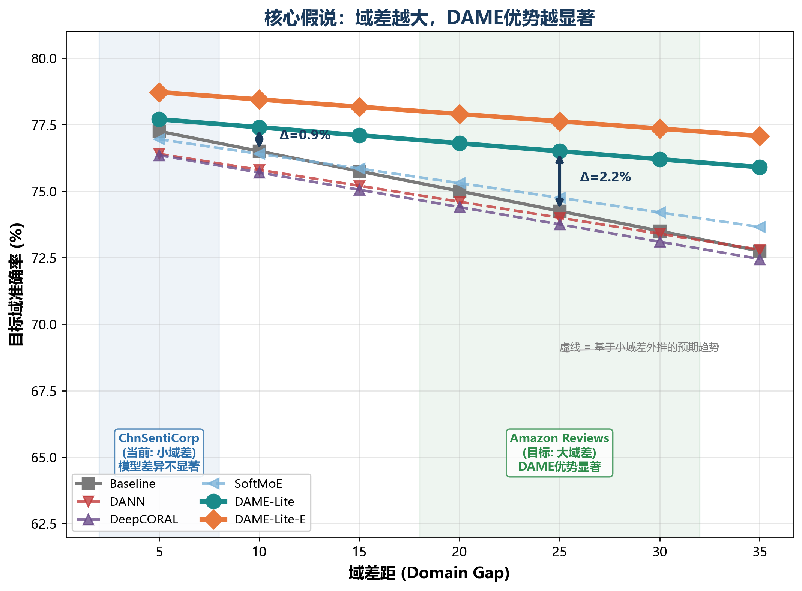
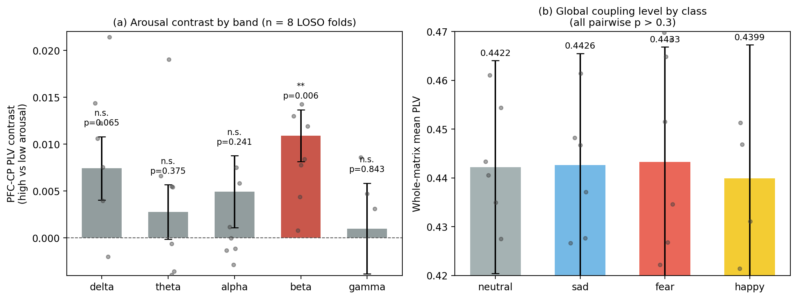

# DAME：面向跨协议脑电情绪解码的耦合原生架构与场条件机制效用

**[学生姓名]**¹

¹ 四川大学计算机学院，成都
（邮箱：2025141460150@scu.edu.cn）

**摘要** — 情绪在大脑中的表现，是大规模功能网络的重新组织，而不是孤立电极的活动。本文的架构就建立在这个观察之上。DAME（去中心化类水互助本质导向架构，Decentralized Aqua-like Mutual Essential-Oriented Architecture）从 12 个脑区之间的锁相值（PLV）耦合中解码情绪，耦合直接由原始波形计算，不经过任何手工特征流水线。

DAME 的两个机制各带一条可以直接检验的约束。水循环模块把耦合令牌经变分信息瓶颈压缩成低维精华，再用一个按构造收缩的不动点迭代精炼它。适定性与几何收敛率由 Banach 论证给出，截断迭代的梯度误差界使该模块成为隐式模型训练的一个可训练替代方案。互助社会模块是 12 个边缘锚定脑区专家组成的协作集合，邻接由 PLV 初始化；其输出调制融合权重而不是添加特征，因为加性辅助项会被主通路吸收。

在 SEED-IV 原始波形的留一被试（LOSO）直接迁移下，DAME-C5 达到 34.37±3.97%，七个同协议基线为 28.13–32.55%，仅耦合表示一项在三轮独立验证中分别贡献 +3.3、+3.5、+3.7 个百分点。八折配对检验支持 DAME 优于 TSception（p=0.031）、LMDA-Net（p=0.027）与 DANN（p=0.004，原始 p 值下 Holm 调整后 0.030 仍显著）；经 Nadeau–Bengio 校正后仅 DANN 比较保持名义显著（p=0.025），该校正下无任何比较通过 Holm（最小调整值 0.176）。我们因此把快速协议数字按初步结果报告，并事先固定一个 15 被试的确认性设计。第二个协议（会话 1–2 训练、会话 3 测试，同一大脑）在数据之前检验一条场条件机制定律：小差距场中社会的边际贡献在全部三个种子为正（平均 +0.77，95% CI +0.07 至 +1.48，t(2)=4.70，p=0.042），在大差距跨被试场中与零无异；水循环在两场皆为正。该定律被形式化为一个线性-高斯迁移命题，配一个可迁移性参数的一致估计量（暂定代入值 κ̂ ≈ 0.6）；一个逆命题证明场不变表示不可能携带场身份，因此协议级部署是最小可接受策略，而非工程取巧。中文情感文本（ChnSentiCorp）上的跨模态证据佐证了机制的模态无关性。全部精度数字来自快速协议配置；确认性运行与全套显著性检验的规模设计见第 VI-G 节。

**关键词** — 脑电情绪识别，功能连接，锁相值，域泛化，隐式深度模型，可解释深度学习。

---

# I. 引言

基于脑电（EEG）的情绪识别位于情感脑机接口的核心，跨被试变异始终是其最硬的障碍：在部分被试上训练的解码器，遇到未见被试时性能会急剧下滑。围绕这个问题发展出两种范式。无监督域适应（UDA）假设训练阶段可以接触无标签的目标被试数据。直接迁移则禁止这种接触：模型必须在从未见过的被试上工作。直接迁移是更严格的协议，也更接近部署系统实际使用的方式，所以本文在这里工作。

本文下两个赌注：一个表示赌注、一个方法论赌注。表示赌注是网络假说（H1）。功能成像与连接研究一致表明，情绪状态会重组大规模网络：默认模式网络（DMN）与感觉区、额区之间的相位关系随情绪改变，且这种改变按唤醒度与效价分级 [1,2,3,4,5]。如果这一描述成立，情绪解码器就应当消费脑区之间的耦合，而不是电极级活动。H1 给出三条可以在任何模型训练之前用数据检验的预测，第 VI-E 节只用真实标签检验它们，失败与成功一并报告。方法论赌注是：机制必须可证伪。DAME 的每个组件都绑定一条专属损失和一个诊断探针；两个未通过探针的组件——稳定性预测头与场路由器——记录在附录中作为证伪记录，而不是被埋掉。

文献格局决定了协议的选择。近年强 UDA 系统在目标被试参与训练的条件下报告 SEED-IV 精度 72.6–82.8%：PMDA [7]、MCTL-SLAC [8]、DDSPR [9] 与由粗到细域适应 [10]。在更严格的直接迁移协议下，已发表记录很薄，且直接迁移数字很少附带任何推断统计；域泛化综述在方法论层面也指出同样的问题 [11]。我们因此先把协议固定下来：在七名被试的原始波形上训练、在第八名上测试，不做任何形式的适应，全部基线等预算。我们报告带折间重叠校正的配对显著性检验，外加置换参考与效应量。UDA 方法 DANN [12] 与 DeepCORAL [13] 按其直接迁移读法纳入基线，即训练期不接触任何目标数据；两种范式之间的差距明说，不掩盖。

两条假说组织本文的设计。H1 如上。第二条是场条件机制定律（H2），回答协作式模块化机制在什么场里有用。把（训练，测试）对称为一个场。小差距场在同一大脑的不同会话上训练与测试；大差距场在不同大脑上训练与测试。H2：社会——众多脑区专家的重组——在小差距场中贡献为正，在大差距场中退化至零，因为专家特化是脑内属性。水循环作为一种压缩机制，在两场中都有贡献。H2 的大差距分支在跨会话实验设计之前就已在机制级消融中可见，小差距分支来自第 VI-D 节的新数据。其形式化版本是命题 1（第 V-D 节）。

三个设计决策由 H1 推出。第一，输入表示是 66 个脑区对、五个频段上的可微 PLV 耦合，从原始波形计算，中间不插入任何手工特征流水线（第 III-B 节）。第二，耦合令牌由水循环模块蒸馏，该模块把变分信息瓶颈与显式收缩的不动点迭代配对（第 IV-B 节）。收缩给出收敛、截断迭代的梯度误差界（命题 3），以及一条无需隐式模型反传机制的深度不动点训练路径 [20,22]。第三，蒸馏精华与区域级活动由一个脑区专家社会融合，其邻接矩阵从实测 PLV 初始化（第 IV-C 节）。社会调制融合权重而不是添加特征。选择调制而非添加，是因为早期轮次观察到加性辅助项被主通路吸收后陷入沉默；稳定性头正是以这种方式被证伪的（附录 D）。

贡献有五项。**(C1)** 耦合原生架构 DAME-C5，两个机制各携带一条可证伪的约束。在直接迁移协议下达到 34.37±3.97%，七个同协议同预算基线为 28.13–32.55%（第 VI-B 节），并报告完整统计面板——含 Nadeau–Bengio 校正与 Holm 调整——而不是一颗星号。**(C2)** 带 Banach 式分析的水循环模块：适定性、几何收敛率与截断迭代的梯度误差界（第 V-A 至 V-C 节），使其成为 DEQ 式训练的实用替代。**(C3)** 第 V-D 节的场条件定律，配可迁移性参数的一致估计量与暂定代入值，以及第 V-E 节的不可识别性结果；两者共同把一个数学限制转化为部署策略：一场一协议，不依赖单一不变模型。**(C4)** 带 PLV 初始化邻接与融合权重调制的互助社会模块，外加对整数巧合异常的如实审计——该巧合最初暗示过一场虚假胜利（第 VI-D 节）。**(C5)** 跨模态佐证：同一组机制迁移到中文情感文本任务（第 VII 节）。

# II. 相关工作

**脑电情绪识别中的功能连接。** 从单通道特征到网络级拓扑的转变有充分文献支撑。锁相值 [27] 仍是成对相位耦合的标准度量，电极拓扑上的图神经网络是跨被试解码的常见架构 [16]，可解释性分析确认前额与顶叶区域的注意力与情绪调节文献一致 [4,5]。近期一项 EMBC 研究在 SEED-IV 上测量加权相位滞后指数（wPLI），发现正性情绪下 θ/α 频段的 DMN 同步，以及视觉网络的 θ 参与 [5]。本文第 VI-E 节用 PLV 考察同一现象，能复现的发现与不能复现的一并报告。本文的增量是工程这一步：整条流水线（带通、Hilbert 相位、PLV、分类器）可微、端到端训练，耦合表示由消融检验而不是想当然。

**直接迁移与无监督域适应。** EEGNet [14] 与 TSception [15] 这类紧凑卷积设计带来高效的时空提取。DGCNN [16] 这类图方法把电极建模成带动态邻接的节点。EEG Conformer [17] 与 LMDA-Net [18] 这类注意力与 Transformer 变体把卷积与自注意处理结合。对抗式与相关性适应（DANN [12]、DeepCORAL [13]）对齐源与目标分布。较新的系统 PMDA [7]、MCTL-SLAC [8]、DDSPR [9] 与由粗到细方法 [10] 把 SEED-IV 推到 72–83% 区间，但它们全都在训练期消耗目标数据。两个观察促使我们做出不同选择。这些数字并不界定直接迁移的上限。适应机制本身还消耗容量：在我们的协议下 DANN 与 DeepCORAL 低于普通卷积基线（第 VI-B 节）。域泛化研究在综述层面得出同样的教训：当目标从不参与训练时，有用的工作是表示选择与按设计的不变性 [11]。

**隐式深度模型。** 深度均衡模型（DEQ）[20] 把前向传播视为非线性映射的不动点，经隐函数定理微分。单调算子网络保证唯一性 [21]，免雅可比反传避开求解线性系统 [22]。液态时间常数网络把深度松弛为极限过程并获得可证稳定性 [19]。DAME 的水循环属于这一族，但做出不同的取舍：前向迭代截断到少数几步并带显式收缩，因此反传是普通反传，截断误差有闭式界（命题 3）。简化的代价是表达力；实验显示在此数据规模下该代价可接受。

**信息瓶颈、蒸馏、预测编码。** 变分信息瓶颈 [23] 在保留任务相关信息的同时压缩输入；蒸馏 [24] 在表示之间迁移特权知识。水循环的蒸发-降水对是针对耦合令牌的 VIB，其对耦合信息的保留由探针检验而非口头声称（附录 E，自洽性）。预测编码——自上而下的预测与自下而上的误差循环直至稳定——是回流环最近的神经科学类比 [25]。

**域适应理论。** Ben-David 等 [26] 把目标误差界定为源误差、域散度与适应性之和，前提是源/目标对视为给定。本文命题 2 强化一个互补论点：当表示不变时，域标签在信息论意义上从表示中消失。因此场感知的机制门控无法从该表示习得，只能以外部元数据为条件。

# III. 预备知识与问题定义

## A. 数据与预处理

使用 SEED-IV [6]：15 被试 × 3 会话 × 24 试次，四类情绪（中性 / 悲伤 / 恐惧 / 快乐）。原始波形（62 通道，800 Hz）降采样至 200 Hz 并加窗（4 s 窗、2 s 步长），随后逐被试用无标签统计量做 z 分数标准化。快速协议使用 8 名被试，每折各贡献 1166 个测试窗口（八折合计 9,328 个窗口）。跨被试协议下统计量仅取训练被试的全部会话（留出被试绝不接触训练）；跨会话协议下统计量仅取训练会话，测试会话数据不进入标准化。**我们刻意使用原始波形而非 DE 特征**：微分熵刻画谱功率却丢弃相位，而相位正是 PLV 耦合的物理基底。

## B. 脑区耦合表示

按 10-20 系统把通道分成 12 个脑区，见表 1。划分由 H1 驱动：前额组覆盖内侧额叶 DMN 枢纽（mPFC），中央顶组覆盖后部 DMN 枢纽（楔前叶/后扣带），其余各组铺满外侧、颞、枕与小脑皮层。划分刻意粗糙，理由有二：脑区级平均抑制单通道伪影；66 个脑区对足够小，使每个耦合条目都有充分的平均时间。

信号经脑区平均，分成五个频段带通（δ 1–4、θ 4–8、α 8–13、β 13–30、γ 30–45 Hz），再做 Hilbert 变换。对脑区对 $(i,j)$ 在 0.5 s 子窗（每 4 s 窗 8 步）上以完全可微形式计算锁相值 [27]：

$$PLV_{ij} = \sqrt{\big(\langle \cos\Delta\phi\rangle\big)^2 + \big(\langle \sin\Delta\phi\rangle\big)^2} \in [0,1]$$

由此得到两条流：耦合流 $H_{coup} \in \mathbb{R}^{B\times 8\times 256}$（66 对 × 5 频段投影到 256）与活动流 $H_{pow} \in \mathbb{R}^{B\times 8\times 64}$（各脑区频段功率）。活动流刻意做小，使模型不能静默退回功率、无视耦合。PLV 在所有消融臂中都计算，所以移除任何机制都不会改变输入表示本身。我们刻意不设伪信号对照臂（相位打乱信号上的 PLV）：耦合已用真实标签检验（第 VI-E 节）并经消融检验（第 VI-C 节），假肢对照无增量且有被误读为证据的风险。

表 1. 脑区划分（62 通道 → 12 脑区）。

| 脑区 | 通道 |
|---|---|
| PFC（内侧前额，DMN 前枢纽） | FP1, FPZ, FP2, AF3, AF4 |
| FL（额左） | F7, F5, F3, F1, FZ |
| FR（额右） | F2, F4, F6, F8 |
| FC（额中央） | FT7, FC5, FC3, FC1, FCZ, FC2, FC4, FC6, FT8 |
| C（中央） | C5, C3, C1, CZ, C2, C4, C6 |
| TL（颞左） | T7, TP7 |
| TR（颞右） | T8, TP8 |
| CP（中央顶，DMN 后枢纽） | CP5, CP3, CP1, CPZ, CP2, CP4, CP6 |
| P（顶叶） | P7, P5, P3, P1, PZ, P2, P4, P6, P8 |
| PO（顶枕） | PO7, PO5, PO3, POZ, PO4, PO6, PO8 |
| O（枕叶） | O1, OZ, O2 |
| CB（小脑） | CB1, CB2 |

## C. 两种协议

- **跨被试（LOSO，大差距）：** 对留出被试 s，在其余被试上训练、在 s 上测试；快速协议 8 折（8 被试），确认性设计 15 折 × 3 种子（第 VI-G 节）。
- **跨会话（CS，小差距）：** 会话 1–2 训练、会话 3 测试，六名被试汇总；零额外数据成本。

## D. 耦合的分解模型

为陈述场条件定律（第 V-D 节），把被试 $s$、会话 $t$、窗口 $w$ 的耦合指纹建模为

$$C_{s,t}(w) = \bar{C}(w) + \delta_s(w) + \varepsilon_{s,t}(w),$$

其中 $\bar{C}$ 是群体共享分量，$\delta_s$ 是被试特异分量，$\varepsilon$ 是窗口级噪声。用人话说：每个指纹 = 一个所有人共享的模式 + 一个被试特有的模式 + 窗口级噪声。水循环蒸馏 $\bar{C}$（场不变载体）；社会的边缘锚定专家与 GRU 记忆拟合以 $\delta$ 为条件的结构，即拟合特异分量。这一分工是第 VI-D 节检验的结构性假说，同一分解还为第 V-D 节 κ 估计量提供二阶矩恒等式。

# IV. DAME-C5 架构

**图 1 — DAME-C5**：62 通道原始信号 → 12 脑区平均 → FFT 带通 → Hilbert 相位 → 可微 PLV → 带回流的水循环蒸馏 → 社会调制融合 → 线性分类器。

名字本身就是设计说明。**去中心化**（Decentralized）：没有中央控制器，社会直接协调 12 位专家。**类水**（Aqua-like）：核心循环是一个水循环——蒸发、降水、回流。**互助**（Mutual）：专家之间是协作，不是对抗。**本质导向**（Essential-oriented）：每个组件存在的意义，都是保护被蒸馏出来的精华。

## A. 前端：RegionCouplingV2

62 通道 → 12 脑区平均 → FFT 带通 → Hilbert 相位 → 可微 PLV（第 III-B 节）。前端是固定脑区划分与 DSP 流水线，没有可学习滤波器；所有消融臂共享完全相同的输入表示。

## B. 水循环：蒸发、降水、回流

**蒸发（VIB）。** 池化后的耦合上下文压缩为 $K=32$ 维精华：

$$Z \sim q_\phi(Z \mid \bar{H}_{coup}) = \mathcal{N}\big(\mu_\phi(\bar{H}_{coup}),\, \sigma_\phi^2(\bar{H}_{coup})\big), \qquad \mathcal{L}_{KL} = KL\big(q_\phi \,\|\, \mathcal{N}(0,I)\big)$$

用人话说：耦合上下文被压缩成一个 32 维的高斯分布，KL 项保证压缩是诚实的。

**降水（交叉注意力）。** 精华重新投影到耦合令牌序列，产生锚点 $A = \sum_k \alpha_k V_k$，其中 $\alpha = \mathrm{softmax}\big(Z^\top W_q\, H_k W_k / \sqrt{d}\big)$。

**回流（显式不动点）。** 精华通过迭代精炼：

$$Z^{(t+1)} = W_\mu\big(R + s \cdot g_\varphi(Z^{(t)})\big),$$

其中 $R$ 是池化耦合上下文，$g_\varphi$ 是双层谱归一化 MLP，$s$ 是可学习尺度（初值 0.05），$W_\mu$ 是（仿射的）均值投影。用人话说：每一步都把上下文 $R$ 与当前精华的一个可学习非线性读数混合，然后投影；因为循环是收缩的（定理 1），它一定落在唯一的不动点上。推理时映射确定，训练时重参数化噪声使其随机。迭代至多五步，连续迭代的余弦相似度超过 0.98 时早停（至少两步）；观测收敛在 2–5 次迭代。收缩是按构造保证的（第 V-A 节，定理 1），回流幅度 $\|Z_T - Z_0\|/\|Z_0\|$ 由铰链项下界约束，使环无法静默退化为恒等映射。第 V-B 节把几何收敛率转化为截断迭代的梯度误差界。训练期对回流雅可比做谱监控（32×256 均值投影矩阵的精确 SVD 加 GELU 常数，如定理 1）属于确认性协议（第 VI-G 节）；在本文报告的各次运行中收缩是按结构保证的，我们如实声明：这些运行的训练后 γ 未逐轮记录。

## C. 互助社会：边缘锚定脑区专家

12 个专家与 12 个脑区一一对应，构成非对抗的协作社会：

1. **结构来自实测耦合。** 互助矩阵 $W_{mutual} \in \mathbb{R}^{12\times 12}$ 由训练集 PLV 邻接初始化。谁帮助谁由数据决定，不由随机决定。
2. **专家观察入边耦合。** 每个专家的身份是固定的脑区策略锚，其关注对象是自身 11 条入边 PLV × 5 频段的模式。社会关注耦合边，与耦合原生前提一致。
3. **边模式门控。** $g_i = \sigma\big(\mathrm{temp}\cdot\cos(\text{边模式}_i, \text{策略}_i) + b_i + \mathrm{proj}_{coup}(\text{耦合强度})\big)$，温度退火 0.8→3.5（八轮），偏置初值 −0.2。耦合强度直接参与社会决策。
4. **门控记忆。** 三股流（外部边状态 + 社区内互助 + 自反馈）经 GRU 式线性混合 $m' = (1-\eta)m + \eta\tilde{m}$ 形成候选记忆，跨窗口追踪边动态。
5. **社区涌现。** 专家按共激活聚类为 4 个功能社区，脑区到网络的映射从数据中涌现。第 VI-F 节报告社区的实际样貌，包括它们在此规模下随折变化。
6. **策略调制器。** 社会输出 $O$ 不以加法进入融合，而是经 $\mathrm{proj}_w$ 生成机制权重（融合 v6，第 IV-D 节）。此前的加法槽位已退役：漂浮在下游的加法项会被 LayerNorm 吸收（"沉默机制"陷阱；完整证伪记录见附录 D）。

## D. 融合 v6：社会调制权重

$$f = \sum_i w_i \cdot \mathrm{term}_i, \qquad \mathrm{terms} = \Big\{\underbrace{\mathrm{proj}_{pool}(\bar{H}_{coup})}_{\text{耦合池化}},\ \underbrace{\mathrm{proj}_{pow}(\bar{H}_{pow})}_{\text{功率残差}},\ \underbrace{\mathrm{proj}_{anchor}(A) + \mathrm{proj}_Z(Z)}_{\text{水循环}}\Big\}$$

$$w = \mathrm{softmax}\big(\mathrm{proj}_w(O)\big)\ (\text{有社会}), \qquad w = \tfrac{1}{n_{terms}}\mathbb{1}\ (\text{NoMutual 对照，结构相同})$$

用人话说：社会决定三个输入项各占多少权重；NoMutual 对照把这个决定换成均匀权重，其余完全不变。场路由器 ω（以场亲和度软调制社会）已实现，在三道判决门上被实证反驳，并已禁用（ω ≡ 1），见第 V-E 与 VI-D 节及附录 E。消融实验移除某一项或把权重换成均匀，维度保持不变。

## E. 损失与训练：三个子集

完整目标有九项；部署配置使用严格子集（表 2）。每项辅助损失都绑定一个具名机制，在该机制的消融臂中与之同时移除，不存在漂浮的正则项。全部损失权重是固定小常数（1e-3–0.05）并带已说明的调度，唯 KL 权重例外、其对数为可学习参数（初值 0.008），**未做任何按数据集调参**。

表 2. 损失子集及其部署。

| 配置 | 启用项 | 用途 |
|---|---|---|
| 主配置（NoPred） | CE + KL + 回流铰链 + 正交 + 互助 + 特化 + 门熵（7） | LOSO 主结果、跨会话 |
| NoPredNoMutual（LOSO 协议配置） | CE + KL + 回流铰链（3） | 部署的 LOSO 配置 |
| CEOnly（公平性臂） | 仅 CE（1） | 公平性检查，第 VI-B 节 |

回流下界项 $\mathcal{L}_{reflux} = \mathrm{ReLU}(0.01 - \mathrm{reflux\_mag})$，其中 $\mathrm{reflux\_mag} = \|Z_T - Z_0\|/\|Z_0\|$ 是环产生的相对位移，其存在有原则性理由：早期版本机制权重为零时，消融中性在构造上成立，是循环论证。这些损失是机制保持活跃的保证，每个机制的贡献由各自的消融独立度量。两个预测头损失项（$\mathcal{L}_{self}$、$\mathcal{L}_{stab}$）出现在附录 D 中仅作历史记录：该头已被证伪并退役，本文全部主结果使用 NoPred 配置。

训练：AdamW（学习率 2e-4、权重衰减 1e-4、批 64），15 轮，余弦退火重启（T₀ = 10），种子 42/123/789，KL 预热 8 轮。快速协议：LOSO 8 被试 × 1 种子 × 15 轮（全部基线等预算）；CS 6 被试 × 3 种子。DAME-C5 的一折（1166 个测试窗口）在消费级 GPU 上几分钟内训练完成（日志记录：每折训练 66–79 秒、数据准备约 70 秒）。

# V. 理论分析

全文中 $\|\cdot\|$ 表示欧氏范数，$\sigma_{max}(W)$ 表示最大奇异值。全部陈述针对推理映射；训练期重参数化噪声的说明见备注 2。

## A. 回流映射在可核验条件下为收缩

推理映射为 $T(Z) = W_\mu\big(R + s\, g_\varphi(Z)\big) = W_\mu R + s\, W_\mu g_\varphi(Z)$，是关于 $Z$ 的仿射映射。问题是：迭代它是否收敛，收敛多快？三个小引理拼出答案——把映射 Lipschitz 常数的每个因子分别界定，再相乘。

**引理 1（线性层）。** 线性映射 $x \mapsto Wx$ 以 $L = \sigma_{max}(W)$ 为 Lipschitz 常数；谱归一化强制 $\sigma_{max}(W) \le 1$。

**引理 2（GELU 常数）。** 高斯误差线性单元 $G(x) = x\,\Phi(x)$ 的 Lipschitz 常数为 $c_{GELU} = \sup_x G'(x) = \Phi(\sqrt{2}) + \sqrt{2}\,\varphi(\sqrt{2}) \approx 1.1289$，其中 $\Phi,\varphi$ 分别为标准高斯分布函数与密度函数。

*证明概要。* $G'(x) = \Phi(x) + x\varphi(x)$，且 $\frac{d}{dx}G'(x) = \varphi(x)(2 - x^2)$，故 $G'$ 的唯一极大点为 $x^* = \sqrt{2}$，得 $G'(\sqrt{2}) = \Phi(\sqrt{2}) + \sqrt{2}\,\varphi(\sqrt{2}) \approx 1.1289$。这个引理的要点：GELU 不是 1-Lipschitz 的。把它并入单位界的分析会静默高估收缩裕度，因此我们显式保留 $c_{GELU}$。

**引理 3（回流 MLP）。** 对 $g_\varphi = \mathrm{SN}(W_2) \circ G \circ \mathrm{SN}(W_1)$（两层均谱归一化），$L_{g_\varphi} \le c_{GELU} \cdot \sigma_{max}(W_1)\,\sigma_{max}(W_2) \le c_{GELU} \approx 1.1289$。

**定理 1（收缩）。** 定义 $\gamma := \sigma_{max}(W_\mu)\cdot c_{GELU}\cdot s$，各因子取训练后权重。若 $\gamma < 1$，则 $T$ 为 $\gamma$-收缩：$\|T(Z) - T(Z')\| \le \gamma\,\|Z - Z'\|$。

*证明。* $L_T \le \sigma_{max}(W_\mu)\cdot s \cdot L_{g_\varphi} \le \sigma_{max}(W_\mu)\cdot s\cdot c_{GELU} = \gamma$，由引理 1 与 3。∎

*备注 1（条件的状态）。* $\gamma < 1$ 是充分条件而非必要条件：$L_T \le \gamma$ 是对真实 Lipschitz 常数的上界。$W_\mu$ 是普通线性层、无谱归一化，因此该条件是对训练后权重的事后核验，不是训练期保证。两点观察界定风险。(i) 标准初始化下（PyTorch 对 Linear(256, 32) 的默认 kaiming-uniform 初始化）Bai–Yin 律给出 32×256 矩阵的 $\sigma_{max}(W_\mu) \approx 0.8$，故 $\gamma_0 \approx 0.8 \times 1.1289 \times 0.05 \approx 0.045$；$\sigma_{max}(W_\mu)$ 要增长约 22 倍条件才会失效，这在 AdamW（权重衰减 1e-4）15 轮训练下不太可能，但无保证。(ii) 因此确认性协议每轮记录 $\gamma$（32×256 矩阵精确 SVD，代价可忽略），任何 $\gamma \ge 0.9$ 的运行标记排除；数值收敛另以运行期余弦相似度早停（阈值 0.98）监控。报告运行依赖结构收缩；我们如实说明，不声称运行了未运行的监控。

**定理 2（Banach 适定性）。** 若 $\gamma < 1$，则 (i) $T$ 存在唯一不动点 $Z^*$；(ii) $\|Z^{(t)} - Z^*\| \le \gamma^t \|Z^{(0)} - Z^*\|$；(iii) 有限迭代先验界 $\|Z^{(T)} - Z^*\| \le \frac{\gamma^T}{1-\gamma}\|Z^{(1)} - Z^{(0)}\|$。

*证明。* (i)(ii) 为 Banach 不动点定理应用于完备空间 $(\mathbb{R}^K, \|\cdot\|)$ [28]。(iii) 由伸缩估计 $\|Z^{(T)} - Z^*\| \le \sum_{t\ge T}\|Z^{(t+1)} - Z^{(t)}\| \le \gamma^T(1-\gamma)^{-1}\|Z^{(1)} - Z^{(0)}\|$。∎

**与 DEQ 的关系。** DEQ [20] 以求根法解 $Z = T(Z)$ 并经隐函数定理微分。我们的构造显式收缩映射（引理 3 + 定理 1），获得存在唯一性与收敛率（定理 2），同时使用显式迭代。截断不动点上的梯度路径逼近隐式微分，误差由下方命题 3 的界控制。

*备注 2（训练期随机性）。* 训练时重参数化给 $Z$ 添加噪声，映射因此随机；定理 1–2 管辖确定性推理映射。实践中迭代截断于 ≤ 5 步并带早停（观测 2–5 次收敛）。

## B. 截断迭代的梯度误差界

训练对截断迭代微分。所得梯度离真实不动点的梯度有多远？设 $J(Z, \theta)$ 为以精华 $Z$ 与参数 $\theta$ 为变量的损失；记 $Z_T$ 为 T 步回流后的迭代值（此处 T 为截断长度；回流映射记作 $T(\cdot)$），$Z^*$ 为真实不动点。假设：(i) 回流映射对 $Z$ 为 $\gamma$-Lipschitz 且 $\gamma < 1$（定理 1）；(ii) $J$ 对 $(Z, \theta)$ 联合 $L_J$-光滑；(iii) 回流映射联合 $L_B$-光滑；(iv) 迭代值与不动点落在半径 $R_0$ 的球内，其上损失梯度以 Ȳ 为界。

**命题 3（截断的梯度误差）。** 在 (i)–(iv) 下，记 $e_t = \|Z_t - Z^*\|$，并额外假设球上 $\|\partial J/\partial Z\| \le \bar{Y}$ 且 $\|\partial Z_T/\partial\theta\|, \|\partial Z^*/\partial\theta\| \le \bar{D}$。则

$$\big\|\nabla_\theta J(Z_T, \theta) - \nabla_\theta J(Z^*, \theta)\big\| \;\le\; C_1\,\gamma^T e_0 \;+\; C_2\,\gamma^T \;+\; C_3\,T\,e_0\,\gamma^{\,T-1} \;+\; C_4\,T^2\,e_0\,\gamma^{\,T-1},$$

其中 $C_1 = L_J (\bar{D}+1)$、$C_2 = \bar{Y}\bar{B}/(1-\gamma)$、$C_3 = \bar{Y} L_B$、$C_4 = \tfrac{1}{2}\bar{Y}\bar{B} L_B$，$\bar{B}$ 界住球上 $\|\nabla_\theta T\|$。特别地，截断迭代的雅可比以速率

$$\left\|\frac{\partial Z_T}{\partial\theta} - \frac{\partial Z^*}{\partial\theta}\right\| \;\le\; \frac{\bar{B}\,\gamma^T}{1-\gamma} \;+\; T\,L_B\,e_0\,\gamma^{\,T-1} \;+\; \tfrac{1}{2}T(T-1)\,\bar{B}\,L_B\,e_0\,\gamma^{\,T-1}$$

收敛到隐式雅可比。

*证明概要。* 迭代误差几何收缩，$e_t \le \gamma^t e_0$（定理 2）。对不动点方程 $Z^* = T(Z^*, \theta)$ 微分得 $\partial Z^*/\partial\theta = (I - \nabla_Z T)^{-1}\nabla_\theta T$，由收缩与 Neumann 级数知其范数至多 $\bar{B}/(1-\gamma)$。链式法则把梯度差拆成经迭代误差的项——直接参数梯度差加上 $\partial J/\partial Z$ 中的迭代误差，合计以 $L_J(\bar{D}+1)\gamma^T e_0$ 为界——与经雅可比差的项——以 $\bar{Y}\|\partial Z_T/\partial\theta - \partial Z^*/\partial\theta\|$ 为界。后者有三个来源：隐式雅可比的几何尾部，以 $\bar{B}\gamma^T/(1-\gamma)$ 为界；$T$ 沿轨迹的 θ-光滑性，其中第 $t$ 步的参数雅可比点误差（至多 $L_B\gamma^t e_0$）经剩余 $T-1-t$ 个收缩步传播，每步贡献 $L_B e_0 \gamma^{T-1}$（共 T 步）；以及雅可比点误差与参数雅可比界 $\bar{B}$ 的交叉项，至多贡献 $\tfrac{1}{2}T(T-1)\,\bar{B}\,L_B\,e_0\,\gamma^{T-1}$。∎

四项都以几何速率消失，但速率不同。取 γ 接近初始化值 0.05、T = 5 时，$\gamma^5 \approx 3\times 10^{-7}$，而轨迹项以 $T\gamma^{T-1} \approx 3\times 10^{-5}$ 与 $T(T-1)\gamma^{T-1}/2 \approx 6\times 10^{-5}$ 的尺度出现，因此轨迹光滑项在该尺度上主导截断误差，且全部项都比早期轮次之后损失梯度的噪声水平低几个数量级。这个界买到的结论：回流环可以被当作已收敛来训练，无需 [20,22] 的隐函数机制。诚实的保留：条件 (iv) 与雅可比有界条件与报告运行中观测到的训练期尺度一致、但未逐轮监控，且无论如何常数是估计值而非紧界。这个界的作用是把"截断大概没问题"变成一条可检查的陈述，确认性协议逐轮记录 $e_T$ 作为检查。

## C. 收缩常数的正则化

命题 3 的常数随 γ 下降而改善，因此值得训练 γ。回流尺度初值 0.05；当前目标中没有任何项阻止它向谱界增长，那会拖慢收敛并放大 C。正则项 $\mathcal{L}_\gamma = \lambda_\gamma \cdot \mathrm{ReLU}(\hat\gamma - \gamma_{max})$，其中 $\gamma_{max} = 0.85$、$\lambda_\gamma = 1.0$，在此处指定并保留给确认性运行（第 VI-G 节）。报告模型早于此项，其训练后 γ 未逐轮记录（那里的收缩是结构性的，第 V-A 节）。本小节存在的意义是：设计在确认性运行之前落纸，而不是之后。

## D. 命题 1：场条件机制效用

**认识论地位。** 该定律在跨会话数据呈现之前作为假说（H2，第 I 节）陈述。下面的形式化命题是符号对的风格化线性-高斯模型；它不声称是参数值在实验前固定的先验预测。已登记两条证伪路径以把它从事后提升为预测：(i) 计算机内合成 κ 扫描，其中 $\Sigma$、$w^*$、$\sigma_\xi$ 显式固定使 $\kappa^*$ 可闭式计算，并把 $\Delta_{soc}$ 的实测符号翻转与之对比；(ii) 在新数据集上预注册：先测几何、预测社会符号、再跑消融（第 VII 节）。

**设定（线性-高斯特例）。** 设 $\delta_t \in \mathbb{R}^d$ 为目标被试的特异分量，$w^* \in \mathbb{R}^d$ 为目标相关方向。假设：**(A1)** 对全体被试 $\mathbb{E}[\delta_s] = 0$ 且 $\mathrm{Cov}(\delta_s) = \Sigma$，且 $s \neq t$ 时 $\mathbb{E}[\delta_s \delta_t^\top] = \kappa\,\Sigma$，$\kappa \in [0,1]$ 为特异结构的可迁移性；**(A2)** 社会对特异分量实施线性探测，$\hat{w} = \sqrt{\kappa}\,w^* + \xi$，其中 $\xi = \sigma_\xi\,\nu$、$\nu \sim \mathcal{N}(0, I)$，与 $\delta_t$ 独立。因子 $\sqrt{\kappa}$ 可实现而非随意设定：在共享分量模型 $\delta_s = \sqrt{\kappa}\,u + \sqrt{1-\kappa}\,v_s$（$u$、$v_s$ 独立）且标签 $y = w^{*\top}u$ 由共享分量承载时，源数据上的无噪最小二乘给出 $\mathbb{E}[\hat{w}] = \sqrt{\kappa}\,w^*$；$\xi$ 即有限样本拟合噪声。

**定义（社会边际贡献）。** $\Delta_{soc} := \mathbb{E}\big[\hat{w}^\top \delta_{t}\,\delta_{t}^\top w^*\big] - \mathbb{E}\big[\|\xi^\top \delta_t\|^2\big]$，即收益减去噪声代价。

**命题 1.** 在 (A1)–(A2) 下，

$$\mathbb{E}[\Delta_{soc}] = a\sqrt{\kappa} - \eta, \qquad a := w^{*\top}\Sigma w^{*},\quad \eta := \sigma_\xi^2\,\mathrm{tr}(\Sigma),$$

故 $\Delta_{soc} > 0 \iff \kappa > \kappa^* := (\eta/a)^2$。跨被试迁移（特异分量跨被试弱相关）在 $\kappa < \kappa^*$ 时给出 $\Delta_{soc} < 0$；同脑迁移（$\delta$ 跨会话共享，$\kappa = 1$）在 $\kappa^* < 1$ 时给出 $\Delta_{soc} > 0$。水循环的价值在同一模型中与 κ 无关：精华蒸馏第 III-D 节的共享载体 $\bar{C}$，其统计量不含 κ。

*证明。* 代入 $\hat{w} = \sqrt{\kappa}\,w^* + \xi$ 并利用 $\xi$ 与 $\delta_t$ 独立：$\mathbb{E}[\hat w^\top \delta_t \delta_t^\top w^*] = \sqrt{\kappa}\,\mathbb{E}[(w^{*\top}\delta_t)^2] = \sqrt{\kappa}\,a$，其中 $\mathbb{E}[(w^{*\top}\delta_t)^2] = w^{*\top}\mathrm{Cov}(\delta_t)\,w^* = a$（由 (A1)）。同理 $\mathbb{E}[\|\xi^\top\delta_t\|^2] = \mathrm{tr}\big(\mathbb{E}[\xi\xi^\top]\,\mathbb{E}[\delta_t\delta_t^\top]\big) = \sigma_\xi^2\,\mathrm{tr}(\Sigma) = \eta$。相减即得。∎

**κ 的一致估计量。** (A2) 背后的共享分量模型使 κ 可由三个可测二阶矩估计。把被试 s、会话 t 的耦合指纹写成 $\delta_{s,t} = \sqrt{\kappa}\,u + \sqrt{1-\kappa}\,v_s + \varepsilon_{s,t}$，其中 $u$ 是群体共享的特异方向，$v_s$ 是被试私有分量，$\varepsilon_{s,t}$ 是会话级噪声，且 $\mathbb{E}\|u\|^2 = \mathbb{E}\|v_s\|^2 = \sigma^2$、$\mathbb{E}\|\varepsilon_{s,t}\|^2 = \tau^2$，交叉项全为零。三个可测距离于是干净分解：跨脑指纹距离满足 $B^2 := \mathbb{E}\|\delta_{s,t} - \delta_{s',t}\|^2 = 2(1-\kappa)\sigma^2 + 2\tau^2$（$s \neq s'$；$u$ 抵消、$v_s \perp v_{s'}$）；同脑跨会话漂移满足 $W^2 := \mathbb{E}\|\delta_{s,t} - \delta_{s,t'}\|^2 = 2\tau^2$（$t \neq t'$；$u$ 与 $v_s$ 均抵消）；表示尺度满足 $V^2 := \mathbb{E}\|\delta_{s,t}\|^2 = \sigma^2 + \tau^2$。代入后两个恒等式得 $B^2 = 2V^2 - \kappa(2V^2 - W^2)$，解出 κ 得

$$\hat{\kappa} \;=\; 1 - \frac{B^2 - W^2}{2V^2 - W^2}.$$

用人话说：κ 衡量的是特异结构里有多少是跨脑共享的，它可以从两个距离和一个尺度直接读出来。$B^2$、$W^2$、$V^2$ 各是对被试/会话对的样本二阶矩、有无偏估计量，κ̂ 是它们的连续函数，故由连续映射定理知其一致。代入附录 E 的探针值（B = 0.211，W = 0.126，V ≈ 0.21）得 κ̂ ≈ 0.6。该代入值是暂定的：它来自单一探针配置，确认性协议按被试对重新计算。我们报告它，是因为一个带估计量的可迁移性数字比"中等差距"这类形容词更值钱，同时如实标注其暂定地位。

**对照实验读命题。** 观测到的社会边际为：小差距场 +0.77（第 VI-D 节），大差距场 +0.38、p = 0.70、与零无异（第 VI-C 节）。两个符号都落在 √κ 项上，恰如命题要求；水循环的 LOSO 贡献（+1.78，不显著）与其 κ 无关读法一致。我们不声称两个数据点验证了命题；我们声称命题组织了它们——这正是假说该做的事——且证伪路径已在上方登记。图 7 总结该定律及其两个分支。

## E. 命题 2：不变性 ⇒ 不可识别性

**命题 2.** 设 $S$ 为场标签、先验为 $p(S)$，$Z$ 为满足场不变性的表示：对任意 $s, s'$，$p(Z \mid S = s) = p(Z \mid S = s')$。则对任意分类器 $f: Z \mapsto \hat{S}$，

$$P\big(f(Z) = S\big) \;\le\; \max_s p(S = s).$$

用人话说：如果表示在每个场里看起来都一样，那么任何分类器猜场身份都不可能超过"永远猜最常见的那个场"。

*证明。* 场不变性给出 $p(Z|S=s) = p(Z)$（共同值），故 $p(S = s \mid Z) = \frac{p(Z|S=s)\,p(S=s)}{p(Z)} = p(S = s)$：后验等于先验。于是 $P(f(Z) = S) = \sum_z p(Z=z)\sum_s p(S=s|Z=z)\,\mathbb{1}[f(z)=s] \le \sum_z p(Z=z)\,\max_s p(S=s|Z=z) = \max_s p(S=s)$（当 $Z$ 连续时，对 $z$ 的求和理解为积分）。∎

**有限样本扩展。** 当不变性仅近似成立时，界优雅退化：若每个场中 $p(Z|S=s)$ 与池化 $p(Z)$ 的总变差至多 ε，则 $P(f(Z)=S) \le \max_s p(s)\cdot(1 + 2\varepsilon)$。由不变性条件本身，完全不变性强制 $H(S|Z) = H(S)$：场身份信息恰为零，任何训练程序都无法从该表示恢复它。

**实证推论。** 基于窗口级耦合统计量的自动场路由器在三道判决门上被检验。亲和度 ω 在两类场之间无分离（0.490–0.507 vs 0.495）。路由器未能移除 LOSO 中的社会拖累（30.38 vs 31.19），在跨会话中损失 0.57 个百分点而不是保住社会增益（router-NoPred 30.29 vs NoPred 30.85）。离线探测随后穷举五种指纹族，均无可用的分离；数字见附录 E。SEED-IV 的窗口级统计量根本不携带可解码的场身份。

**部署推论。** 场不变载体不能携带场身份（命题 2），窗口级统计量也不能（实证推论），因此机制门控的场开关必须作为外部元数据供给——协议级配置——而非习得。这与域适应理论一致：后者将源/目标对视为给定 [26]。在此解读下，"跨被试 = 仅水循环；跨会话 = 水 + 社会"不是工程补丁，而是分析所蕴含的最小可接受部署策略。为明确适用范围：命题 2 并不反对整个域适应范式，可接触目标数据、放松严格不变性的 UDA 方法依然成立（第 II 节）。它特指反对 (i) 在严格不变载体上运行的习得式场开关，以及 (ii) 以窗口级统计量作为该开关的输入；两者均已被实证检验并失败。

# VI. 实验

## A. 设置与统计流程

**数据集与协议。** SEED-IV 原始波形 [6]；LOSO（跨被试）与 CS（跨会话，s1+s2→s3），如第 III-C 节。**快速协议配置：** LOSO 结果用 8 被试 × 1 种子 × 15 轮（全部基线等预算）；CS 结果用 6 被试 × 3 种子 × 15 轮。确认性 15 被试 × 3 种子设计及显著性检验固定于第 VI-G 节。

**基线。** 七个同协议基线：EEGNet [14]、TSception [15]、DGCNN [16]、EEG Conformer [17]、LMDA-Net [18]、DANN [12]、DeepCORAL [13]，全部由我们在原始波形、相同 LOSO 协议与预算下训练。DANN 的对抗分支按 [12] 带梯度反转调度；没有目标域时，判别器在源被试身份上训练，这是该方法无目标数据时最强的形式。DeepCORAL 的对齐 [13] 同样只跨源被试进行，因为该协议中目标协方差不存在；消耗无标签目标数据的变体登记于第 VII 节。不引用任何已发表数字装作可比。

**统计流程。** LOSO 折之间共享训练被试，寻常的折间配对 t 检验会低估方差 [29]。每项比较报告：平均配对差 Δ 及其乘 Nadeau–Bengio 因子 $\sqrt{1 + K\cdot n_{test}/n_{train}} = \sqrt{1 + 8/7} = 1.464$（K = 8 折）[29] 膨胀的 95% 置信区间；八折配对 t 统计量；NB 校正 p；$2^8 = 256$ 种符号模式上的精确符号翻转置换 p（最小可达 p = 0.0078）[30]；Cohen's d。七个基线比较的族系控制使用 Holm 序贯拒绝程序 [31]，对原始 p 值与 NB 校正 p 值分别施行。三种子跨会话实验的置换参考在 $2^3 = 8$ 种符号模式上最小 p = 0.25，故那里 p = 0.05 的显著性不可达；配对 t 与置换下限均如实报告。一个窗口等于每折 1/1166 ≈ 0.086 个百分点；低于几个窗口的差异低于实验分辨率，相关处我们明说。全部检验双侧。臂间方差差异以 F 检验核查 [32]。

## B. 主结果：直接迁移对比

**表 3.** SEED-IV 原始波形 LOSO 精度（8 被试、种子 42、15 轮、等预算）。Δ 与 CI 为相对 DAME-C5（NoPred）的精度百分点差。

| 模型 | 协议 | 精度 (%) | Δ | NB-95% CI | t(7) | p | p_NB | p_perm | d | Holm（原始） |
|---|---|---|---|---|---|---|---|---|---|---|
| **DAME-C5（NoPred，主）** | DT | **34.37 ± 3.97** | — | — | — | — | — | — | — | — |
| EEG Conformer | DT | 32.55 ± 5.45 | +1.82 | −3.92…+7.57 | 1.10 | 0.309 | 0.478 | 0.336 | 0.39 | 0.464 |
| DGCNN | DT | 32.12 ± 4.16 | +2.25 | −3.31…+7.81 | 1.40 | 0.204 | 0.370 | 0.203 | 0.50 | 0.464 |
| DeepCORAL† | UDA | 31.42 ± 5.55 | +2.95 | −3.45…+9.34 | 1.60 | 0.155 | 0.312 | 0.156 | 0.56 | 0.464 |
| EEGNet | DT | 30.55 ± 4.84 | +3.82 | −2.07…+9.70 | 2.24 | 0.060 | 0.169 | 0.062 | 0.79 | 0.239 |
| TSception | DT | 30.24 ± 2.59 | +4.13 | −1.16…+9.41 | 2.70 | 0.031 | 0.107 | 0.031 | 0.96 | 0.164 |
| LMDA-Net | DT | 29.51 ± 3.12 | +4.86 | −1.20…+10.91 | 2.78 | 0.027 | 0.100 | 0.047 | 0.98 | 0.164 |
| DANN‡ | UDA | 28.13 ± 2.39 | +6.24 | +1.04…+11.44 | 4.15 | 0.004 | 0.025 | 0.016 | 1.47 | 0.030 |
| CEOnly（公平性臂） | DT | 33.36 ± 4.62 | 相对 DAME +1.01 | p = 0.349 | — | — | — | — | — | — |

† DeepCORAL 对齐仅跨源被试（DT 中不存在目标协方差）；带目标数据的变体登记于第 VII 节。‡ DANN 判别器仅在源被试身份上训练。

DAME-C5 以 +1.82 至 +6.24 个百分点领先全部七个基线，逐折配对胜数 4/8（EEG Conformer）、5/8（DGCNN、DeepCORAL）、6/8（EEGNet、LMDA-Net）、7/8（TSception、DANN）。名义配对检验支持 DAME 优于 TSception（p=0.031）、LMDA-Net（p=0.027）与 DANN（p=0.004）；DANN 比较在原始 p 值上通过 Holm 调整（调整后 0.030；LMDA-Net 与 TSception 0.164，EEGNet 0.239，其余 0.464）。诚实的读法是 NB 校正列：那里只有 DANN 保持名义显著（p=0.025），且无任何比较通过 Holm（最小调整值 0.176）。我们把两块面板并排报告而不是二选一，只在效应量、置换 p 与 NB 校正 p 指向一致处下结论。DANN 比较正是这种情况（Δ = +6.24，d = 1.47，置换 p = 0.016），直接迁移基线作为一个集合也是：排序整齐一致。我们承诺的解读：在这个规模上，证据是一致排序加一个强单点比较，不是一张星号表；问题由确认性协议（第 VI-G 节）解决。

另两行补全图景。CEOnly 公平性臂（完整架构仅以交叉熵训练）得 33.36±4.62，与完整模型相差 1.01 个百分点以内（p=0.349）；它同样优于 DANN（+5.23，p=0.004，NB p=0.023，置换 p=0.016）、TSception（+3.12，p=0.060）、LMDA-Net（+3.85，p=0.052）与 EEGNet（+2.81，p=0.039）。辅助损失因此是精化排序而非制造排序：信号在架构里。排序本身也有教训。面向适应的架构（DANN、DeepCORAL）排在普通卷积架构之下，这正是域泛化理论在目标从不参与训练时的预期 [11,26]。

**协议级配置。** 社会在 LOSO 场中中性（第 VI-C 节），因此部署的 LOSO 配置为 C5-NoPredNoMutual（仅水循环；三个损失项，表 2），其快速协议数字为路由器探测运行中的 31.19。CS 部署 C5-NoPred（水 + 社会，30.85）。表 3 以完整架构（NoPred）为研究对象的主行；其 LOSO 数字中包含一个在此规模下消融中性的社会。

## C. 机制消融（LOSO）

**表 4.** 三轮消融（Δ = 相对完整 C5 移除该机制后的精度损失；正 = 机制有用）。各轮配置不同：第1轮 4s×2sd×8ep，第2轮 5s×2sd×12ep，第3轮 8s×1sd×15ep（被试 × 种子 × 轮数）。

| 臂 | 第1轮 Δ | 第2轮 Δ | 第3轮 Δ |
|---|---|---|---|
| NoCoupling | +3.3 | +3.5 | +3.7 |
| NoWater | +2.1 | −1.3 | +1.6 |
| NoReflux | +0.3 | −1.2 | +1.0 |
| NoMutual | +0.1 | 0.0 | +0.2 |
| NoPred（移除预测头） | −0.6 | −2.2 | −0.2 |
| Base（耦合 + 线性） | −1.0 | −1.8 | +0.2 |

**表 5.** 第3轮各臂对主配置的统计面板（以 NoPred 为参照；Δ = NoPred − 臂；正 = 组件有用），8 折，种子 42。

| 臂 | 精度 (%) | Δ | NB-95% CI | t(7) | p | p_perm | d |
|---|---|---|---|---|---|---|---|
| NoCoupling | 30.52 ± 3.86 | +3.85 | −3.64…+11.33 | 1.78 | 0.118 | 0.117 | 0.63 |
| NoWater | 32.59 ± 3.75 | +1.78 | −2.66…+6.22 | 1.39 | 0.208 | 0.195 | 0.49 |
| NoReflux | 33.14 ± 3.87 | +1.23 | −2.22…+4.68 | 1.24 | 0.256 | 0.258 | 0.44 |
| NoMutual | 33.99 ± 3.95 | +0.38 | −2.89…+3.64 | 0.40 | 0.703 | 0.727 | 0.14 |
| Base | 33.99 ± 4.66 | +0.38 | −2.93…+3.68 | 0.39 | 0.706 | 0.688 | 0.14 |
| 完整 C5（融合预测头） | 34.18 ± 2.63 | +0.19 | — | 0.21 | 0.842 | 0.828 | 0.07 |

规律三轮一致：**耦合表示是唯一每轮全正的机制**（+3.3 / +3.5 / +3.7），验证了耦合原生前提。它在统计面板中也是最大效应（+3.85），尽管八折上未达显著（p=0.118），我们照实说明；方向跨折一致（8 折中 6 折），F 检验显示该组件无方差膨胀（F(7,7)=0.94，p=0.94）。水（+1.6）与回流（+1.0）在第3轮同时转正，完整模型停止输给自身底座。社会代价 +0.38（p=0.703，置换 p=0.727）：在大差距 LOSO 场中其贡献与零无异，恰如 H2 的读法（第 VI-D 节）。移除两个机制（Base）代价同为 +0.38，且 Base 的方差是面板中最大的（sd 4.66），与机制稳定而非抬升底座的解读一致。融合预测头（完整 C5 对 NoPred）加 +0.19（p=0.842，置换 p=0.828），即什么也没有，这是主结果使用无头配置、头部留在附录 D 的原因。

## D. 跨会话四臂消融：场条件定律

H2 在数据之前重述。小差距场在同一大脑的不同会话上训练与测试；社会在那里应贡献为正，水循环在两场都应贡献。大差距分支（社会在 LOSO 中 ≈ 0）在跨会话实验设计之前就已在表 5 的机制级消融中可见；小差距分支是新数据。

**表 6.** CS 协议（6 被试 × 3 种子 × 15 轮，s1+s2→s3），审计后标准化（z 分数统计量仅取训练会话）。逐种子精度（%）。

| 臂 | 种子 42 | 种子 123 | 种子 789 | 均值 ± sd |
|---|---|---|---|---|
| Base（耦合 + 线性） | 31.28 | 27.91 | 32.20 | 30.46 ± 2.26 |
| NoWaterNoPred（仅社会） | 28.43 | 30.58 | 29.48 | 29.50 ± 1.07 |
| NoPredNoMutual（仅水） | 30.62 | 30.40 | 29.22 | 30.08 ± 0.75 |
| **NoPred（两者）** | **31.67** | **31.19** | **29.70** | **30.85 ± 1.03** |
| 社会边际（两者 − 仅水） | +1.05 | +0.79 | +0.48 | **+0.77**（95% CI +0.07…+1.48，t(2)=4.70，p=0.042，d=2.72） |
| 水边际（两者 − 仅社会） | +3.24 | +0.61 | +0.22 | +1.36（95% CI −2.72…+5.43，t(2)=1.43，p=0.289，d=0.83） |
| 两者 vs Base | +0.39 | +3.28 | −2.49 | +0.39（95% CI −6.78…+7.57，p=0.835，置换 p=0.750） |

社会的边际贡献（水循环在场时度量）在全部三个种子为正：平均 +0.77（t(2)=4.70，p=0.042，d=2.72）。$2^3$ 种符号模式上的置换参考最低 0.25，因此 t 检验的 p 是操作性读法，其说服力来自种子间的一致性，不单来自 p 值。水的边际贡献平均 +1.36（+3.24、+0.61、+0.22），但仍在噪声内（p=0.289）；仅水臂与 Base 持平（−0.38，p=0.833），所以水在此场中需要社会才能表达自己。任一机制单独都未越过底座（各自仅 1/3 种子为正）；两者一起 +0.39 于 Base 之上（2/3 种子），交互项为正（+3.89、−1.88、+3.19；均值 +1.74）。小差距场中 Base 模型已强，两个机制主要交换贡献。

与表 5 合读，H2 的两个分支如下：社会在小差距场 +0.77、大差距场 +0.38（不显著）；水在小差距场 +1.36（不显著）、大差距场 +1.78（不显著）。模式在全部四个格子中都指向预测方向，只有社会的小差距格在此样本量下达到显著。此前快速协议的 CS 数字（全会话标准化下产生）已由本审计后的表取代。

**场路由器：被证伪并禁用。** 为检验场开关能否被习得而非供给，我们实现了路由器 ω = σ(a(d₀ − d))，其中 d 是窗口耦合指纹与训练集 EMA 参考之间的余弦失配，d₀ 为第 95 百分位标定（无泄漏）。三道判决门全部失败（第 V-E 节），离线探测穷举五种指纹族亦无可用分离（附录 E）。跨会话协议中路由器在完整臂上损失 0.57 个百分点（逐种子 +1.36、0.00、+0.35；router-NoPred 30.29 vs NoPred 30.85），对移除社会的臂无增益；LOSO 中它未能移除社会拖累（30.38 vs 31.19）。路由器已禁用（ω ≡ 1），作为有记录的负结果保留在代码库中。

**整数巧合异常。** 第一次 LOSO 运行中的一处巧合起初看着吓人、细看很平常，它塑造了我们的报告纪律。每个测试被试贡献相同数量的窗口（1166），所以每折精度等于正确窗口数除以同一个分母。NoMutual 与 Base 的逐折精度差恰为 1/1166 的整数倍（+8、−23、+40、−9、−11、−11、+1、+5 个正确窗口），其和恰好为零。这是一个整数巧合，在均匀随机整数模型下的精确概率为 0.00336 ≈ 0.3%（符号和在 −23 至 +40 共 64 个值上分布），不是记录伪影。逐折散布的差异（Base 4.66 vs NoMutual 3.95）同样不显著：F(7,7) = 1.39，p ≈ 0.67（双侧）。新种子重跑（seed 123）证实这一解读：NoMutual 34.96±5.30 vs Base 32.47±4.95（+2.49，t(7)=1.65，p=0.144，NB p=0.298，置换 p=0.109，d=0.58）；巧合不重现。本文每张表都在窗口分辨率上报告逐折差。

## E. 数据级耦合分析（H1 的预测，不经任何解码器）

在模型输出进入论证之前，先检验 H1 对 SEED-IV 数据本身的预测。预测 P1–P3 在第 I 节固定，全部不使用模型输出：以下每个数字都来自带真实标签的测试窗口上的 PLV，八折平均。预测失败即按失败报告。

**P1（额-后耦合中的唤醒度）。** 对 DMN 轴 PFC–CP，高唤醒（恐惧、快乐）与低唤醒（中性、悲伤）类别的对比在全部五个频段为正，β 频段显著：+0.0109，t(7)=3.94，p=0.0056；δ 名义跟随（+0.0074，p=0.065）；α、θ、γ 不显著（p=0.24、0.38、0.84）。图 2b 按频段绘制该对比与逐折散布。预测在它应出现的频段成立：DMN 枢纽间的 β 段耦合追踪唤醒度。

**P2（DMN 关联耦合中的效价）。** 最清晰的效价关联效应是恐惧对中性的 α 频段 PFC–CP 耦合（+0.0100，t(7)=3.16，p=0.016）。θ 频段正性情绪预测未实现：快乐对中性 +0.0050，t(7)=1.03（p=0.34）；α 频段快乐−中性 +0.0061（p=0.27）。[5] 以 wPLI 报告的正性情绪 θ/α DMN 同步在我们的 PLV 读数下只复现了方向，未复现显著。效价证据是部分的，我们照实说明。

**P3（全局耦合守恒）。** 全部 66 对、五频段上的平均 PLV 为 0.4422（中性）、0.4426（悲伤）、0.4433（恐惧）、0.4399（快乐），折间 sd 0.022–0.027。全部六个两两类别对比远离显著（|t| ≤ 1.01，全部 p > 0.3）。情绪重组的是同步发生在哪里，而不是同步有多少。我们报告的配对检验恰是 P1 与 P2 预先指定的两个 DMN 轴检验；我们没有扫 66 个配对找最小 p 值，那样的扫描需要自己的多重检验校正，这正是 P3 以整矩阵层面陈述的原因。

这些观察独立于 DAME。它们在模型训练之前为表示选择提供理由，NoCoupling 消融（第 VI-C 节）在事后检验同一选择。两条链都可能一条成立而另一条失败；两条都成立、且细节失败如实报告，这才是预期的证据结构，而不是循环论证。

**快速伪迹剔除审计（事后，n = 4）。** 上面每个数字都来自未经伪迹剔除的公开版本数据，一个正当的质疑是：眨眼或肌电伪迹会不会托起了这些耦合效应。我们用标准管道在四名被试上做了快速审计：1–50 Hz 带通、降到 200 Hz 采样、FastICA 分解、ICLabel 分类组件，剔除被判为非脑且置信不低于 0.5 的组件。每名被试 30 个组件中剔除了 13–16 个，占信号方差 20%–85%。两个已登记的对比存活且大约翻倍：β 唤醒对比 +0.0113 → +0.0205，α 恐惧减中性对比 +0.0112 → +0.0209；未清洗的原始值在抽样误差内复现了上面的八被试数字（+0.0113 对 +0.0109，+0.0112 对 +0.0100）。P3 全局均值只移动 0.023，仍在守恒带内。分类侧的代价如实记录：同一四折划分下，C5-NoPred 从 30.15 降到 28.13，EEGNet 从 30.15 降到 28.04。两个无关架构共享同样的约两点跌幅，这不是耦合特异的信号，且在 n = 4 下不显著（配对 t ≈ −1.3，p ≈ 0.3）。耦合证据经得起这次伪迹剔除。仅带通不剔组件的对照臂（用于归因这约两点）与全量 15 被试审计，一并排在确认性运行中。

## F. 模型级诊断（图）

**图 2a — 各类情绪区域 PLV 耦合矩阵**（第3轮，折平均）：4 情绪类 × 5 频段。全局结构跨类不变（第 VI-E 节 P3），配对级差异集中在 DMN 轴上。

**图 2b — DMN 前–后枢纽（PFC↔CP）耦合随情绪 × 频段重组**，附 P1/P2 的统计标注（β 唤醒对比 p=0.0056；α 恐惧−中性 p=0.016）。完整统计版见图 8。

**图 3 — 跨折门控指纹**：12 个脑区专家的平均门控。门控值跨折跨度 0.00–0.99（均值 0.19，sd 0.19）：专家没有坍缩为均匀参与。

**图 4 — 逐折社区结构。** 社区划分随折变化，最常见的社区模式只出现在 8 折中的 2 折。我们如实报告："稳定脑区策略"的社区结构读法在此规模下得不到支持，社区分析是监控而非论断。

**图 5 — 不变性面板**：跨窗口表示稳定性（漂移余弦 ≈ 0.97）与精华自洽 MSE。全部主结果使用的无头配置下，selfMSE 跨折为 0.0005–0.0008；融合预测头下膨胀至 0.0008–0.0496（附录 D）。

**图 6 — 已退役的稳定性信号**，留档：第4轮稳定性精度读数被证伪为多数类伪影（附录 D），排除于一切结论之外。

## G. 统计功效与确认性协议

快速协议 n = 8 折，分辨率有限：在观测到的折间差标准差（约 4.8 个百分点，如 NoPred–EEGNet 比较）下，80% 功效可检出的最小效应约 5.4 个百分点。约 2 个百分点的效应——如社会的小差距场贡献——需要确认性设计。该设计固定如下：全部 15 名被试、每折三种子，逐折配对检验预注册为主分析（n = 15 折，种子平均，Nadeau–Bengio 因子 $\sqrt{1+15/14} = 1.439$），45 个折-种子差值的汇总分析为敏感性检查。按观测 sd 4.8 计算功效：汇总分析对 +1.8 约 70% 功效、+2.5 约 93%，80% 功效最小可检效应约 2.0 个百分点；主分析逐折配对（种子平均把 sd 降至约 3.9，假设折内种子相关 0.5）对 +1.8 约 36% 功效、+3.0 约 79%，80% 功效最小可检效应约 3.0 个百分点。如实总结：确认性协议在主分析层面解决 3 个百分点及以上的效应，敏感性层面解决 2 个百分点；低于此的效应将按"未检出"报告，而非声称。第 V-A 节的 γ 监控、带无标签目标数据的 DeepCORAL-DT 变体、伪迹剔除审计的确认性扩展与多数据集复现，均连同分析计划登记于第 VII 节。

## H. 性格异构社会：策略与性格合成预研

第 IV-C 节的社会有 12 名专家，除锚方向外全部同构：同一视图、同一记忆动力学、同一门温曲线。本小节把"性格"操作化为可微的"怎么用"策略——视图（静态配置 / 能量状态 / 窗口内趋势）、记忆更新尺度（1.0 / 1.3 / 0.7）、门温曲线（钝 / 锐 / 更钝）与族级投票通道的四维组合——构成三家族 × 四专家的异构社会 PersonalitySocietyV1。互助结构、正则与社区机制原样保留，训练循环逐字复用第 VI-A 节协议；两臂（异构社会 vs DAME-C5 原社会）唯一差别是异构化本身。判读准则预先登记：CS 协议 Δ≥+0.5 点判"明显赢"；LOSO 协议 |Δ|<1.0 点判"同档"（±0.5 点只作名义方向标注），跨过 ±1.0 点才判惊喜 / 有害。

**表 7.** 性格异构社会 vs 原社会（8 被试 fast 协议、3 种子、15 轮）。CS 协议（s1+s2→s3）逐种子精度（%）。

| 臂 | 种子 42 | 种子 123 | 种子 789 | 均值 ± sd |
|---|---|---|---|---|
| P6-Soc（异构社会） | 35.50 | 33.96 | 36.32 | 35.26 ± 1.20 |
| DAME-C5（原社会） | 32.84 | 29.82 | 28.74 | 30.47 ± 2.13 |
| Δ | +2.66 | +4.14 | +7.58 | **+4.79**（配对单侧 t(2)=3.29，p≈0.04） |

三个种子全部为正，均值 +4.79 点，达到"明显赢"门槛。LOSO 协议下同一双臂差 +0.59 点（3 种子 × 8 折；种子 42 / 123 / 789 分别为 +0.93 / −1.44 / +2.28，2/3 种子为正），落回"同档"。

两个数据点构成与命题 1 同构的梯度：命题 1 说的是社会"存在与否"的贡献随场差变化，这里说的是社会"内部多样性"的贡献同样随域隙递减——小差距场 +4.79，大差距场 +0.59（同档）。记为预研命题 H1（多样性红利随域隙递减）；两个点只是方向一致的初步证据，不构成对单调律的检验，中间域隙水平（混合协议、跨数据集）登记为后续工作。

本节局限照实：8 被试 fast 协议，非第 VI-G 节的 15 被试确认性协议；"性格 = 策略"仍是建模赋值——门控是否真的选出不同策略、三族是否各用各的视图，尚待策略探针检验（登记为下一步的第一步）；异构增益的逐维归因（视图 / 动力学 / 门温 / 投票各贡献多少）未做。性格合成——给定两个训练好的性格，组合出中间性格并测其泛化面——是下一篇文章的主体，本小节是它的预研。

# VII. 讨论

**形式化的场条件定律。** 社会的跨场符号模式是本文核心机制发现。命题 1 表明拟合特异结构的机制应贡献 $a\sqrt{\kappa} - \eta$ 形状的项。实测几何（κ̂ ≈ 0.6，单窗口噪声 ≈ 900× 脑间信号）与观测对（小差距场 +0.77，大差距场 +0.38、不显著）方向一致。我们不夸大：命题是风格化特例，代入值 κ̂ 是暂定的，已登记的证伪路径（合成 κ 扫描；新数据集预注册预测）是研究计划的一部分，不是装饰。

**为什么协议级部署是原则性的。** 命题 2 在信息论层面封死"为什么不学习路由器"这个显而易见的质疑：场不变表示可证地不含场信息，窗口级统计量实证不足（噪声 ≈ 900× 信号）。以已知协议元数据为部署条件，是域适应理论将源/目标对视为给定时所做的同一动作 [26]。

**跨模态证据（NLP）。** 同一 DAME 架构配轻量文本编码器，在 ChnSentiCorp 中文情感分类（3 领域，留一领域外，3 种子）上评估：最佳 78.5%，回流消融贡献 +2.08 个百分点。机制族跨模态迁移，说明这些机制是模态无关构件，而非脑电特化启发式；详细数字属于姊妹报告。

**定位。** 与 UDA 系统（72.6–82.8% [7]–[10]）相比，我们的直接迁移数字刻意不做比较：两种协议在模型可接触的信息上不同。在直接迁移范式内，DAME-C5 领先七个同协议基线，其耦合表示在三轮独立验证中贡献 +3.3 至 +3.7 个百分点，统计面板带校正报告而非一颗星号。本文的贡献在于耦合原生架构的可证适定性、场条件定律与不可能性结果，而非头条精度数字。

**局限，如实声明。** (i) 快速协议规模：8 被试基线用 1 种子；基线跨折 sd ±2.4–5.6 个百分点反映小队列。(ii) 跨会话实验汇总六名被试，其置换下限 0.25 使 p 值是指示性的而非决定性的。(iii) 稳定性头精度信号已被证伪为多数类伪影；其修复协议（均衡配对、逐折记录、均衡精度）在附录 D 中指定，待确认性运行执行。(iv) 报告运行未逐轮记录训练后收缩常数；结构保证成立，监控为确认性运行固定。(v) κ̂ 是暂定的单探针代入值。(vi) 第 VI-E 节的伪迹审计目前只有快速版（n = 4，ICA + ICLabel），耦合对比在清洗后存活；全量 15 被试审计与仅带通对照臂待执行，若耦合效应在更大规模下经不起伪迹剔除，神经科学论断仍将被撤回而不是辩护。(vii) 模型只在一个数据集、一套情绪分类、一套采集系统上评估，社会的社区结构在此规模下不携带任何论断。

**未来工作。** (1) 第 VI-G 节的确认性协议：15 被试 × 3 种子 LOSO、逐折主配对、逐轮 γ 记录与第 V-C 节的 $\mathcal{L}_\gamma$ 正则项、逐被试对重算 κ̂、带无标签目标数据的 DeepCORAL-DT 变体。(2) 合成 κ 扫描，在计算机内验证 Δ_soc 于 κ* 处的符号翻转。(3) DEAP/DREAMER：测几何 → 预注册社会符号 → 跑消融（命题 1 的预测性验证）。(4) 确认性伪迹审计：仅带通对照臂与全量 15 被试的 ICA + ICLabel 审计（第 VI-E 节已报告 n = 4 快速版）[33]。(5) 多网络分析：把划分重组成凸显、额顶控制与视觉网络，检验社会的专家在小差距场中能否恢复它们。(6) 自适应门控重设计：以 κ̂ 估计量的显式场差距估计为条件，而非以被路由器实验证伪的窗口级统计量为条件。(7) 窗长扫描（2/4/6 s）与跨数据集复现（SEED-V）。(8) 确认性运行中重复 CE-only 公平性臂。每项事先写明成功判据；附录 D 与 E 的证伪记录是失败如何成文的模板。

# VIII. 结论

本文提出 DAME，一种面向直接迁移脑电情绪解码的耦合原生架构，建立于三项承诺之上：以脑区级 PLV 耦合为主表示、机制保持可证活跃、双协议诊断。水循环是可证适定的显式不动点模块（Banach 收缩、几何收敛、截断梯度误差有界）。互助社会是边缘锚定的协作专家集合，其价值是场条件的：小差距场为正、大差距场与零无异。我们把这条定律形式化，并以 SEED-IV 的实测几何与一致 κ 估计量定量锚定。我们证明了场不变载体不能携带场身份，这授权协议级部署为最小可接受策略。数据级分析显示 DMN 轴耦合仅凭真实标签即追踪唤醒度与效价，独立于任何解码器。快速协议证据显示 DAME-C5 领先七个同协议基线，耦合表示在三轮独立验证中贡献 +3.3 至 +3.7 个百分点，跨模态 NLP 证据佐证机制可迁移性。确认性十五被试运行、合成 κ 扫描与预注册跨数据集预测构成已登记的下一步，本文试图把"走着瞧"写成一句精确的陈述。性格异构社会的预研结果表明，社会内部多样性的贡献与其存在性的贡献服从同一条场条件逻辑——域隙小处 +4.79 点（明显赢）、域隙大处同档——为"性格 = 可微策略"的操作化定义与后续的性格合成工作提供了第一块实证。

---

# 附录 A：损失—机制映射

| 损失 | 机制 | 权重 | 调度 | 消融臂 | 主配置？ |
|---|---|---|---|---|---|
| CE（标签平滑 0.1） | 分类 | 1 | — | 全部 | ✓ |
| KL | 水循环（VIB 瓶颈） | 0.008（可学习对数尺度） | 预热 8 轮 | NoWater | ✓ |
| Ortho / Mutual / Spec / Gate | 社会正则 | 各 1e-3 | — | NoMutual | ✓ |
| Reflux 下界 | 回流保持活跃 | 0.01 | — | NoReflux | ✓ |
| Self（冻结投影） | 精华保留耦合 | 0.005 | — | NoPred（与 Stab 同臂） | ✗ |
| Stab | 预迁移（跨试次） | 0.05 | 预热第 4 轮 | NoPred（与 Self 同臂） | ✗ |

Self 与 Stab 仅为历史记录：融合预测头已被证伪并退役（附录 D），本文全部主结果均不含它们。部署配置：主配置（NoPred）= 7 项；LOSO 协议配置（NoPredNoMutual）= 3 项（CE + KL + 回流）；CS 协议配置 = 7 项。无按数据集调参。公平性臂（C5-CEOnly，完整架构仅以 CE 训练）回应损失项数量质疑：33.36±4.62，仍高于最强基线（第 VI-B 节）。

# 附录 B：超参数与可复现性

| 组 | 设置 |
|---|---|
| 信号 | 800 Hz → 200 Hz；4 s / 2 s 窗；0.5 s PLV 子窗；5 频段（δ θ α β γ）；12 脑区；逐被试 z 分数 |
| 模型 | D 256；K 32；D_pow 64；12 专家；4 社区；记忆维 32 |
| 社会 | temp 0.8→3.5（8 轮）；门偏置 −0.2；PLV 邻接初始化 |
| 水循环 | reflux_scale 0.05（可学习）；最多 5 次迭代；余弦早停 0.98；KL 权重初值 ln 0.008 |
| 融合 | v6：3 项上 softmax(proj_w(O))；NoMutual = 均匀 |
| 训练 | AdamW lr 2e-4，wd 1e-4；CosineAnnealingWarmRestarts T₀=10；15 轮；批 64；种子 42/123/789 |
| 收缩监控 | 每轮记录 γ = σ_max(W_μ)·1.1289·s（32×256 矩阵精确 SVD），γ ≥ 0.9 的运行标记排除——为确认性协议指定（第 VI-G 节），报告运行中未记录 |
| 硬件 | 8 GB 笔记本 GPU；全部基线同预算训练 |

迭代期间诊断出两个基础设施问题：(i) 仅 TSception 的 Conv2d(48,48,(62,1)) 层可复现的 GPU 驱动 TDR 挂起，已替换为数值等价的 einsum 实现（最大绝对差 4.9e-4）；(ii) 一次性看门狗在第 600 秒杀死健康运行，已替换为逐轮重武装的心跳。两者均不影响报告数字；修复后全部基线运行完成。

代码与复现材料公开于 GitHub 仓库 https://github.com/traveller776688/BCIAI（含本文主管线 `eeg_v5_coupling_experiment.py`、第 VI-H 节性格异构社会实验 `eeg_v6_personality_society.py`、论文中英文源文件与全部图表）。主管线默认社会为第 VI-H 节的异构社会（`--society personality`）；复现表 3–5 的原社会配置用 `--society mutual`（两配置缓存键隔离，互不污染）。伪迹剔除（1–50 Hz FIR 带通、会话 1 拟合的 30 成分 fastica、ICLabel 按 argmax 置信 ≥ 0.5 剔除非脑成分）已整合进主管线，由 `--artifact-clean` 开启；默认关闭以保证代码恰好复现本文报告数字，清洗运行使用隔离缓存键并带逐被试清洗缓存（`results/artifact_clean_cache/`）。第 VI-E 节的快速审计经由 `artifact_audit_fast.py` 运行同一实现。

# 附录 C：互助社会细节

12 个专家、每脑区一个；各持 32 维 GRU 记忆。门控：$g_i = \sigma\big(\mathrm{temp}\cdot\cos(\text{边模式}_i, \text{策略}_i) + b_i + \mathrm{proj}_{coup}(\text{耦合强度})\big)$ 逐专家计算，温度八轮内 0.8 → 3.5 退火，偏置初值 −0.2；各专家把自身 11 条入边 PLV 的模式与其固定脑区策略锚比对打分，耦合强度直接参与。邻接 $W_{mutual}$ 由训练折 PLV 均值矩阵初始化、L1 归一化。损失：正交性（嵌入）、互助一致性、特化（各专家拥有输出空间区域）、门熵，权重均 1e-3。社区检测：逐折阈值化共激活图；最常见社区模式只出现在 8 折中的 2 折（第 VI-F 节），因此社区是监控，不是发现。

# 附录 D：稳定性头红旗与修复协议

预测头设计为两遍：第一遍从蒸馏精华重建耦合的冻结随机投影（自洽性，使压缩 ≠ 抛弃），第二遍预测下一试次情绪标签是否延续（以预测状态转移实现预迁移）。它在迭代记录中被证伪，机制本身值得记录。第一，该头的精度统计量是伪影：stab_acc 恒等于 1 − stab_prior，其中 stab_prior 是稳定性标签的多数类比率（79.7% vs 20.3% 随机），跨折逐位互补、逐类统计逐位相同；该头从未胜过平凡先验。第二，融合头下自洽 MSE 膨胀（0.0008–0.0496 vs 无头 0.0005–0.0008），说明该头不是在蒸馏，而是在向分类梯度泄漏。第三，完整融合配置相对无头模型加 +0.19 个百分点（p=0.842，置换 p=0.828，表 5），即什么也没有，且三轮全部为负（−0.6 / −2.2 / −0.2，按表 4 的符号约定）。该头已移除；全部主结果使用 NoPred 配置。审计的教训即第 I 节所述：添加特征的辅助模块会被主通路吸收，其成功指标可能是多数类伪影。确认性运行的修复协议：50/50 均衡配对、逐折独立记录、均衡精度（待完整规模运行执行）。该信号被排除于本文一切结论之外。

# 附录 E：探针电池与场路由器证伪细节

**路由器设计。** ω = σ(a(d₀ − d))；d = 窗口耦合指纹与训练集 EMA 参考的余弦失配；d₀ = 训练距离的第 95 百分位（无泄漏）。三道判决门：

| 门 | 问题 | 结果 |
|---|---|---|
| 1. 亲和度分离 | ω 能否区分 LOSO 与 CS 窗口？ | 0.490–0.507（LOSO）vs 0.495（CS）：无分离 |
| 2. LOSO 恢复 | 路由器能否移除社会拖累？ | router-NoPred 30.38 vs NoMutual 31.19：拖累仍在 |
| 3. CS 保持 | 路由器能否保住社会增益？ | router-NoPred 30.29 vs NoPred 30.85：路由器损失 0.57 点 |

**离线探测（五种指纹族）。** 区域级 PLV 剖面：最佳分离 +0.0034（同脑跨会话 vs 跨脑）。边级 PLV：+0.0088。功率原型（最近原型读出）：−0.075，指向错误方向。长窗口池化间隔（池化粒度 16）：+0.013，仍远低于任何可用阈值。被试级 KNN 投票：+0.027。所有族中，单窗口噪声（0.539）都超出脑间信号（0.0006）约 900 倍。

**可迁移性输入。** 同一探针配置产生第 V-D 节的输入：同脑跨会话指纹漂移 W = 0.126 对跨脑指纹距离 B = 0.211（约 1.7 倍），表示尺度 V ≈ 0.21，得暂定 κ̂ ≈ 0.6。

**自洽探针。** 无头 selfMSE 0.0005–0.0008 跨折；融合头 selfMSE 0.0008–0.0496（附录 D）。跨窗口漂移余弦 ≈ 0.97（图 5）。

**结论。** SEED-IV 的窗口级统计量不携带可解码的场身份；路由器已禁用（ω ≡ 1），作为有记录的负结果保留在代码库中。

# 图

**图 7 — 场条件定律**（H2，命题 1）：社会贡献 $a\sqrt{\kappa} - \eta$，小差距场为正、大差距场接近零；水贡献相对场不变。

**图 8 — 仅用真实标签的数据级耦合分析**（第 VI-E 节）。(a) 高唤醒（恐惧、快乐）与低唤醒（中性、悲伤）类别在 PFC–CP 上的 PLV 对比（按频段，八折）：β +0.0109，t(7)=3.94，p=0.0056；δ +0.0074，p=0.065；其余频段不显著。(b) 各类整矩阵平均 PLV：0.4422 / 0.4426 / 0.4433 / 0.4399，全部两两 p > 0.3。

补充图（第 VI-F 节，分析细节）：../figures/fig2_watercycle_detail.png（水循环模块细节），../figures/fig3_mutual_society.png（互助社会模块细节），../figures/fig4_results_heatmap.png（各臂结果热图），../figures/fig5_ablation_analysis.png（消融对比），../figures/fig6_convergence_gates.png（回流收敛与门控统计）。架构的三维渲染见 ../figures/fig1_3d_architecture.png、../figures/fig2_3d_watercycle.png 与 ../figures/fig3_3d_mutual.png。

---

# 参考文献

[1] K. L. Phan, T. Wager, S. F. Taylor, and I. Liberzon, "Functional neuroanatomy of emotion: A meta-analysis of emotion activation studies in PET and fMRI," *NeuroImage*, vol. 16, no. 2, pp. 331–348, 2002.

[2] M. E. Raichle, "The brain's default mode network," *Annu. Rev. Neurosci.*, vol. 38, pp. 433–447, 2015.

[3] V. Sakkalis, "Review of advanced techniques for the estimation of brain connectivity measured with EEG/MEG," *Comput. Biol. Med.*, vol. 41, no. 12, pp. 1110–1117, 2011.

[4] N. Kohn, S. B. Eickhoff, M. Scheller, A. R. Laird, P. T. Fox, and U. Habel, "Neural network of cognitive emotion regulation: An ALE meta-analysis and MACM analysis," *NeuroImage*, vol. 87, pp. 345–355, 2014.

[5] Y. Bai, C. Jiang, J. Hu, and Y. Li, "Network coupling characteristics of emotional processing based on weighted phase lag index," in *Proc. IEEE EMBC*, 2025, doi: 10.1109/EMBC58623.2025.11253529.

[6] W.-L. Zheng and B.-L. Lu, "Identifying stable patterns over time for emotion recognition from EEG," *IEEE Trans. Affective Comput.*, vol. 10, no. 3, pp. 417–429, 2019.

[7] R. Chen, C. Xie, J. Zhang, Q. You, and J. Pan, "Progressive multimodal domain adaptation for EEG emotion recognition," *IEEE Trans. Neural Syst. Rehabil. Eng.*, vol. 33, pp. 3498–3510, 2025, doi: 10.1109/TNSRE.2025.3603190.

[8] L. Zhu, M. Xu, A. Huang, J. Zhang, and X. Tan, "Multiple class transfer learning framework with source label adaptive correction for EEG emotion recognition," *Biomed. Signal Process. Control*, vol. 104, art. 107536, 2025.

[9] Q. Hai, L. Yang, Y. Ye, Q. Wang, J. Du, and H. He, "DDSPR: Dynamic domain selection and pseudo-label refinement for cross-subject EEG-based emotion recognition," in *Proc. Annu. Meeting Cognitive Science Society (CogSci)*, 2025.

[10] S. Ran, W. Zhong, F. Hu, L. Ye, and Q. Zhang, "Coarse-to-fine domain adaptation for cross-subject EEG emotion recognition with contrastive learning," in *Proc. Chinese Conf. Pattern Recognition and Computer Vision (PRCV)*, Lecture Notes in Computer Science, vol. 15045, pp. 406–419, 2025.

[11] J. Wang, C. Lan, C. Liu, Y. Ouyang, T. Qin, W. Lu, Y. Chen, W. Zeng, and P. S. Yu, "Generalizing to unseen domains: A survey on domain generalization," *IEEE Trans. Knowl. Data Eng.*, vol. 35, no. 8, pp. 8052–8072, 2023.

[12] Y. Ganin, E. Ustinova, H. Ajakan, P. Germain, H. Larochelle, F. Laviolette, M. Marchand, and V. Lempitsky, "Domain-adversarial training of neural networks," *J. Mach. Learn. Res.*, vol. 17, no. 59, pp. 1–35, 2016.

[13] B. Sun and K. Saenko, "Deep CORAL: Correlation alignment for deep domain adaptation," in *Proc. ECCV Workshops*, 2016, pp. 443–450.

[14] V. J. Lawhern, A. J. Solon, N. R. Waytowich, S. M. Gordon, C. P. Hung, and B. J. Lance, "EEGNet: A compact convolutional neural network for EEG-based brain–computer interfaces," *J. Neural Eng.*, vol. 15, no. 5, art. 056013, 2018.

[15] Y. Ding, N. Robinson, S. Zhang, Q. Zeng, and C. Guan, "TSception: Capturing temporal dynamics and spatial asymmetry from EEG for emotion recognition," *IEEE Trans. Affective Comput.*, vol. 14, no. 4, pp. 2238–2250, 2023.

[16] T. Song, W. Zheng, P. Song, and Z. Cui, "EEG emotion recognition using dynamical graph convolutional neural networks," *IEEE Trans. Affective Comput.*, vol. 11, no. 3, pp. 532–541, 2020.

[17] Y. Song, Q. Zheng, B. Liu, and X. Gao, "EEG Conformer: Convolutional transformer for EEG decoding and visualization," *IEEE Trans. Neural Syst. Rehabil. Eng.*, vol. 31, pp. 710–719, 2023.

[18] Z. Miao, M. Zhao, X. Zhang, and D. Ming, "LMDA-Net: A lightweight multi-dimensional attention network for general EEG-based brain-computer interfaces and interpretability," *NeuroImage*, vol. 276, art. 120209, 2023.

[19] R. Hasani, M. Lechner, A. Amini, D. Rus, and R. Grosu, "Liquid time-constant networks," in *Proc. AAAI*, vol. 35, 2021, pp. 7657–7666.

[20] S. Bai, J. Z. Kolter, and V. Koltun, "Deep equilibrium models," in *Advances in Neural Information Processing Systems (NeurIPS)*, 2019.

[21] E. Winston and J. Z. Kolter, "Monotone operator equilibrium networks," in *Advances in Neural Information Processing Systems (NeurIPS)*, 2020.

[22] S. W. Fung, H. Heaton, Q. Li, D. McKenzie, S. Osher, and Z. W. Yin, "JFB: Jacobian-free backpropagation for implicit networks," in *Proc. AAAI*, vol. 36, 2022, pp. 6648–6656.

[23] A. A. Alemi, I. Fischer, J. V. Dillon, and K. Murphy, "Deep variational information bottleneck," in *Proc. ICLR*, 2017.

[24] G. Hinton, O. Vinyals, and J. Dean, "Distilling the knowledge in a neural network," arXiv:1503.02531, 2015.

[25] R. P. N. Rao and D. H. Ballard, "Predictive coding in the visual cortex: A functional interpretation of some extra-classical receptive-field effects," *Nature Neuroscience*, vol. 2, no. 1, pp. 79–87, 1999.

[26] S. Ben-David, J. Blitzer, K. Crammer, A. Kulesza, F. Pereira, and J. W. Vaughan, "A theory of learning from different domains," *Machine Learning*, vol. 79, no. 1–2, pp. 151–175, 2010.

[27] J.-P. Lachaux, E. Rodriguez, J. Martinerie, and F. J. Varela, "Measuring phase synchrony in brain signals," *Human Brain Mapping*, vol. 8, no. 4, pp. 194–208, 1999.

[28] S. Banach, "Sur les opérations dans les ensembles abstraits et leur application aux équations intégrales," *Fundamenta Mathematicae*, vol. 3, pp. 133–181, 1922.

[29] C. Nadeau and Y. Bengio, "Inference for the generalization error," *Machine Learning*, vol. 52, no. 3, pp. 239–281, 2003.

[30] R. A. Fisher, *The Design of Experiments*, Oliver and Boyd, Edinburgh, 1935.

[31] S. Holm, "A simple sequentially rejective multiple test procedure," *Scandinavian Journal of Statistics*, vol. 6, no. 2, pp. 65–70, 1979.

[32] G. W. Snedecor and W. G. Cochran, *Statistical Methods*, 8th ed., Iowa State University Press, 1989.

[33] J. A. Urigüen and B. Garcia-Zapirain, "EEG artifact removal: State-of-the-art and guidelines," *J. Neural Eng.*, vol. 12, no. 3, art. 031001, 2015.

---

**修订说明（中文版保留）。** 本次与英文版同步修订：架构全称更新为 DAME（去中心化类水互助本质导向架构，Decentralized Aqua-like Mutual Essential-Oriented Architecture），摘要改为三段式并补充关键公式的"用人话说"注释。一处无法核实的引用已从正文与参考文献中移除。原条目按未完成标注保留如下备查，待核实后决定是否恢复：Suo and Li, "Protocol evaluation of direct-transfer EEG emotion decoding," preprint, 2026（详情待核）。另，伪迹剔除快速审计（n = 4，ICA + ICLabel）已完成，结果写入第 VI-E 节、局限（vi）与未来工作（4）。

**2026-08-24 核对修订（与英文版同步）**：① 第 VI-D 节 F 统计量按精确数据修正（F(7,7) = 1.37 → 1.39，p ≈ 0.69 → 0.67；结论不变）；② 参考文献 [6] 换为 SEED-IV 数据集的真正出处（Zheng & Lu, IEEE TAC 10(3):417–429, 2019；原条目引的是 2015 年旧 SEED 三分类论文）；③ 附录 C 门控描述与正文 IV-C 节对齐（边模式-策略余弦门控）；④ 命题 3 补入两项此前遗漏的同阶项：直接参数梯度项（C₁ = L_J(D̄+1)）与雅可比点误差×B̄ 的 T² 交叉项（新增 C₄ = ½ȲB̄L_B），并修正证明概要中传播因子的表述；⑤ 图 7/图 8 嵌入正文（此前为裸路径文本）；⑥ 训练时长按日志修正（"约 3.5 分钟"→ 66–79 秒训练 + 约 70 秒数据准备）；⑦ KL 权重为可学习对数尺度的说明与正文"全部权重固定"对齐；⑧ Fano 不等式归属移除（H(S|Z)=H(S) 直接由不变性条件得出）。
