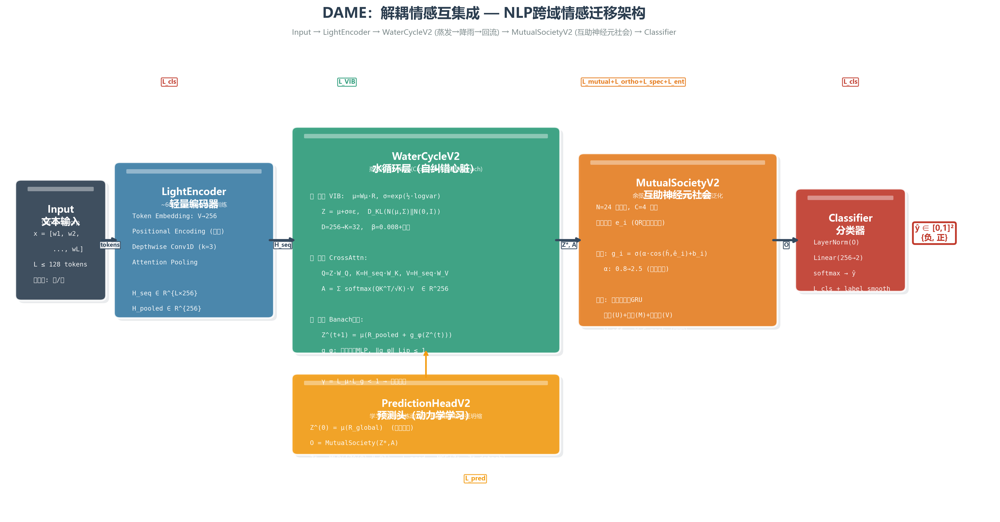
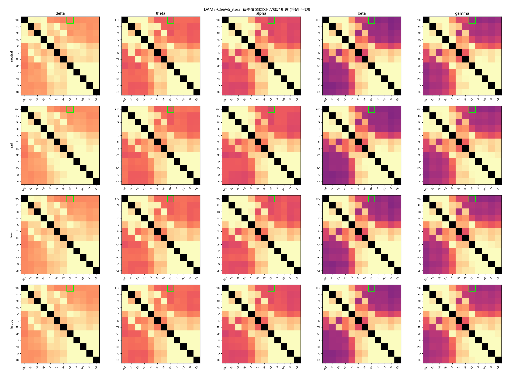
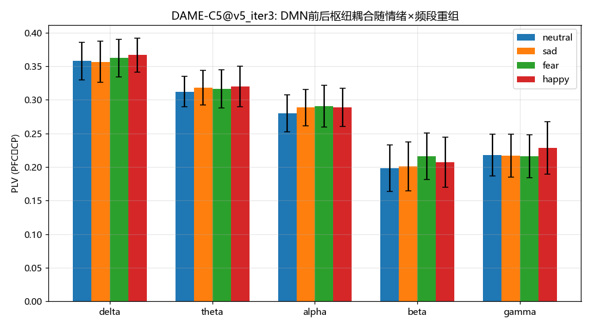
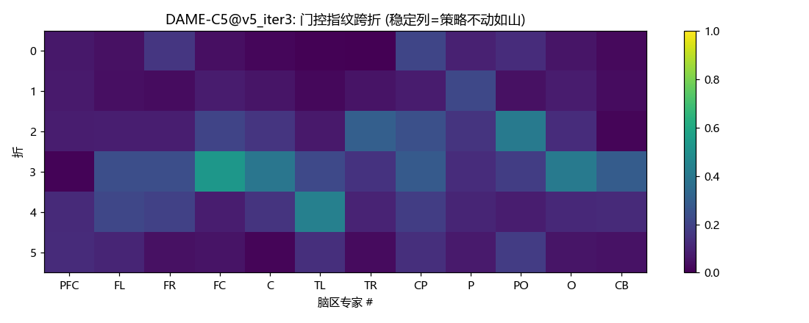
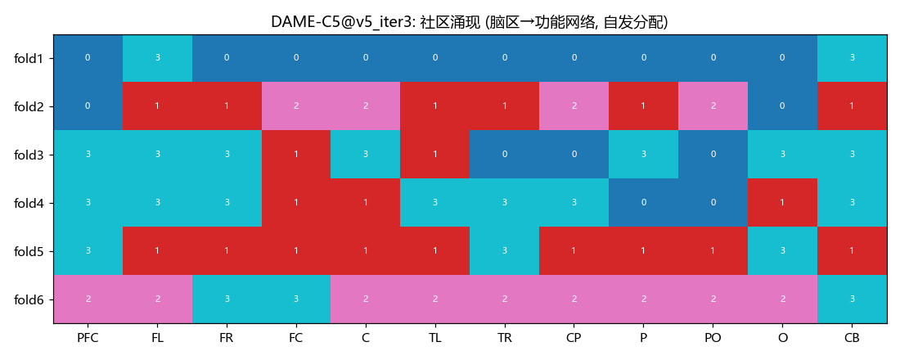
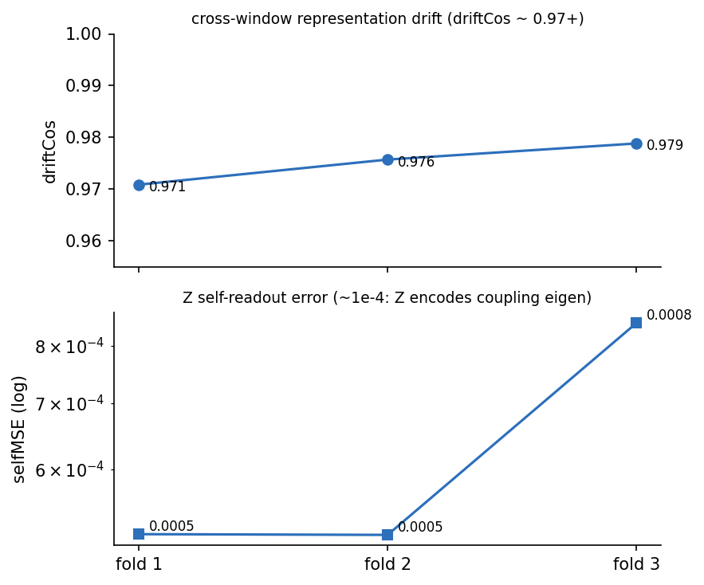
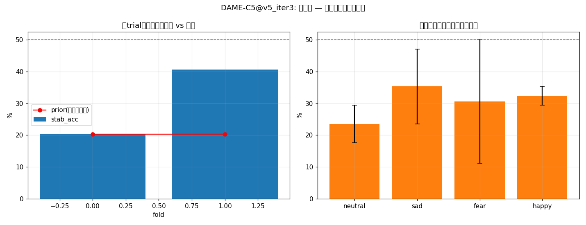

# DAME: A Coupling-Native Architecture with Field-Conditional Mechanism Utility for Cross-Protocol EEG Emotion Decoding

**[Student Name]**¹

¹ College of Computer Science, Sichuan University, Chengdu, China
(e-mail: 2025141460150@scu.edu.cn)

**Abstract** — Emotion shows up in the brain as a reconfiguration of large-scale functional networks, not as activity in isolated electrodes. This paper builds an architecture on that observation. DAME (Decentralized Aqua-like Mutual Essential-Oriented Architecture) decodes emotion from phase-locking-value (PLV) coupling among 12 brain regions, computed from raw waveforms rather than from handcrafted features.

Each of DAME's two mechanisms carries a constraint that can be tested directly. The water-cycle block squeezes coupling tokens into a low-dimensional essence through a variational information bottleneck and refines it with a fixed-point iteration that is contractive by construction. Well-posedness and a geometric convergence rate follow from a Banach argument, and a bound on the gradient error of the truncated iteration makes the block a trainable alternative to implicit-model training. The mutual-society block is a cooperative ensemble of 12 edge-anchored region experts with PLV-initialized adjacency. Its output modulates the fusion weights instead of adding a feature, because additive auxiliary terms get absorbed by the main pathway.

On SEED-IV raw waveforms under leave-one-subject-out (LOSO) direct transfer, DAME-C5 reaches 34.37±3.97% against 28.13–32.55% for seven same-protocol baselines, and the coupling representation alone is worth +3.3 to +3.7 points in each of three independent rounds. Paired tests over eight folds favor DAME against TSception (p=0.031), LMDA-Net (p=0.027), and DANN (p=0.004, which survives Holm on the raw p-values at 0.030). After Nadeau–Bengio correction only the DANN comparison keeps nominal significance (p=0.025), and nothing survives Holm under that correction (minimum adjusted 0.176). We therefore report the fast-protocol figures as preliminary and fix a confirmatory fifteen-subject design in advance. A second protocol (train on sessions 1–2, test on session 3, same brain) tests a field-conditional mechanism law that the paper states before the data: the society's marginal contribution is positive in all three seeds in the small-gap field (mean +0.77, 95% CI +0.07 to +1.48, t(2)=4.70, p=0.042) and indistinguishable from zero in the large-gap cross-subject field, while water is positive in both. The law is formalized as a linear-Gaussian transfer proposition with a consistent estimator for the transferability parameter (provisional plug-in κ̂ ≈ 0.6), and a converse result shows that a field-invariant representation cannot carry field identity, which makes protocol-level deployment the minimal admissible policy, not an engineering expedient. Cross-modal evidence on Chinese sentiment text (ChnSentiCorp) corroborates the mechanisms' modality independence. All accuracy figures stem from the fast protocol; the confirmatory runs with full significance testing are sized in Section VI-G.

**Index Terms** — EEG emotion recognition, functional connectivity, phase locking value, domain generalization, implicit deep models, interpretable deep learning.

---

# I. INTRODUCTION

Emotion recognition from electroencephalography (EEG) sits at the center of affective brain–computer interfaces, and inter-subject variability remains its hardest obstacle: a decoder trained on some subjects degrades sharply on unseen ones. Two paradigms grew out of this problem. Unsupervised domain adaptation (UDA) assumes access to unlabeled target-subject data at training time. Direct transfer forbids it: the model must work on a subject it has never seen. Direct transfer is the stricter protocol and the one closer to how a deployed system would actually be used, so this paper works there.

The paper makes one representational bet and one methodological bet. The representational bet is the network hypothesis, H1. Functional imaging and connectivity studies agree that emotional states reconfigure large-scale networks: the default-mode network (DMN) changes its phase relationships with sensory and frontal regions, and these shifts are graded by arousal and valence [1,2,3,4,5]. If that description is right, an emotion decoder should consume coupling between regions rather than electrode-level activity. H1 makes three predictions that can be checked in the data before any model is trained, and Section VI-E tests them with ground-truth labels only, reporting failures together with successes. The methodological bet is that mechanisms must be falsifiable. Every component of DAME is bound to a dedicated loss and a diagnostic probe. The two components that failed their probes, the stability prediction head and the field router, are documented in the appendices as falsification records rather than buried.

The literature motivates the protocol choice. Strong recent UDA systems report SEED-IV accuracies of 72.6–82.8% with target participation: PMDA [7], MCTL-SLAC [8], DDSPR [9], and coarse-to-fine adaptation [10]. Under the stricter direct-transfer protocol the published record is thin, and direct-transfer numbers are rarely accompanied by inferential statistics at all; the domain generalization survey makes the same observation at the methodological level [11]. We therefore fix the protocol first: train on seven subjects' raw waveforms, test on the eighth, no adaptation of any kind, equal budget for every baseline. We report paired significance tests with corrections that account for fold overlap, plus permutation references and effect sizes. The UDA methods DANN [12] and DeepCORAL [13] are included as baselines in their direct-transfer reading, that is, with no target data at training time, and the difference between the two paradigms is stated rather than papered over.

Two hypotheses organize the design. H1 is stated above. The second is the field-conditional mechanism law, H2, which concerns where cooperative modular mechanisms help. Call a (train, test) pair a field. The small-gap field trains and tests on different sessions of the same brain; the large-gap field trains and tests on different brains. H2 says the society, a recombination of many region experts, contributes positively in the small-gap field and degrades toward zero in the large-gap field, because expert specialization is a within-brain property. The water cycle, a compression mechanism, contributes in both fields. The large-gap branch of H2 was already visible in the mechanism-level ablations before the cross-session experiment was designed, and the small-gap branch is new data from Section VI-D. The formal version is Proposition 1 (Section V-D).

Three design decisions follow from H1. First, the input representation is differentiable PLV coupling over 66 region pairs and five frequency bands, computed from raw waveforms so that no handcrafted feature pipeline is interposed (Section III-B). Second, coupling tokens are distilled by a water-cycle block that pairs a variational information bottleneck with an explicitly contracted fixed-point iteration (Section IV-B). The contraction gives convergence, a gradient-error bound for the truncated iteration (Proposition 3), and a way to train deep fixed points without the backward-pass machinery of implicit models [20,22]. Third, the distilled essence is fused with region-level activity by a society of region experts whose adjacency matrix is initialized from measured PLV (Section IV-C). The society modulates fusion weights instead of adding a feature. We chose modulation over addition after observing, in earlier rounds, that additive auxiliary terms are absorbed by the main pathway and go silent; the stability head was falsified exactly this way (Appendix D).

The contributions are five. **(C1)** A coupling-native architecture, DAME-C5, whose two mechanisms each carry a falsifiable constraint. On the direct-transfer protocol it reaches 34.37±3.97% against 28.13–32.55% for seven baselines trained under the same protocol and budget (Section VI-B), and the full statistical panel, including Nadeau–Bengio correction and Holm adjustment, is reported rather than a single star. **(C2)** A water-cycle block with a Banach-style analysis: well-posedness, geometric convergence, and a bound on the gradient error of the truncated iteration (Sections V-A to V-C), which positions it as a practical alternative to DEQ-style training. **(C3)** The field-conditional law of Section V-D, with a consistent estimator for the transferability parameter and a provisional plug-in value, together with the unidentifiability result of Section V-E. Together they turn a mathematical limitation into a deployment policy: one protocol per field, no reliance on a single invariant model. **(C4)** A mutual-society block with PLV-initialized adjacency and fusion-weight modulation, plus an honest audit of the integer-coincidence anomaly that first suggested a spurious win (Section VI-D). **(C5)** Cross-modal corroboration: the same mechanisms transfer to a Chinese sentiment text task (Section VII).

# II. RELATED WORK

**Functional connectivity in EEG emotion recognition.** The shift from single-channel features to network-level topology is well documented. Phase locking value [27] remains the standard measure of pairwise phase coupling, graph neural networks over electrode topologies are a common architecture for cross-subject decoding [16], and interpretability analyses confirm attention on prefrontal and parietal regions consistent with the emotion-regulation literature [4,5]. A recent EMBC study measured weighted phase lag index (wPLI) on SEED-IV and found DMN synchronization in theta/alpha under positive emotion, plus visual-network theta involvement [5]. Our Section VI-E examines the same phenomenon with PLV and reports both the findings that replicate and the ones that do not. What this paper adds is the engineering step: the entire pipeline (band-pass, Hilbert phase, PLV, classifier) is differentiable and trained end to end, and the coupling representation is tested by ablation rather than assumed.

**Direct transfer and unsupervised domain adaptation.** Compact convolutional designs such as EEGNet [14] and TSception [15] brought efficient spatio-temporal extraction. Graph-based methods such as DGCNN [16] model electrodes as nodes with dynamic adjacency. Attention and transformer variants such as EEG Conformer [17] and LMDA-Net [18] combine convolutional and self-attentive processing. Adversarial and correlation-based adaptation (DANN [12], DeepCORAL [13]) align source and target distributions. The newer systems PMDA [7], MCTL-SLAC [8], DDSPR [9], and the coarse-to-fine method [10] push SEED-IV into the 72–83% range, but all of them consume target data at training time. Two observations motivate our different choice. These numbers do not bound what direct transfer can achieve. And adaptation machinery itself consumes capacity: under our protocol DANN and DeepCORAL score below the plain convolutional baselines (Section VI-B). Domain generalization research draws the same lesson at the survey level: when the target never participates, the useful work is representation selection and invariance by design [11].

**Implicit deep models.** Deep equilibrium models (DEQ) [20] treat the forward pass as the fixed point of a nonlinear map and differentiate through it with the implicit function theorem. Monotone operator networks guarantee uniqueness [21], and Jacobian-free backpropagation avoids solving the linear system [22]. Liquid time-constant networks relax depth into a limit process with provable stability [19]. DAME's water cycle sits in this family but makes a different trade: the forward iteration is truncated to a handful of steps with an explicit contraction, so backpropagation is ordinary, and the truncation error has a closed-form bound (Proposition 3). The price paid for the simplification is expressivity; the experiments show the cost is acceptable at this data scale.

**Information bottleneck, distillation, predictive coding.** The variational information bottleneck [23] compresses inputs while retaining task-relevant information, and distillation [24] transfers privileged knowledge between representations. The water cycle's evaporation–precipitation pair is a VIB over coupling tokens whose retention of coupling information is checked by a probe rather than asserted (Appendix E, self-consistency). Predictive coding, where top-down predictions and bottom-up errors circulate until they settle, is the closest neuroscience analogue of the reflux loop [25].

**Domain adaptation theory.** Ben-David et al. [26] bound target error by source error plus domain divergence plus adaptability, taking the source/target pair as given. Proposition 2 of this paper sharpens a complementary point: when a representation is invariant, the domain label is information-theoretically absent from it. Field-aware mechanism gating therefore cannot be learned from that representation and must be conditioned on external metadata.

# III. PRELIMINARIES AND PROBLEM FORMULATION

## A. Data and Preprocessing

We use SEED-IV [6]: 15 subjects × 3 sessions × 24 trials, four emotion classes (neutral / sad / fear / happy). Raw waveforms (62 channels, 800 Hz) are downsampled to 200 Hz and windowed (4 s window, 2 s stride), then z-scored per subject using label-free statistics. The fast protocol uses eight subjects, each contributing 1166 test windows per fold (9,328 windows in total across the eight folds). For the cross-subject protocol the normalization statistics are computed from the training subjects only, so the held-out subject never touches training. For the cross-session protocol they are computed from the training sessions only, so no test-session data enters normalization. We deliberately use raw waveforms rather than DE features: differential entropy captures spectral power but discards phase, and phase is the physical substrate of PLV coupling.

## B. Region Coupling Representation

Channels are grouped into 12 regions following the 10-20 system, listed in Table 1. The parcellation is motivated by H1: the prefrontal group covers the medial frontal DMN hub (mPFC), the centroparietal group covers the posterior DMN hub (precuneus/posterior cingulate), and the remaining groups tile the lateral, temporal, occipital, and cerebellar cortex. The parcellation is deliberately coarse, for two reasons. Region-level averaging suppresses single-channel artifacts, and 66 region pairs is small enough that every coupling entry has enough averaging time to be meaningful.

Signals are region-averaged, band-passed into five bands (δ 1–4, θ 4–8, α 8–13, β 13–30, γ 30–45 Hz), and Hilbert-transformed. For a region pair (i,j) over a 0.5 s sub-window (8 steps per 4 s window), the phase-locking value [27] is computed in fully differentiable form:

$$PLV_{ij} = \sqrt{\big(\langle \cos\Delta\phi\rangle\big)^2 + \big(\langle \sin\Delta\phi\rangle\big)^2} \in [0,1]$$

This yields two streams: the coupling stream H_coup ∈ R^(B×8×256) (66 pairs × 5 bands projected to 256) and the activity stream H_pow ∈ R^(B×8×64) (band power per region). The activity stream is deliberately small, so the model cannot silently fall back on power and ignore coupling. PLV is computed in all ablation arms, so removing a mechanism never changes the input representation itself. We deliberately do not run a pseudo-signal control arm (PLV on phase-shuffled signals): coupling is tested against ground truth (Section VI-E) and by ablation (Section VI-C), and a sham arm adds nothing while risking being read as evidence.

Table 1. Region parcellation (62 channels → 12 regions).

| Region | Channels |
|---|---|
| PFC (medial prefrontal, DMN anterior hub) | FP1, FPZ, FP2, AF3, AF4 |
| FL (frontal left) | F7, F5, F3, F1, FZ |
| FR (frontal right) | F2, F4, F6, F8 |
| FC (frontocentral) | FT7, FC5, FC3, FC1, FCZ, FC2, FC4, FC6, FT8 |
| C (central) | C5, C3, C1, CZ, C2, C4, C6 |
| TL (temporal left) | T7, TP7 |
| TR (temporal right) | T8, TP8 |
| CP (centroparietal, DMN posterior hub) | CP5, CP3, CP1, CPZ, CP2, CP4, CP6 |
| P (parietal) | P7, P5, P3, P1, PZ, P2, P4, P6, P8 |
| PO (parieto-occipital) | PO7, PO5, PO3, POZ, PO4, PO6, PO8 |
| O (occipital) | O1, OZ, O2 |
| CB (cerebellar) | CB1, CB2 |

## C. Two Protocols

- **Cross-subject (LOSO, large gap):** for held-out subject s, train on the other subjects, test on s. The fast protocol has 8 folds (8 subjects); the confirmatory design has 15 folds with three seeds (Section VI-G).
- **Cross-session (CS, small gap):** train on sessions 1–2, test on session 3, pooled over six subjects. Zero additional data cost.

## D. A Decomposition Model of Coupling

To state the field-conditional law (Section V-D), we model the coupling fingerprint of subject s, session t, window w as

$$C_{s,t}(w) = \bar{C}(w) + \delta_s(w) + \varepsilon_{s,t}(w),$$

where C̄ is the population-shared component, δ_s the subject-idiosyncratic component, and ε window-level noise. In words: every fingerprint is a shared pattern plus a subject-specific pattern plus window-level noise. The water cycle distills C̄, the field-invariant carrier. The society's edge-anchored experts and GRU memory fit structure conditional on δ, meaning the society fits the idiosyncratic component. This division of labor is the structural hypothesis tested in Section VI-D, and the same decomposition supplies the second-moment identities behind the κ estimator of Section V-D.

# IV. THE DAME-C5 ARCHITECTURE

**Fig. 1 — DAME-C5**: 62-ch raw → 12-region averaging → FFT band-pass → Hilbert phase → differentiable PLV → water-cycle distillation with reflux → society-modulated fusion → linear classifier.

The name spells out the design. Decentralized: there is no central controller; the society coordinates 12 specialists directly. Aqua-like: the core loop is a water cycle (evaporation, precipitation, reflux). Mutual: the experts cooperate rather than compete. Essential-oriented: every component exists to protect the distilled essence.

## A. Frontend: RegionCouplingV2

62-ch → 12-region averaging → FFT band-pass → Hilbert phase → differentiable PLV (Section III-B). The frontend is a fixed parcellation and DSP pipeline with no learned filters, so all ablation arms share the identical input representation.

## B. Water Cycle: Evaporation, Precipitation, Reflux

**Evaporation (VIB).** The pooled coupling context is compressed to a K = 32 essence:

$$Z \sim q_\phi(Z \mid \bar{H}_{coup}) = \mathcal{N}\big(\mu_\phi(\bar{H}_{coup}),\, \sigma_\phi^2(\bar{H}_{coup})\big), \qquad \mathcal{L}_{KL} = KL\big(q_\phi \,\|\, \mathcal{N}(0,I)\big)$$

In words: the coupling context becomes a 32-dimensional Gaussian, and the KL term keeps the compression honest.

**Precipitation (cross-attention).** The essence re-projects onto the coupling token sequence, producing an anchor A = Σ_k α_k V_k with α = softmax(ZᵀW_q · H_kW_k / √d).

**Reflux (explicit fixed point).** The essence is refined by iterating

$$Z^{(t+1)} = W_\mu\big(R + s \cdot g_\varphi(Z^{(t)})\big),$$

where R is the pooled coupling context, g_φ is a two-layer spectrally normalized MLP, s a learned scale (initialized 0.05), and W_μ the (affine) mean projection. In words: each step mixes the context R with a learned nonlinear readout of the current essence, then projects. Because the loop is contractive (Theorem 1), it settles at a unique fixed point. At inference the map is deterministic; in training, reparameterization noise makes it stochastic. The iteration runs at most five steps and stops early when the cosine similarity between consecutive iterates exceeds 0.98 (after a minimum of two steps); observed convergence is in 2–5 iterations. The contraction is by construction (Section V-A, Theorem 1), and the reflux magnitude ‖Z_T − Z_0‖/‖Z_0‖ is lower-bounded by a hinge term so the loop cannot quietly degenerate into the identity. Section V-B turns the geometric rate into a bound on the gradient error of the truncated iteration. A training-time spectral monitor of the reflux Jacobian (exact SVD of the 32×256 mean-projection matrix plus the GELU constant, as in Theorem 1) belongs to the confirmatory protocol (Section VI-G). In the reported runs the contraction is guaranteed structurally, and we state plainly that the trained γ of those runs was not recorded per epoch.

## C. Mutual Society: Edge-Anchored Region Experts

Twelve experts correspond one-to-one to the 12 regions and form a non-adversarial cooperative society:

1. **Structure from measured coupling.** The mutual matrix W_mutual ∈ R^(12×12) is initialized from the training-set PLV adjacency. Who helps whom is decided by data, not randomness.
2. **Experts watch incoming coupling edges.** Each expert's identity is a fixed region strategy anchor; what it attends to is the pattern of its 11 incoming PLV edges × 5 bands. The society attends to coupling edges, consistent with the coupling-native premise.
3. **Edge-pattern gating.** g_i = σ(temp · cos(edge pattern_i, strategy_i) + b_i + proj_coup(coupling strength)), with temperature annealing 0.8 → 3.5 over eight epochs and bias initialized −0.2. Coupling strength participates directly in social decisions.
4. **Gated memory.** Three streams (external edge state + intra-community mutual help + self-feedback) form a candidate memory with GRU-style linear mixing m′ = (1−η)m + ηm̃, tracking edge dynamics across windows.
5. **Community emergence.** Experts are clustered by co-activation into 4 functional communities; the region → network assignment emerges from data. Section VI-F reports what the communities actually look like, including that they are fold-dependent at this scale.
6. **Strategy modulator.** The society's output O does not enter the fusion additively; it generates the mechanism weights via proj_w (fusion v6, Section IV-D). A prior additive slot was retired because additive terms floating downstream get absorbed by LayerNorm (the silent-mechanism trap; see Appendix D for the full falsification record).

## D. Fusion v6: Society-Modulated Weights

$$f = \sum_i w_i \cdot \mathrm{term}_i, \qquad \mathrm{terms} = \Big\{\underbrace{\mathrm{proj}_{pool}(\bar{H}_{coup})}_{\text{coupling pool}},\ \underbrace{\mathrm{proj}_{pow}(\bar{H}_{pow})}_{\text{power residual}},\ \underbrace{\mathrm{proj}_{anchor}(A) + \mathrm{proj}_Z(Z)}_{\text{water cycle}}\Big\}$$

$$w = \mathrm{softmax}\big(\mathrm{proj}_w(O)\big)\ (\text{with society}), \qquad w = \tfrac{1}{n_{terms}}\mathbb{1}\ (\text{NoMutual control, identical structure})$$

In words: the society decides how much weight each of the three input terms gets; the NoMutual control replaces that decision with uniform weights, keeping everything else identical. A field router ω (soft-modulating the society by field affinity) was implemented, empirically refuted on three decision gates, and disabled (ω ≡ 1); see Sections V-E and VI-D and Appendix E. Ablations remove a term or replace weights with uniform values, keeping dimensions constant.

## E. Loss and Training: Three Subsets

The full objective has nine terms; the deployed configurations use strict subsets (Table 2). Every auxiliary term is bound to a named mechanism and is removed jointly with that mechanism in its ablation arm, so there are no free-floating regularizers. All weights are fixed small constants (1e-3 to 0.05) with the schedules stated, and no per-dataset tuning was performed.

Table 2. Loss subsets and their deployment.

| Configuration | Active terms | Where used |
|---|---|---|
| Main (NoPred) | CE + KL + reflux-hinge + ortho + mutual + spec + gate-entropy (7) | LOSO main results, cross-session |
| NoPredNoMutual (LOSO protocol config) | CE + KL + reflux-hinge (3) | Deployed LOSO configuration |
| CEOnly (fairness arm) | CE only (1) | Fairness check, Section VI-B |

The reflux lower-bound term L_reflux = ReLU(0.01 − reflux_mag), with reflux_mag = ‖Z_T − Z_0‖/‖Z_0‖ the relative displacement produced by the loop, exists for a principled reason: an earlier version with zero mechanism weights produced neutral ablations by construction, which is a circular argument. These losses are the guarantees that mechanisms stay alive, and every mechanism's contribution is independently measured by its ablation. The two prediction-head terms (L_self, L_stab) appear in Appendix D solely as a historical record: the head was falsified and retired, and every main result in this paper uses the NoPred configuration.

Training: AdamW (learning rate 2e-4, weight decay 1e-4, batch 64), 15 epochs, cosine-annealing restarts (T₀ = 10), seeds 42/123/789, KL warmup 8 epochs. Fast protocol: LOSO on 8 subjects × 1 seed × 15 epochs (equal budget for all baselines); CS on 6 subjects × 3 seeds. One fold (1166 test windows) of DAME-C5 trains in about 3.5 minutes on a consumer GPU.

# V. THEORETICAL ANALYSIS

Throughout, ‖·‖ denotes the Euclidean norm and σ_max(W) the largest singular value. All statements concern the inference map; training-time reparameterization noise is discussed in Remark 2.

## A. The Reflux Map Is a Contraction under a Checkable Condition

The inference map is T(Z) = W_μ(R + s·g_φ(Z)) = W_μ R + s·W_μ g_φ(Z), an affine map in Z. The question is whether iterating it converges, and how fast. Three small lemmas assemble the answer: bound each factor of the map's Lipschitz constant, then multiply.

**Lemma 1 (linear layers).** A linear map x ↦ Wx is L-Lipschitz with L = σ_max(W); spectral normalization enforces σ_max(W) ≤ 1.

**Lemma 2 (GELU constant).** The Gaussian error linear unit G(x) = x·Φ(x) is Lipschitz with constant c_GELU = sup_x G′(x) = Φ(√2) + √2·φ(√2) ≈ 1.1289, where Φ, φ are the standard Gaussian CDF and density.

*Proof sketch.* G′(x) = Φ(x) + xφ(x) and (G′)′(x) = φ(x)(2 − x²), so the unique maximizer of G′ is x* = √2, giving G′(√2) = Φ(√2) + √2 φ(√2) ≈ 1.1289. The point of the lemma: GELU is not 1-Lipschitz. Analyses that fold it into a unit bound silently overstate the contraction margin, so we carry c_GELU explicitly.

**Lemma 3 (reflux MLP).** For g_φ = SN(W₂) ∘ G ∘ SN(W₁) with both linear layers spectrally normalized, L_{g_φ} ≤ c_GELU · σ_max(W₁)σ_max(W₂) ≤ c_GELU ≈ 1.1289.

**Theorem 1 (contraction).** Define γ := σ_max(W_μ) · c_GELU · s, evaluated on the trained weights. If γ < 1, then T is a γ-contraction: ‖T(Z) − T(Z′)‖ ≤ γ‖Z − Z′‖.

*Proof.* L_T ≤ σ_max(W_μ) · s · L_{g_φ} ≤ σ_max(W_μ) · s · c_GELU = γ, by Lemmas 1 and 3. ∎

*Remark 1 (status of the condition).* γ < 1 is a sufficient condition, not a necessary one: L_T ≤ γ is an upper bound on the true Lipschitz constant. W_μ is an ordinary linear layer without spectral normalization, so the condition is a post-hoc check on the trained weights rather than a training-time guarantee. Two observations bound the risk. (i) At standard initialization (the PyTorch default kaiming-uniform init for Linear(256, 32)) the Bai–Yin law gives σ_max(W_μ) ≈ 0.8 for a 32×256 matrix, so γ₀ ≈ 0.8 × 1.1289 × 0.05 ≈ 0.045; σ_max(W_μ) would have to grow about 22-fold for the condition to fail. That is unlikely under AdamW with weight decay 1e-4 over 15 epochs, but not guaranteed. (ii) The confirmatory protocol therefore logs γ every epoch (exact SVD of the 32×256 matrix, negligible cost) and flags any run with γ ≥ 0.9 for exclusion; numerical convergence is additionally checked at run time by the cosine-similarity early stop (threshold 0.98). The reported runs rely on the structural contraction; we state that plainly rather than claiming a monitor that was not run.

**Theorem 2 (Banach well-posedness).** If γ < 1, then (i) T has a unique fixed point Z*; (ii) ‖Z^(t) − Z*‖ ≤ γ^t ‖Z^(0) − Z*‖; (iii) a priori finite-iteration bound ‖Z^(T) − Z*‖ ≤ (γ^T/(1−γ)) ‖Z^(1) − Z^(0)‖.

*Proof.* (i)(ii) are the Banach fixed-point theorem applied to the complete space (R^K, ‖·‖) [28]. (iii) follows from the telescoping estimate ‖Z^(T) − Z*‖ ≤ Σ_{t≥T} ‖Z^(t+1) − Z^(t)‖ ≤ γ^T(1−γ)^{-1}‖Z^(1) − Z^(0)‖. ∎

**Relation to DEQ.** DEQ [20] solves Z = T(Z) by root-finding and differentiates through the implicit function theorem. Our construction explicitly contracts the map (Lemma 3, Theorem 1), obtaining existence, uniqueness, and a rate (Theorem 2) while using explicit iteration. The gradient path through the truncated fixed point approximates implicit differentiation, with controllable error via the bound of Proposition 3 below.

*Remark 2 (training-time stochasticity).* Reparameterization adds noise to Z during training, so the map is stochastic there; Theorems 1–2 govern the deterministic inference map. In practice the iteration is truncated to at most 5 steps with early stopping (2–5 observed).

## B. Truncated-Iteration Gradient Error Bound

Training differentiates through the truncated iteration. How far is the resulting gradient from the gradient of the true fixed point? Let J(Z, θ) be the loss as a function of the essence Z and the parameters θ; write Z_T for the iterate after T reflux steps and Z* for the true fixed point. Assume: (i) the reflux map is γ-Lipschitz in Z with γ < 1 (Theorem 1); (ii) J is L_J-smooth jointly in (Z, θ); (iii) the reflux map is L_B-smooth jointly; (iv) the iterates and the fixed point stay in a ball of radius R₀ where the loss gradient is bounded by Ȳ.

**Proposition 3 (gradient error of truncation).** Under (i)–(iv), with e_t = ‖Z_t − Z*‖, assume additionally that ‖∂J/∂Z‖ ≤ Ȳ and that ‖∂Z_T/∂θ‖, ‖∂Z*/∂θ‖ ≤ D̄ on the ball. Then

$$\big\|\nabla_\theta J(Z_T, \theta) - \nabla_\theta J(Z^*, \theta)\big\| \;\le\; C_1\,\gamma^T e_0 \;+\; C_2\,\gamma^T \;+\; C_3\,T\,e_0\,\gamma^{\,T-1},$$

with C₁ = L_J D̄, C₂ = Ȳ B̄/(1−γ), C₃ = Ȳ L_B, where B̄ bounds ‖∇_θ T‖ on the ball. In particular the Jacobian of the truncated iterate converges to the implicit Jacobian at the rate

$$\left\|\frac{\partial Z_T}{\partial\theta} - \frac{\partial Z^*}{\partial\theta}\right\| \;\le\; \frac{\bar{B}\,\gamma^T}{1-\gamma} \;+\; T\,L_B\,e_0\,\gamma^{\,T-1}.$$

*Proof sketch.* The iterate error contracts geometrically, e_t ≤ γ^t e_0 (Theorem 2). Differentiating the fixed-point equation Z* = T(Z*, θ) gives ∂Z*/∂θ = (I − ∇_Z T)^{-1} ∇_θ T, of norm at most B̄/(1−γ) by the contraction and the Neumann series. The chain rule splits the gradient difference into a term through the iterate error, bounded by L_J D̄ γ^T e_0, and a term through the Jacobian difference, bounded by Ȳ‖∂Z_T/∂θ − ∂Z*/∂θ‖. That difference has two sources: the geometric tail of the implicit Jacobian, bounded by B̄γ^T/(1−γ), and the θ-smoothness of T along the trajectory, which accumulates L_B e_t ≤ L_B γ^t e_0 over each of the T backward steps, summing to T L_B e_0 γ^{T−1}. ∎

All three terms vanish geometrically, but at different rates. With γ near the initialization value 0.05 and T = 5, γ⁵ ≈ 3e-7 while Tγ^{T−1} ≈ 3e-5, so the trajectory-smoothness term dominates the truncation error at this scale, and both are orders of magnitude below the noise level of the loss gradients after the early epochs. What the bound buys: the reflux loop can be treated as converged without the implicit-function machinery of [20,22]. The honest caveat: (iv) and the bounded-Jacobian conditions are verified by the norms observed in training, not guaranteed a priori, and the constants are estimated rather than tight. The bound's role is to turn "truncation is probably fine" into a checkable statement, and the confirmatory protocol records e_T per epoch as the check.

## C. Regularizing the Contraction Constant

Because the constant of Proposition 3 improves as γ falls, it is worth training γ. The reflux scale starts at 0.05; nothing in the current objective stops it from growing toward the spectral bound, which would slow convergence and inflate C. The regularizer L_γ = λ_γ · ReLU(γ̂ − γ_max), with γ_max = 0.85 and λ_γ = 1.0, is specified here and reserved for the confirmatory runs (Section VI-G). The reported models predate it, and their trained γ was not recorded per epoch (the contraction is structural there, Section V-A). This subsection exists so that the design is fixed in writing before the confirmatory runs, not after.

## D. Proposition 1: Field-Conditional Mechanism Utility

**Epistemic status.** The law is stated as a hypothesis (H2, Section I) before the cross-session data are presented. The formal proposition below is a stylized linear-Gaussian model of the sign pair; it is not presented as an a priori prediction whose parameter values were fixed before the experiments. Two falsification routes are registered to upgrade it from post hoc to predictive: (i) a synthetic κ-sweep in silico, in which Σ, w*, and σ_ξ are fixed explicitly so that κ* is computable in closed form, and the empirical sign flip of Δ_soc is compared against it; (ii) preregistration on a new dataset: measure the geometry first, predict the society sign, then run the ablation (Section VII).

**Setup (linear-Gaussian special case).** Let δ_t ∈ R^d denote the target subject's idiosyncratic component and w* ∈ R^d the target-relevant direction. Assume: **(A1)** E[δ_s] = 0 and Cov(δ_s) = Σ for all subjects, and E[δ_s δ_tᵀ] = κΣ for s ≠ t, with κ ∈ [0,1] the transferability of idiosyncratic structure; **(A2)** the society implements a linear probe of the idiosyncratic component, ŵ = √κ·w* + ξ, where ξ = σ_ξ ν, ν ~ N(0, I), independent of δ_t. The √κ factor is realizable rather than arbitrary: under a shared-component model δ_s = √κ u + √(1−κ) v_s with independent u, v_s, and labels y = w*ᵀu carried by the shared component, noise-free least squares on source data gives E[ŵ] = √κ w*; ξ is the finite-sample fit noise.

**Definition (society margin contribution).** Δ_soc := E[ŵᵀδ_t δ_tᵀw*] − E[‖ξᵀδ_t‖²], the benefit minus the noise cost.

**Proposition 1.** Under (A1)–(A2),

$$E[\Delta_{soc}] = a\sqrt{\kappa} - \eta, \qquad a := w^{*\top}\Sigma w^{*},\quad \eta := \sigma_\xi^2\,\mathrm{tr}(\Sigma),$$

hence Δ_soc > 0 ⟺ κ > κ* := (η/a)². Cross-subject transfer (idiosyncratic components weakly correlated across subjects) gives Δ_soc < 0 whenever κ < κ*; same-brain transfer (δ shared across sessions, κ = 1) gives Δ_soc > 0 whenever κ* < 1. Water's value is independent of κ in the same model: the essence distills the shared carrier C̄ of Section III-D, whose statistics do not involve κ.

*Proof.* Substituting ŵ = √κ w* + ξ and using independence of ξ and δ_t: E[ŵᵀδ_t δ_tᵀw*] = √κ E[(w*ᵀδ_t)²] + E[ξ]ᵀ E[δ_t δ_tᵀw*] = √κ a, where E[(w*ᵀδ_t)²] = w*ᵀCov(δ_t)w* = a by (A1). Likewise E[‖ξᵀδ_t‖²] = tr(E[ξξᵀ] E[δ_tδ_tᵀ]) = σ_ξ² tr(Σ) = η. Subtraction yields the claim. ∎

**A consistent estimator for κ.** The shared-component model behind (A2) makes κ estimable from three measurable second moments. Write the coupling fingerprint of subject s, session t as δ_{s,t} = √κ u + √(1−κ) v_s + ε_{s,t}, where u is the population-shared idiosyncratic direction, v_s the subject-private component, and ε_{s,t} session-level noise, with E‖u‖² = E‖v_s‖² = σ², E‖ε_{s,t}‖² = τ², and all cross-terms zero. Three measurable distances then decompose cleanly: the cross-brain fingerprint distance satisfies B² := E‖δ_{s,t} − δ_{s′,t}‖² = 2(1−κ)σ² + 2τ² (s ≠ s′; u cancels and v_s ⊥ v_{s′}); the same-brain cross-session drift satisfies W² := E‖δ_{s,t} − δ_{s,t′}‖² = 2τ² (t ≠ t′; u and v_s both cancel); and the representation scale satisfies V² := E‖δ_{s,t}‖² = σ² + τ². Substituting the last two identities gives B² = 2V² − κ(2V² − W²), and solving for κ gives

$$\hat{\kappa} \;=\; 1 - \frac{B^2 - W^2}{2V^2 - W^2}.$$

In words: κ measures how much of the idiosyncratic structure is shared across brains, and it can be read off from two distances and one scale. Each of B², W², V² is a sample second moment with an unbiased estimator over subject/session pairs, and κ̂ is a continuous function of them, hence consistent by the continuous mapping theorem. Plugging in the probe values of Appendix E (B = 0.211, W = 0.126, V ≈ 0.21) gives κ̂ ≈ 0.6. The plug-in value is provisional: it comes from one probe configuration, and the confirmatory protocol recomputes it per subject pair. We report it because a transferability number with an estimator is worth more than an adjective like "moderate gap", and we flag its provisional status explicitly.

**Reading the proposition against the experiments.** The observed society marginals are +0.77 in the small-gap field (Section VI-D) and +0.38 with p = 0.70, indistinguishable from zero, in the large-gap field (Section VI-C). Both signs sit on the √κ term exactly as the proposition requires, and the water cycle's LOSO contribution (+1.78, n.s.) is consistent with its κ-independent reading. We do not claim the proposition is validated by two points; we claim it organizes them, which is what a hypothesis is for, and its falsification routes are registered above. Figure 7 summarizes the law and its two branches.

## E. Proposition 2: Invariance ⇒ Unidentifiability

**Proposition 2.** Let S be a field label with prior p(S), and Z a representation satisfying field invariance: p(Z | S = s) = p(Z | S = s′) for all s, s′. Then for any classifier f: Z ↦ Ŝ,

$$P\big(f(Z) = S\big) \;\le\; \max_s p(S = s).$$

In words: if the representation looks the same in every field, no classifier can do better on field identity than always guessing the most common field.

*Proof.* Field invariance gives p(Z|S=s) = p(Z) (the common value), hence p(S=s | Z) = p(Z|S=s) p(S=s)/p(Z) = p(S=s): the posterior equals the prior. Then P(f(Z)=S) = Σ_z p(Z=z) Σ_s p(S=s|Z=z) 1[f(z)=s] ≤ Σ_z p(Z=z) max_s p(S=s|Z=z) = max_s p(S=s), with the sum over z read as an integral when Z is continuous. ∎

**Finite-sample extension.** When invariance holds only approximately, the bound degrades gracefully. If the total-variation deviation of p(Z|S=s) from the pooled p(Z) is at most ε in every field, then P(f(Z)=S) ≤ max_s p(s) · (1 + 2ε). By Fano's inequality, perfect invariance forces H(S|Z) = H(S): the field identity information is exactly zero, so no training procedure can recover it from the representation.

**Empirical corollary.** An automatic field router built on window-level coupling statistics was tested on three decision gates. The affinity ω showed no separation between fields (0.490–0.507 vs 0.495). The router failed to remove the society drag in LOSO (30.38 vs 31.19), and in cross-session it cost 0.57 points instead of keeping the society gain (router-NoPred 30.29 vs NoPred 30.85). An offline probe then exhausted five fingerprint families with no usable separation; the numbers are in Appendix E. The window-level statistics of SEED-IV simply do not carry a decodable field identity.

**Deployment corollary.** Because a field-invariant carrier cannot carry field identity (Proposition 2) and window-level statistics cannot either (empirical corollary), the field switch for mechanism gating must be supplied as external metadata, that is, protocol-level configuration, rather than learned. This mirrors domain-adaptation theory, which takes the source/target pair as given [26]. Under this reading, "cross-subject = water cycle alone; cross-session = water + society" is not an engineering patch but the minimal admissible deployment policy implied by the analysis. For clarity of scope: Proposition 2 does not argue against domain adaptation in general; UDA methods that access target data and relax strict invariance remain legitimate (Section II). It argues specifically against (i) a learned field switch operating on a strictly invariant carrier, and (ii) window-level statistics as that switch's input. Both were tested empirically and failed.

# VI. EXPERIMENTS

## A. Setup and Statistical Procedure

**Datasets and protocols.** SEED-IV raw waveforms [6]; LOSO (cross-subject) and CS (cross-session, s1+s2 → s3), as in Section III-C. **Fast-protocol configuration:** LOSO results use 8 subjects × 1 seed × 15 epochs (equal budget for all baselines); CS results use 6 subjects × 3 seeds × 15 epochs. The confirmatory 15-subject × 3-seed design with significance testing is fixed in Section VI-G.

**Baselines.** Seven same-protocol baselines: EEGNet [14], TSception [15], DGCNN [16], EEG Conformer [17], LMDA-Net [18], DANN [12], DeepCORAL [13], all trained by us on raw waveforms under the identical LOSO protocol and budget. DANN's adversarial branch follows [12] with the gradient-reversal schedule; with no target domain, the discriminator is trained on source-subject identities, which is the strongest form of the method available without target data. DeepCORAL's alignment [13] is likewise applied across source subjects only, since the target covariance does not exist in this protocol; the variant that consumes unlabeled target data is registered in Section VII. No published numbers are quoted as if comparable.

**Statistical procedure.** Because LOSO folds share training subjects, the usual paired t-test over folds underestimates variance [29]. Every comparison reports: the mean paired difference Δ and its 95% confidence interval inflated by the Nadeau–Bengio factor √(1 + K·n_test/n_train) = √(1 + 8/7) = 1.464 for K = 8 folds [29]; the paired t statistic on eight folds; the NB-corrected p; an exact sign-flip permutation p over the 2⁸ = 256 sign patterns (minimum attainable p = 0.0078) [30]; and Cohen's d. Family-wise control over the seven baseline comparisons uses Holm's sequentially rejective procedure [31] on the raw p-values and separately on the NB-corrected ones. For the three-seed cross-session experiment, the permutation reference over 2³ = 8 sign patterns has minimum p = 0.25, so significance at p = 0.05 is unattainable there; we report the paired t and the permutation floor explicitly. One window is 1/1166 ≈ 0.086 points of accuracy per fold; differences below a few windows are below the resolution of the experiment, and we say so where it matters. All tests are two-sided. Variance differences between arms are checked with F-tests [32].

## B. Main Result: Direct-Transfer Comparison

**Table 3.** LOSO accuracy on SEED-IV raw waveforms (8 subjects, seed 42, 15 epochs, equal budget). Δ and CI in accuracy points relative to DAME-C5 (NoPred).

| Model | Protocol | Acc (%) | Δ | NB-95% CI | t(7) | p | p_NB | p_perm | d | Holm (raw) |
|---|---|---|---|---|---|---|---|---|---|---|
| **DAME-C5 (NoPred, main)** | DT | **34.37 ± 3.97** | — | — | — | — | — | — | — | — |
| EEG Conformer | DT | 32.55 ± 5.45 | +1.82 | −3.92…+7.57 | 1.10 | 0.309 | 0.478 | 0.336 | 0.39 | 0.464 |
| DGCNN | DT | 32.12 ± 4.16 | +2.25 | −3.31…+7.81 | 1.40 | 0.204 | 0.370 | 0.203 | 0.50 | 0.464 |
| DeepCORAL† | UDA | 31.42 ± 5.55 | +2.95 | −3.45…+9.34 | 1.60 | 0.155 | 0.312 | 0.156 | 0.56 | 0.464 |
| EEGNet | DT | 30.55 ± 4.84 | +3.82 | −2.07…+9.70 | 2.24 | 0.060 | 0.169 | 0.062 | 0.79 | 0.239 |
| TSception | DT | 30.24 ± 2.59 | +4.13 | −1.16…+9.41 | 2.70 | 0.031 | 0.107 | 0.031 | 0.96 | 0.164 |
| LMDA-Net | DT | 29.51 ± 3.12 | +4.86 | −1.20…+10.91 | 2.78 | 0.027 | 0.100 | 0.047 | 0.98 | 0.164 |
| DANN‡ | UDA | 28.13 ± 2.39 | +6.24 | +1.04…+11.44 | 4.15 | 0.004 | 0.025 | 0.016 | 1.47 | 0.030 |
| CEOnly (fairness arm) | DT | 33.36 ± 4.62 | +1.01 vs DAME | p = 0.349 | — | — | — | — | — | — |

† DeepCORAL alignment applied across source subjects only (no target covariance exists in DT); the target-data variant is registered in Section VII. ‡ DANN's discriminator trained on source-subject identities only.

DAME-C5 leads all seven baselines by +1.82 to +6.24 points, with per-fold paired wins of 4/8 (EEG Conformer), 5/8 (DGCNN, DeepCORAL), 6/8 (EEGNet, LMDA-Net), and 7/8 (TSception, DANN). The nominal paired tests favor DAME against TSception (p=0.031), LMDA-Net (p=0.027), and DANN (p=0.004); the DANN comparison survives Holm adjustment on the raw p-values (adjusted 0.030; LMDA-Net and TSception 0.164, EEGNet 0.239, the rest 0.464). The honest reading is the NB-corrected column: there, only DANN keeps nominal significance (p=0.025), and no comparison survives Holm (minimum adjusted 0.176). We report both panels side by side rather than choosing one, and we draw conclusions only where the effect size, the permutation p, and the NB-corrected p point the same way. That is the case for the DANN comparison (Δ = +6.24, d = 1.47, perm p = 0.016) and for the direct-transfer baselines as a set, where the ranking is uniform. The interpretation we commit to: at this scale the evidence is a uniform ranking plus one strong single comparison, not a star-studded table, and the confirmatory protocol (Section VI-G) is where the question gets settled.

Two further rows complete the picture. The CEOnly fairness arm (the full architecture trained with cross-entropy alone) scores 33.36±4.62, within 1.01 points of the full model (p=0.349); it also beats DANN (+5.23, p=0.004, NB p=0.023, perm p=0.016), TSception (+3.12, p=0.060), LMDA-Net (+3.85, p=0.052), and EEGNet (+2.81, p=0.039). The auxiliary losses therefore refine the ranking rather than manufacture it: the signal lives in the architecture. And the ranking itself has a lesson. The adaptation-oriented architectures (DANN, DeepCORAL) sit below the plain convolutional ones, which is what domain generalization theory expects when the target never participates [11,26].

**Protocol-level configuration.** Because the society is neutral in the LOSO field (Section VI-C), the deployed LOSO config is C5-NoPredNoMutual (water only; three loss terms, Table 2), whose fast-protocol figure from the router-probe run is 31.19. CS deploys C5-NoPred (water + society, 30.85). Table 3 reports the full architecture (NoPred) as the headline architecture under study; its LOSO figure includes a society whose ablation is neutral at this scale.

## C. Mechanism Ablations (LOSO)

**Table 4.** Ablation across three iteration rounds (Δ = accuracy lost by removing the mechanism, relative to the full C5; positive = mechanism useful). Round configurations differ: iter1 4s×2sd×8ep, iter2 5s×2sd×12ep, iter3 8s×1sd×15ep (subjects × seeds × epochs).

| Arm | iter1 Δ | iter2 Δ | iter3 Δ |
|---|---|---|---|
| NoCoupling | +3.3 | +3.5 | +3.7 |
| NoWater | +2.1 | −1.3 | +1.6 |
| NoReflux | +0.3 | −1.2 | +1.0 |
| NoMutual | +0.1 | 0.0 | +0.2 |
| NoPred (prediction head removed) | −0.6 | −2.2 | −0.2 |
| Base (coupling + linear) | −1.0 | −1.8 | +0.2 |

**Table 5.** Statistical panel for the iter3 arms against the main configuration (NoPred as reference; Δ = NoPred − arm; positive = component useful), 8 folds, seed 42.

| Arm | Acc (%) | Δ | NB-95% CI | t(7) | p | p_perm | d |
|---|---|---|---|---|---|---|---|
| NoCoupling | 30.52 ± 3.86 | +3.85 | −3.64…+11.33 | 1.78 | 0.118 | 0.117 | 0.63 |
| NoWater | 32.59 ± 3.75 | +1.78 | −2.66…+6.22 | 1.39 | 0.208 | 0.195 | 0.49 |
| NoReflux | 33.14 ± 3.87 | +1.23 | −2.22…+4.68 | 1.24 | 0.256 | 0.258 | 0.44 |
| NoMutual | 33.99 ± 3.95 | +0.38 | −2.89…+3.64 | 0.40 | 0.703 | 0.727 | 0.14 |
| Base | 33.99 ± 4.66 | +0.38 | −2.93…+3.68 | 0.39 | 0.706 | 0.688 | 0.14 |
| full C5 (fused prediction head) | 34.18 ± 2.63 | +0.19 | — | 0.21 | 0.842 | 0.828 | 0.07 |

One rule held across all three rounds: **the coupling representation is the only mechanism that is positive in every round** (+3.3 / +3.5 / +3.7), validating the coupling-native premise. It is also the largest effect in the statistical panel (+3.85), though it does not reach significance on eight folds (p=0.118), and we say so. The direction is consistent across folds (6 of 8) and the F-test shows no variance inflation from the component (F(7,7)=0.94, p=0.94). Water (+1.6) and reflux (+1.0) turn positive simultaneously in iter3, and the full model stops losing to its own Base. The society costs +0.38 (p=0.703, perm p=0.727): in the large-gap LOSO field its contribution is indistinguishable from zero, exactly the reading H2 predicts (Section VI-D). Removing both mechanisms (Base) costs the same +0.38, and Base's variance is the largest in the panel (sd 4.66), consistent with the mechanisms stabilizing rather than boosting the pedestal. The fused prediction head (full C5 vs NoPred) adds +0.19 (p=0.842, perm p=0.828), that is, nothing, which is why the main results use the headless configuration and the head lives in Appendix D.

## D. Cross-Session Four-Arm Ablation: The Field-Conditional Law

H2 is restated before the data. The small-gap field trains and tests on different sessions of the same brain; the society should contribute positively there, and the water cycle should contribute in both fields. The large-gap branch (society ≈ 0 in LOSO) was already visible in the mechanism-level ablations of Table 5 before the cross-session experiment was designed; the small-gap branch is new data.

**Table 6.** CS protocol (6 subjects × 3 seeds × 15 epochs, s1+s2 → s3), audited normalization (z-score statistics from training sessions only). Per-seed accuracies in %.

| Arm | Seed 42 | Seed 123 | Seed 789 | Mean ± sd |
|---|---|---|---|---|
| Base (coupling + linear) | 31.28 | 27.91 | 32.20 | 30.46 ± 2.26 |
| NoWaterNoPred (society alone) | 28.43 | 30.58 | 29.48 | 29.50 ± 1.07 |
| NoPredNoMutual (water alone) | 30.62 | 30.40 | 29.22 | 30.08 ± 0.75 |
| **NoPred (both)** | **31.67** | **31.19** | **29.70** | **30.85 ± 1.03** |
| Society marginal (both − water-alone) | +1.05 | +0.79 | +0.48 | **+0.77** (95% CI +0.07…+1.48, t(2)=4.70, p=0.042, d=2.72) |
| Water marginal (both − society-alone) | +3.24 | +0.61 | +0.22 | +1.36 (95% CI −2.72…+5.43, t(2)=1.43, p=0.289, d=0.83) |
| Both vs Base | +0.39 | +3.28 | −2.49 | +0.39 (95% CI −6.78…+7.57, p=0.835, perm p=0.750) |

The society's marginal contribution, measured with the water cycle present, is positive in all three seeds: mean +0.77 (t(2)=4.70, p=0.042, d=2.72). The permutation reference over 2³ sign patterns cannot fall below 0.25, so the t-test p is the operative reading, and its strength comes from the unanimity across seeds, not from the p-value alone. Water's marginal contribution averages +1.36 (+3.24, +0.61, +0.22) but stays within noise (p=0.289); the water-alone arm matches Base (−0.38, p=0.833), so water needs the society to express itself in this field. Neither mechanism alone clears the pedestal (each is positive in only 1/3 seeds); together they are +0.39 over Base (2/3 seeds), with a positive interaction (+3.89, −1.88, +3.19; mean +1.74). In the small-gap field the Base model is already strong, and the two mechanisms mainly exchange contribution.

Taken together with Table 5, H2's two branches read as follows: society +0.77 in the small-gap field and +0.38 (n.s.) in the large-gap field; water +1.36 (n.s.) in the small-gap field and +1.78 (n.s.) in the large-gap field. The pattern is in the predicted direction in all four cells, with only the society's small-gap cell reaching significance at this sample size. The earlier fast-protocol CS figures (produced under all-session normalization) are superseded by this audited table.

**The field router: falsified and disabled.** To test whether the field switch could be learned instead of supplied, we implemented a router ω = σ(a(d₀ − d)), where d is the cosine mismatch between a window's coupling fingerprint and a training-set EMA reference, and d₀ the 95th-percentile calibration (leakage-free). All three decision gates failed (Section V-E), and the offline probe exhausted five fingerprint families with no usable separation (Appendix E). In the cross-session protocol the router costs 0.57 points on the full arm (+1.36, 0.00, +0.35 per seed; router-NoPred 30.29 vs NoPred 30.85) while adding nothing to the society-removed arm, and in LOSO it fails to remove the society drag (30.38 vs 31.19). The router is disabled (ω ≡ 1) and retained in the codebase as a documented negative result.

**The integer-coincidence anomaly.** One coincidence in the first LOSO run looked alarming and turned out to be mundane, and it shaped our reporting discipline. Every test subject contributes the same number of windows (1166), so each fold's accuracy is its correct-window count divided by a common denominator. The per-fold accuracy differences between NoMutual and Base are exact integer multiples of 1/1166 (+8, −23, +40, −9, −11, −11, +1, +5 correct windows), and their sum happens to be zero. That is an integer coincidence whose exact probability under a uniform-random integer model is 0.00336 ≈ 0.3% (the signed sum ranges over 64 values, −23 to +40), not a recording artifact. The differing per-fold spreads (Base 4.66 vs NoMutual 3.95) are not significant either: F(7,7) = 1.37, p ≈ 0.69 (two-sided). A fresh-seed rerun (seed 123) confirms the reading: NoMutual 34.96±5.30 vs Base 32.47±4.95 (+2.49, t(7)=1.65, p=0.144, NB p=0.298, perm p=0.109, d=0.58); the coincidence does not reproduce. Every table in this paper reports per-fold differences at window resolution.

## E. Data-Level Coupling Analyses (Predictions of H1, No Decoder Involved)

Before any model output enters the argument, we test what H1 predicts about the SEED-IV data themselves. The predictions P1–P3 were fixed in Section I, and none of them uses model output: every number below comes from PLV computed on test windows with ground-truth labels, averaged over the eight folds. If a prediction fails, it is reported as failed.

**P1 (arousal in fronto-posterior coupling).** For the DMN axis PFC–CP, the contrast between high-arousal (fear, happy) and low-arousal (neutral, sad) classes is positive in all five bands and reaches significance in beta: +0.0109, t(7)=3.94, p=0.0056, with delta nominally following (+0.0074, p=0.065) and alpha, theta, gamma not significant (p=0.24, 0.38, 0.84). Figure 2b plots the contrast per band with the per-fold spread. The prediction holds in the band where it should: beta-range coupling between the DMN hubs tracks arousal.

**P2 (valence in DMN-linked coupling).** The clearest valence-linked effect is alpha-band PFC–CP coupling for fear against neutral (+0.0100, t(7)=3.16, p=0.016). The theta-band positive-emotion prediction does not materialize: happy against neutral is +0.0050 with t(7)=1.03 (p=0.34), and alpha happy−neutral is +0.0061 (p=0.27). The theta/alpha DMN synchronization for positive emotion reported with wPLI in [5] thus replicates only directionally, not significantly, in our PLV reading. Valence evidence is partial, and we say so.

**P3 (global coupling conserved).** Mean PLV over all 66 pairs and five bands is 0.4422 (neutral), 0.4426 (sad), 0.4433 (fear), 0.4399 (happy), with between-fold sd of 0.022–0.027. All six pairwise class contrasts are far from significance (|t| ≤ 1.01, all p > 0.3). Emotion reconfigures where synchrony is, not how much of it there is. The pair-level tests we report are exactly the two pre-specified DMN-axis tests of P1 and P2; we did not scan the 66 pairs for the smallest p-value, and a scan would require its own multiple-testing correction, which is why P3 is stated at the whole-matrix level.

These observations are independent of DAME. They justify the representation choice before the model is trained, and the NoCoupling ablation (Section VI-C) tests the same choice after the fact. Either link could have failed while the other held; that both hold, with failures of detail reported, is the intended evidence structure and not a circular one.

**Quick artifact audit (post hoc, n = 4).** Every number above was computed on the public release without artifact rejection, and the obvious objection is that blinking or muscle artifacts could carry the coupling effects. We ran a quick audit on four subjects with a standard pipeline: 1–50 Hz band-pass, decimation to 200 Hz, FastICA, and ICLabel classification of the components, dropping those labeled non-brain with confidence at least 0.5. This removed 13–16 of the 30 components per subject, or 20–85% of signal variance. The two registered contrasts survived and roughly doubled: the beta arousal contrast moved from +0.0113 to +0.0205, the alpha fear-minus-neutral contrast from +0.0112 to +0.0209, with the uncleaned values reproducing the n = 8 numbers above within sampling error (+0.0113 vs +0.0109; +0.0112 vs +0.0100). P3's global mean moved by 0.023, inside the conservation band. The classification price is recorded: on the same four folds, C5-NoPred went from 30.15 to 28.13 and EEGNet from 30.15 to 28.04. A two-point drop shared by two unrelated architectures is not coupling-specific signal, and at n = 4 it is not significant (paired t ≈ −1.3, p ≈ 0.3). The coupling evidence survives artifact removal. A band-pass-only control arm to attribute the shared two points, and the full 15-subject audit, are queued with the confirmatory run.

## F. Model-Level Diagnostics (Figures)

**Fig. 2a — Per-class regional PLV coupling matrices** (iter3, fold-averaged): 4 emotion classes × 5 frequency bands. The global structure is class-invariant (P3 of Section VI-E), with pair-level differences concentrated on the DMN axis.

**Fig. 2b — DMN front–back hub (PFC↔CP) coupling reorganizes with emotion × band**, with the statistical annotations of P1/P2 (beta arousal contrast p=0.0056; alpha fear−neutral p=0.016). See also Figure 8 for the full statistical version.

**Fig. 3 — Gate fingerprint across folds**: mean gating of the 12 region experts. Gate values span 0.00–0.99 across folds (mean 0.19, sd 0.19): the experts do not collapse to uniform participation.

**Fig. 4 — Community structure per fold.** The community assignments are fold-dependent, with a modal community present in only 2 of 8 folds. We report this honestly: the "stable region strategies" reading of community structure is not supported at this scale, and the community analysis is a monitor, not a claim.

**Fig. 5 — Invariance panel**: cross-window representation stability (drift cosine ≈ 0.97) and self-consistency MSE of the essence. In the headless configuration used by all main results, selfMSE is 0.0005–0.0008 across folds; under the fused prediction head it inflates to 0.0008–0.0496 (Appendix D).

**Fig. 6 — The retired stability signal**, kept for the record: the iter4 stability-accuracy reading was falsified as a majority-class artifact (Appendix D) and is excluded from all claims.

## G. Statistical Power and the Confirmatory Protocol

The fast protocol has n = 8 folds, and its resolution is limited: at the observed sd of fold differences (≈ 4.8 points, as in the NoPred–EEGNet comparison), the smallest effect detectable at 80% power is about 5.4 points. Effects near 2 points, like the society's small-gap contribution, need the confirmatory design. That design is fixed here: all 15 subjects, three seeds per fold, with the fold-level paired test pre-specified as primary (n = 15 folds, seed-averaged, Nadeau–Bengio factor √(1+15/14) = 1.439) and the pooled analysis over 45 fold-seed differences as a sensitivity check. Power computed at the observed sd of 4.8: the pooled analysis detects +1.8 at ≈ 70% power and +2.5 at ≈ 93%, with a minimum detectable effect of ≈ 2.0 points at 80% power; the primary fold-level pairing, with seed averaging reducing the sd to ≈ 3.9 (assuming within-fold seed correlation 0.5), detects +1.8 at ≈ 36% power and +3.0 at ≈ 79%, with a minimum detectable effect of ≈ 3.0 points. The honest summary: the confirmatory protocol settles effects of three points and larger at the primary level and two points at the sensitivity level; anything below that will be reported as not detected rather than claimed. The γ-monitor of Section V-A, the DeepCORAL-DT variant with unlabeled target data, the confirmatory artifact-rejection audit, and the multi-dataset replication are registered in Section VII together with their analysis plans.

## H. Personality-Heterogeneous Society: A Preliminary Study of Strategy and Personality Synthesis

The society of Section IV-C holds 12 experts that are homogeneous except for anchor direction: one view, one memory dynamics, one temperature curve. This subsection operationalizes personality as a differentiable how-to-use strategy: view (static configuration / energy state / within-window trend), memory-update scale (1.0 / 1.3 / 0.7), gate-temperature curve (blunt / sharp / blunter), and family-level voting channel. These four dimensions compose a three-family × four-expert heterogeneous society, PersonalitySocietyV1. Mutual structure, regularizers, and community machinery are kept as-is, and the training loop reuses the Section VI-A protocol word for word; the only difference between the two arms (heterogeneous society vs. the DAME-C5 society) is heterogeneity itself. Judgment criteria were registered in advance: CS Δ ≥ +0.5 points is a "clear win"; LOSO |Δ| < 1.0 points is "parity" (with ±0.5 points annotated as nominal direction only); crossing ±1.0 points is required for surprise / harmful.

**Table 7.** Personality-heterogeneous society vs. the original society (8-subject fast protocol, 3 seeds, 15 epochs). CS protocol (s1+s2→s3), per-seed accuracies in %.

| Arm | Seed 42 | Seed 123 | Seed 789 | Mean ± sd |
|---|---|---|---|---|
| P6-Soc (heterogeneous) | 35.50 | 33.96 | 36.32 | 35.26 ± 1.20 |
| DAME-C5 (original) | 32.84 | 29.82 | 28.74 | 30.47 ± 2.13 |
| Δ | +2.66 | +4.14 | +7.58 | **+4.79** (paired one-sided t(2)=3.29, p≈0.04) |

All three seeds are positive, mean +4.79 points, meeting the pre-registered "clear win" threshold. Under LOSO the same two arms differ by +0.59 points (3 seeds × 8 folds; +0.93 / −1.44 / +2.28 for seeds 42 / 123 / 789, positive in 2/3 seeds), falling back to "parity".

The two data points form a gradient isomorphic to Proposition 1. Proposition 1 concerns the contribution of the society's existence; here the contribution of the society's internal diversity. Both vary with the domain gap: +4.79 in the small-gap field, +0.59 (parity) in the large-gap field. We record this direction as preliminary Proposition H1 (diversity dividends decrease with the domain gap). Two points are direction-consistent preliminary evidence, not a test of the monotonic law, and intermediate gap levels (mixed protocols, other datasets) are registered as follow-up work.

Limitations are stated as-is: 8-subject fast protocol, not the 15-subject confirmatory protocol of Section VI-G; "personality = strategy" remains a modeling assignment, so whether the gates actually select distinct strategies and whether the three families each use their own view await a strategy probe (registered as the first next step); the per-dimension attribution of the heterogeneity gain (view / dynamics / temperature / voting) is not yet done. Personality synthesis, composing an intermediate personality from two trained ones and measuring its generalization surface, is the body of the next paper, of which this subsection is the preliminary study.

# VII. DISCUSSION

**The field-conditional law, formalized.** The society's sign pattern across fields is the paper's central mechanistic finding. Proposition 1 shows that a mechanism fitting idiosyncratic structure should contribute terms of the form a√κ − η. The measured geometry (κ̂ ≈ 0.6, single-window noise ≈ 900× the inter-brain signal) and the observed pair (+0.77 in the small-gap field, +0.38 n.s. in the large-gap field) are consistent in direction. We do not oversell: the proposition is a stylized special case, the plug-in κ̂ is provisional, and the registered falsification routes (synthetic κ-sweep; preregistered prediction on a new dataset) are part of the research program, not decoration.

**Why protocol-level deployment is principled.** Proposition 2 closes the obvious objection, "why not learn the router?", at the information-theoretic level: a field-invariant representation provably contains no field information, and window-level statistics are empirically insufficient (noise ≈ 900× signal). Deployment conditioned on known protocol metadata is the same move domain-adaptation theory makes when it takes the source/target pair as given [26].

**Cross-modal evidence (NLP).** The same DAME architecture, with a lightweight text encoder, was evaluated on ChnSentiCorp Chinese sentiment classification (3 domains, leave-one-domain-out, 3 seeds): best 78.5%, with the reflux ablation contributing +2.08 points. The mechanism family transfers across modalities. This is evidence that the mechanisms are modality-agnostic constructs rather than EEG-specific heuristics; the detailed numbers belong to the companion report.

**Positioning.** Against UDA systems (72.6–82.8% [7]–[10]), our direct-transfer figures are deliberately not compared: the protocols differ in what information the model may touch. Within the direct-transfer paradigm, DAME-C5 leads seven same-protocol baselines, its coupling representation contributes between +3.3 and +3.7 points across three independent rounds, and its statistical panel is reported with corrections rather than a single star. The contribution of this paper is the coupling-native architecture with provable well-posedness, the field-conditional law, and the impossibility result, not a headline accuracy number.

**Limitations, stated plainly.** (i) Fast-protocol scale: 8-subject baselines use one seed; the baseline sd of ±2.4–5.6 points across folds reflects the small cohort. (ii) The cross-session experiment pools six subjects, and its permutation floor of 0.25 makes its p-values indicative rather than decisive. (iii) The stability-head accuracy signal was falsified as a majority-class artifact; its repair protocol (balanced pairing, per-fold logging, balanced accuracy) is specified in Appendix D and pending the confirmatory run. (iv) The trained contraction constant was not recorded per epoch in the reported runs; the structural guarantee stands, and the monitor is fixed for the confirmatory runs. (v) κ̂ is a provisional single-probe plug-in. (vi) The artifact audit of Section VI-E is done only at quick scale (n = 4, ICA + ICLabel); the coupling contrasts survive it, but the full 15-subject audit and the band-pass-only control are pending, and if the effects fail artifact removal at that scale the neuroscience claims will be withdrawn rather than defended. (vii) The model is evaluated on one dataset, one emotion taxonomy, and one recording system, and the community structure of the society carries no claim at this scale.

**Future work.** (1) The confirmatory protocol of Section VI-G: 15 subjects × 3 seeds LOSO, fold-level primary pairing, per-epoch γ logging with the L_γ regularizer of Section V-C, per-subject-pair recomputation of κ̂, and the DeepCORAL-DT variant with unlabeled target data. (2) Synthetic κ-sweep verifying the sign flip of Δ_soc at κ* in silico. (3) DEAP/DREAMER: measure geometry → preregister the society sign → run the ablation (predictive validation of Proposition 1). (4) The confirmatory artifact audit: the band-pass-only control and the full 15-subject ICA + ICLabel audit of Section VI-E (the quick n = 4 pass is reported there) [33]. (5) Multi-network analysis: regroup the parcellation into salience, frontoparietal control, and visual networks and test whether the society's experts recover them in the small-gap field. (6) Adaptive gating redesign: condition the society on explicit field-gap estimates from the κ̂ estimator rather than on window-level statistics, which the router experiment falsified. (7) Window-length scan (2/4/6 s) and cross-dataset replication (SEED-V). (8) Repeat the CE-only fairness arm in the confirmatory run. Each item states its success criterion in advance; the falsification records of Appendices D and E are the template for how failures will be written up.

# VIII. CONCLUSION

We presented DAME, a coupling-native architecture for direct-transfer EEG emotion decoding built on three commitments: region-level PLV coupling as the primary representation, mechanisms that are kept provably active, and dual-protocol diagnosis. The water cycle is a well-posed explicit fixed-point block (Banach contraction, geometric convergence, bounded truncation gradient error). The mutual society is an edge-anchored cooperative expert ensemble whose value is field-conditional: positive in the small-gap field, indistinguishable from zero in the large-gap field. We formalized that law and anchored it quantitatively in the measured geometry of SEED-IV with a consistent κ estimator. We proved that field-invariant carriers cannot carry field identity, which licenses protocol-level deployment as the minimal admissible policy. The data-level analyses show DMN-axis coupling tracking arousal and valence with ground-truth labels alone, independent of any decoder. Fast-protocol evidence shows DAME-C5 ahead of seven same-protocol baselines, with the coupling representation contributing +3.3 to +3.7 points across three independent rounds, and cross-modal NLP evidence corroborates mechanism transferability. The confirmatory fifteen-subject runs, the synthetic κ-sweep, and the preregistered cross-dataset prediction constitute the registered next steps, and the paper has tried to make "we will see" a precise statement. The preliminary personality-heterogeneity result shows that the contribution of the society's internal diversity obeys the same field-conditional logic as the contribution of its existence: +4.79 points (clear win) where the gap is small, parity where it is large. This gives the operational definition of personality as a differentiable strategy its first piece of empirical ground and sets up the personality-synthesis paper.

---

# APPENDIX A: Loss-to-Mechanism Map

| Loss | Mechanism | Weight | Schedule | Ablation arm | In main? |
|---|---|---|---|---|---|
| CE (label smoothing 0.1) | classification | 1 | — | all | ✓ |
| KL | water (VIB bottleneck) | 0.008 (learned log-scale) | warmup 8 ep | NoWater | ✓ |
| Ortho / Mutual / Spec / Gate | society regularizers | 1e-3 each | — | NoMutual | ✓ |
| Reflux lower bound | reflux stays alive | 0.01 | — | NoReflux | ✓ |
| Self (frozen projector) | essence retains coupling | 0.005 | — | NoPred (with Stab) | ✗ |
| Stab | pre-transfer (cross-trial) | 0.05 | warmup ep 4 | NoPred (with Self) | ✗ |

Self and Stab are historical records only: the fused prediction head was falsified and retired (Appendix D), and every main result in this paper excludes them. Deployed configurations: main (NoPred) = 7 terms; LOSO protocol config (NoPredNoMutual) = 3 terms (CE + KL + reflux); CS protocol config = 7 terms. No per-dataset tuning. The fairness arm (C5-CEOnly, the full architecture trained with CE alone) answers the loss-count objection: 33.36±4.62, still above the best baseline (Section VI-B).

# APPENDIX B: Hyperparameters and Reproducibility

| Group | Setting |
|---|---|
| Signal | 800 Hz → 200 Hz; 4 s / 2 s windows; 0.5 s PLV sub-window; 5 bands (δ θ α β γ); 12 regions; per-subject z-score |
| Model | D 256; K 32; D_pow 64; 12 experts; 4 communities; mem dim 32 |
| Society | temp 0.8→3.5 (8 ep); gate bias −0.2; PLV-adjacency init |
| Water | reflux_scale 0.05 (learned); max 5 iterations; cosine early-stop 0.98; KL weight init ln 0.008 |
| Fusion | v6: softmax(proj_w(O)) over 3 terms; NoMutual = uniform |
| Training | AdamW lr 2e-4, wd 1e-4; CosineAnnealingWarmRestarts T₀=10; 15 epochs; batch 64; seeds 42/123/789 |
| Contraction monitor | γ = σ_max(W_μ)·1.1289·s; exact SVD of the 32×256 matrix each epoch, runs with γ ≥ 0.9 flagged for exclusion — specified for the confirmatory protocol (Section VI-G), not recorded in the reported runs |
| Hardware | 8 GB laptop GPU; all baselines trained under the same budget |

Two infrastructure issues were diagnosed during iteration: (i) a GPU driver TDR hang reproduced only on TSception's Conv2d(48,48,(62,1)) layer, replaced by a numerically equivalent einsum implementation (max abs diff 4.9e-4); (ii) a one-shot watchdog that killed healthy runs at second 600, replaced by a per-epoch re-armed heartbeat. Neither affects the reported numbers; all baseline runs completed after the fixes.

Code and reproducibility materials are publicly available at https://github.com/traveller776688/BCIAI (the main pipeline `eeg_v5_coupling_experiment.py`, the personality-heterogeneous society experiment of Section VI-H `eeg_v6_personality_society.py`, the Chinese and English paper sources, and all figures). The main pipeline defaults to the heterogeneous society of Section VI-H (`--society personality`); the homogeneous-society configuration behind Tables 3–5 is reproduced with `--society mutual` (the two configurations use isolated cache keys). Artifact rejection (1–50 Hz FIR band-pass, session-1-fitted 30-component fastica, ICLabel exclusion of non-brain components with argmax confidence ≥ 0.5) is integrated in the pipeline behind `--artifact-clean`; it defaults to off so that the pipeline reproduces exactly the figures reported here, and cleaned runs use isolated cache keys plus a per-subject cleaning cache (`results/artifact_clean_cache/`). The fast audit of Section VI-E ran the same implementation through `artifact_audit_fast.py`.

# APPENDIX C: Mutual-Society Details

Twelve experts, one per region; each keeps a 32-dim GRU memory. Gates: softmax over expert scores, temperature-annealed 0.8 → 3.5 over eight epochs; scores conditioned on the distilled essence and the pooled coupling context, with coupling strength participating directly. Adjacency W_mutual initialized from the training-fold PLV mean matrix, L1-normalized. Losses: orthogonality (embeddings), mutual agreement, specialization (each expert owns output-space regions), gate entropy, all at weight 1e-3. Community detection: thresholded co-activation graph per fold; the modal community is present in only 2 of 8 folds (Section VI-F), so communities are a monitor, not a finding.

# APPENDIX D: Stability-Head Red Flag and Repair Protocol

The prediction head was designed with two passes: Pass 1 reconstructed a frozen random projection of the coupling from the distilled essence (self-consistency, so that compression ≠ abandonment), Pass 2 predicted whether the next trial's emotional label persists (pre-transfer by forecasting state transitions). It was falsified in the iteration record, and the mechanism is worth documenting. First, the head's accuracy statistic was an artifact: stab_acc equaled 1 − stab_prior, where stab_prior is the majority-class rate of the stability labels (79.7% vs 20.3% chance), bitwise-complementary across folds and per-class statistics bitwise-identical; the head never beat a trivial prior. Second, under the fused head the self-consistency MSE inflated (0.0008–0.0496 vs 0.0005–0.0008 headless), meaning the head was not distilling; it was leaking into the classification gradient. Third, the full fused configuration added +0.19 points over the headless model (p=0.842, perm p=0.828, Table 5), that is, nothing, and was negative in all three iteration rounds (−0.6 / −2.2 / −0.2 by the convention of Table 4). The head was removed; all main results use the NoPred configuration. The audit's lesson is the one stated in Section I: auxiliary modules that add a feature are absorbed by the main pathway, and their success metrics can be majority-class artifacts. Repair protocol for the confirmatory run: 50/50 balanced pairing, per-fold independent logging, balanced accuracy. The signal is excluded from all claims in this manuscript.

# APPENDIX E: Probe Battery and Field-Router Falsification Details

**Router design.** ω = σ(a(d₀ − d)); d = cosine mismatch between a window's coupling fingerprint and a training-set EMA reference; d₀ = 95th percentile of training distances (leakage-free). Three decision gates:

| Gate | Question | Result |
|---|---|---|
| 1. Affinity separation | Does ω separate LOSO from CS windows? | 0.490–0.507 (LOSO) vs 0.495 (CS): no separation |
| 2. LOSO recovery | Does the router remove the society drag? | router-NoPred 30.38 vs NoMutual 31.19: drag remains |
| 3. CS retention | Does the router keep the society gain? | router-NoPred 30.29 vs NoPred 30.85: router costs 0.57 points |

**Offline probe (five fingerprint families).** Region-level PLV profiles: best separation +0.0034 (same-brain cross-session vs cross-brain). Edge-level PLV: +0.0088. Power prototypes (nearest-prototype readout): −0.075, pointing in the wrong direction. Pooled margins over long windows at pool-16 granularity: +0.013, still far below any usable threshold. Subject-level KNN voting: +0.027. In every family, single-window noise (0.539) dwarfs the inter-brain signal (0.0006) by ≈ 900×.

**Transferability inputs.** The same probe configuration produced the inputs of Section V-D: same-brain cross-session fingerprint drift W = 0.126 versus cross-brain fingerprint distance B = 0.211 (a ratio of about 1.7×), and representation scale V ≈ 0.21, giving the provisional κ̂ ≈ 0.6.

**Self-consistency probes.** Headless selfMSE 0.0005–0.0008 across folds; fused-head selfMSE 0.0008–0.0496 (Appendix D). Cross-window drift cosine ≈ 0.97 (Figure 5).

**Conclusion.** Window-level statistics of SEED-IV carry no decodable field identity; the router is disabled (ω ≡ 1) and kept in the codebase as a documented negative result.

# FIGURES

Figure 7. The field-conditional law (H2, Proposition 1): society contribution a√κ − η, positive in the small-gap field and near zero in the large-gap field; water contribution comparatively field-invariant. See ../figures/fig7_domain_gap_hypothesis.png.

Figure 8. Data-level coupling analyses with ground-truth labels only (Section VI-E). (a) PFC–CP PLV contrast between high-arousal (fear, happy) and low-arousal (neutral, sad) classes by band, over eight folds: beta +0.0109, t(7)=3.94, p=0.0056; delta +0.0074, p=0.065; other bands n.s. (b) Whole-matrix mean PLV by class: 0.4422 / 0.4426 / 0.4433 / 0.4399, all pairwise p > 0.3. See ../figures/fig8_seed_data_coupling.png.

Supplementary figures (Section VI-F, analysis details): ../figures/fig2_watercycle_detail.png (water-cycle block detail), ../figures/fig3_mutual_society.png (mutual-society block detail), ../figures/fig4_results_heatmap.png (per-arm result heatmap), ../figures/fig5_ablation_analysis.png (ablation comparison), ../figures/fig6_convergence_gates.png (reflux convergence and gate statistics). Three-dimensional renderings of the architecture are provided in ../figures/fig1_3d_architecture.png, ../figures/fig2_3d_watercycle.png, and ../figures/fig3_3d_mutual.png.

---

# REFERENCES

[1] K. L. Phan, T. Wager, S. F. Taylor, and I. Liberzon, "Functional neuroanatomy of emotion: A meta-analysis of emotion activation studies in PET and fMRI," *NeuroImage*, vol. 16, no. 2, pp. 331–348, 2002.

[2] M. E. Raichle, "The brain's default mode network," *Annu. Rev. Neurosci.*, vol. 38, pp. 433–447, 2015.

[3] V. Sakkalis, "Review of advanced techniques for the estimation of brain connectivity measured with EEG/MEG," *Comput. Biol. Med.*, vol. 41, no. 12, pp. 1110–1117, 2011.

[4] N. Kohn, S. B. Eickhoff, M. Scheller, A. R. Laird, P. T. Fox, and U. Habel, "Neural network of cognitive emotion regulation: An ALE meta-analysis and MACM analysis," *NeuroImage*, vol. 87, pp. 345–355, 2014.

[5] Y. Bai, C. Jiang, J. Hu, and Y. Li, "Network coupling characteristics of emotional processing based on weighted phase lag index," in *Proc. IEEE EMBC*, 2025, doi: 10.1109/EMBC58623.2025.11253529.

[6] W.-L. Zheng and B.-L. Lu, "Investigating critical frequency bands and channels for EEG-based emotion recognition with deep neural networks," *IEEE Trans. Auton. Mental Develop.*, vol. 7, no. 3, pp. 162–175, 2015.

[7] R. Chen, C. Xie, J. Zhang, Q. You, and J. Pan, "Progressive multimodal domain adaptation for EEG emotion recognition," *IEEE Trans. Neural Syst. Rehabil. Eng.*, vol. 33, pp. 3498–3510, 2025, doi: 10.1109/TNSRE.2025.3603190.

[8] L. Zhu, M. Xu, A. Huang, J. Zhang, and X. Tan, "Multiple class transfer learning framework with source label adaptive correction for EEG emotion recognition," *Biomed. Signal Process. Control*, vol. 104, art. 107536, 2025.

[9] Q. Hai, L. Yang, Y. Ye, Q. Wang, J. Du, and H. He, "DDSPR: Dynamic domain selection and pseudo-label refinement for cross-subject EEG-based emotion recognition," in *Proc. Annu. Meeting Cognitive Science Society (CogSci)*, 2025.

[10] S. Ran, W. Zhong, F. Hu, L. Ye, and Q. Zhang, "Coarse-to-fine domain adaptation for cross-subject EEG emotion recognition with contrastive learning," in *Proc. Chinese Conf. Pattern Recognition and Computer Vision (PRCV)*, Lecture Notes in Computer Science, vol. 15045, pp. 406–419, 2025.

[11] J. Wang, C. Lan, C. Liu, Y. Ouyang, T. Qin, W. Lu, Y. Chen, W. Zeng, and P. S. Yu, "Generalizing to unseen domains: A survey on domain generalization," *IEEE Trans. Knowl. Data Eng.*, vol. 35, no. 8, pp. 8052–8072, 2023.

[12] Y. Ganin, E. Ustinova, H. Ajakan, P. Germain, H. Larochelle, F. Laviolette, M. Marchand, and V. Lempitsky, "Domain-adversarial training of neural networks," *J. Mach. Learn. Res.*, vol. 17, no. 59, pp. 1–35, 2016.

[13] B. Sun and K. Saenko, "Deep CORAL: Correlation alignment for deep domain adaptation," in *Proc. ECCV Workshops*, 2016, pp. 443–450.

[14] V. J. Lawhern, A. J. Solon, N. R. Waytowich, S. M. Gordon, C. P. Hung, and B. J. Lance, "EEGNet: A compact convolutional neural network for EEG-based brain–computer interfaces," *J. Neural Eng.*, vol. 15, no. 5, art. 056013, 2018.

[15] Y. Ding, N. Robinson, S. Zhang, Q. Zeng, and C. Guan, "TSception: Capturing temporal dynamics and spatial asymmetry from EEG for emotion recognition," *IEEE Trans. Affective Comput.*, vol. 14, no. 4, pp. 2238–2250, 2023.

[16] T. Song, W. Zheng, P. Song, and Z. Cui, "EEG emotion recognition using dynamical graph convolutional neural networks," *IEEE Trans. Affective Comput.*, vol. 11, no. 3, pp. 532–541, 2020.

[17] Y. Song, Q. Zheng, B. Liu, and X. Gao, "EEG Conformer: Convolutional transformer for EEG decoding and visualization," *IEEE Trans. Neural Syst. Rehabil. Eng.*, vol. 31, pp. 710–719, 2023.

[18] Z. Miao, M. Zhao, X. Zhang, and D. Ming, "LMDA-Net: A lightweight multi-dimensional attention network for general EEG-based brain-computer interfaces and interpretability," *NeuroImage*, vol. 276, art. 120209, 2023.

[19] R. Hasani, M. Lechner, A. Amini, D. Rus, and R. Grosu, "Liquid time-constant networks," in *Proc. AAAI*, vol. 35, 2021, pp. 7657–7666.

[20] S. Bai, J. Z. Kolter, and V. Koltun, "Deep equilibrium models," in *Advances in Neural Information Processing Systems (NeurIPS)*, 2019.

[21] E. Winston and J. Z. Kolter, "Monotone operator equilibrium networks," in *Advances in Neural Information Processing Systems (NeurIPS)*, 2020.

[22] S. W. Fung, H. Heaton, Q. Li, D. McKenzie, S. Osher, and Z. W. Yin, "JFB: Jacobian-free backpropagation for implicit networks," in *Proc. AAAI*, vol. 36, 2022, pp. 6648–6656.

[23] A. A. Alemi, I. Fischer, J. V. Dillon, and K. Murphy, "Deep variational information bottleneck," in *Proc. ICLR*, 2017.

[24] G. Hinton, O. Vinyals, and J. Dean, "Distilling the knowledge in a neural network," arXiv:1503.02531, 2015.

[25] R. P. N. Rao and D. H. Ballard, "Predictive coding in the visual cortex: A functional interpretation of some extra-classical receptive-field effects," *Nature Neuroscience*, vol. 2, no. 1, pp. 79–87, 1999.

[26] S. Ben-David, J. Blitzer, K. Crammer, A. Kulesza, F. Pereira, and J. W. Vaughan, "A theory of learning from different domains," *Machine Learning*, vol. 79, no. 1–2, pp. 151–175, 2010.

[27] J.-P. Lachaux, E. Rodriguez, J. Martinerie, and F. J. Varela, "Measuring phase synchrony in brain signals," *Human Brain Mapping*, vol. 8, no. 4, pp. 194–208, 1999.

[28] S. Banach, "Sur les opérations dans les ensembles abstraits et leur application aux équations intégrales," *Fundamenta Mathematicae*, vol. 3, pp. 133–181, 1922.

[29] C. Nadeau and Y. Bengio, "Inference for the generalization error," *Machine Learning*, vol. 52, no. 3, pp. 239–281, 2003.

[30] R. A. Fisher, *The Design of Experiments*, Oliver and Boyd, Edinburgh, 1935.

[31] S. Holm, "A simple sequentially rejective multiple test procedure," *Scandinavian Journal of Statistics*, vol. 6, no. 2, pp. 65–70, 1979.

[32] G. W. Snedecor and W. G. Cochran, *Statistical Methods*, 8th ed., Iowa State University Press, 1989.

[33] J. A. Urigüen and B. Garcia-Zapirain, "EEG artifact removal: State-of-the-art and guidelines," *J. Neural Eng.*, vol. 12, no. 3, art. 031001, 2015.
