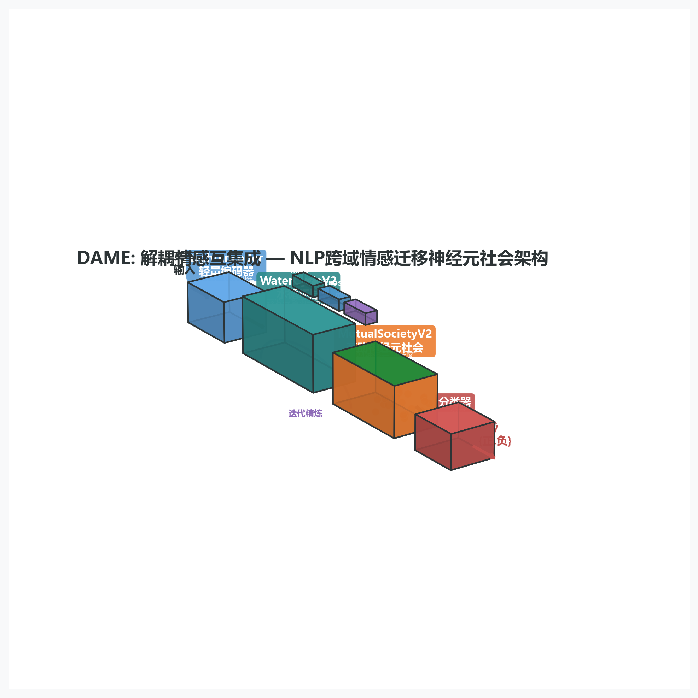
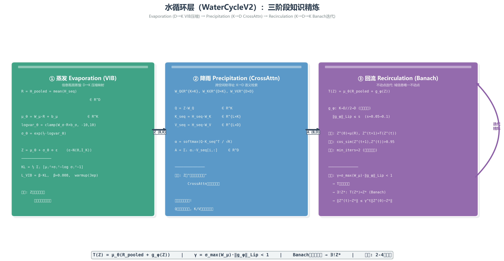
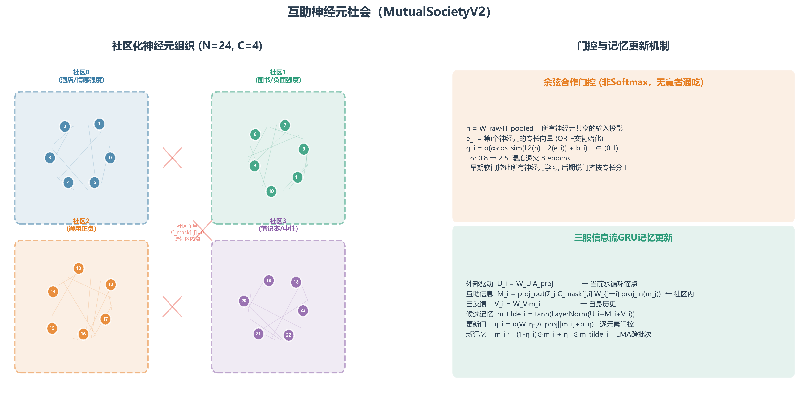
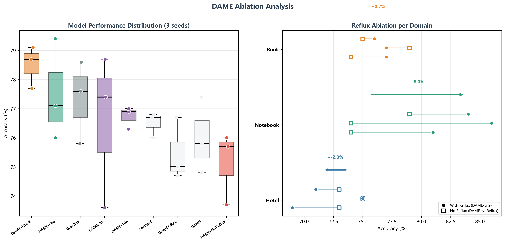

# DAME 脑电情绪解码论文·无脑讲解版

**—— 写给只有少量 AI 基础的读者的完整导读 ——**

> 本文档是论文《耦合原生解耦情感模型：场条件机制效用的跨协议脑电情绪解码》（DAME 架构）的"白话讲解版"。论文里的每一个专有名词、每一条数学公式，在这里都会拆开讲：先讲符号是什么意思，再讲整条公式在干什么，最后打一个生活化的比方。文中的全部数字与图表均来自论文定稿，讲解顺序是：**生物学背景 → 架构设计 → 公式推演 → 实验思路**。

---

# 第 1 章 三分钟总览：这篇论文到底干了什么

## 1.1 一句话版本

**让计算机看着人的脑电波，猜出这个人此刻的情绪（开心 / 难过 / 害怕 / 平静）；并且要保证：在一个陌生人身上，这台"读心机"依然工作。**

## 1.2 问题的本质：让机器"读"情绪

情绪（emotion）是一个看不见摸不着的东西，但它在人脑里有真实可测的物理痕迹：大脑放电的节奏会变。于是人们发明了一种设备——**脑电帽**，上面密密麻麻排着几十个小金属片（**电极**），贴在头皮上，像听诊器一样记录大脑皮层神经元的集体放电。记录下来的波形就叫**脑电**（**EEG**，Electroencephalogram，脑电图）。

现在的问题是：给定一段脑电波形，你能不能用计算机程序自动判断它属于哪种情绪？这件事有个专业名称叫**脑电情绪识别**（EEG-based emotion recognition），属于**情感计算**（Affective Computing）和**脑机接口**（**BCI**，Brain-Computer Interface，让大脑直接和计算机对话的技术）的交叉领域。它有什么用？举几个例子：心理医生想知道抑郁症患者情绪的真实状态、游戏公司想知道玩家什么时候上头、智能座舱想检测司机是否情绪失控。

> 💡 **大白话**：耳朵听声辨情绪，眼睛看脸色辨情绪，本文研究的是"用电极听大脑的脉搏辨情绪"。

## 1.3 最大的难点：换一个人就失灵

这个任务有个著名的坑：**每个人的大脑都是独一无二的**。头骨厚度不一样、皮层沟回不一样、电极贴的位置微差不一样、甚至连"开心时哪块脑区先亮"都因人而异。

这意味着：如果你拿被试 A 的脑电数据训练出一个情绪分类器（classifier，一个会"看图说话"的数学函数，输入波形、输出情绪），它可能在 A 身上表现很好；但一遇到从未见过的被试 B，精度就断崖式下跌。这个现象叫**跨被试变异**（cross-subject variability），是脑电情绪识别几十年来的头号难题。

这个难题逼出了两条技术路线：

- **路线一：无监督域适应（UDA，Unsupervised Domain Adaptation）**。允许模型在正式测试前，先"偷看"一会儿目标被试 B 的无标签数据（知道 B 的波形长什么样，但不知道 B 当时是什么情绪），让自己适应一下 B 的"口音"。近年的顶级系统用这招把精度做到了 72.6%–82.8%。
- **路线二：直接迁移（Direct Transfer）**。最严格的路线：训练时完全不允许接触 B 的任何数据，模型第一次见到 B 就必须给出答案。这条路更贴近真实场景（你不可能让每个新用户先录半小时数据让系统适应），但也更难——已发表的直接迁移记录少而薄弱。

**本文走的是路线二（直接迁移）**，并且把协议（protocol，实验规则）定得明明白白：在七名被试身上训练、在第八名身上测试，训练期不碰测试者一根头发丝的数据。这是一个比"刷高分"更难、也更诚实的赛道选择。

> 💡 **大白话**：UDA 相当于考前让学生先看一遍试卷类型（不告诉答案）；直接迁移相当于闭卷裸考。本文选择裸考，并且老老实实地报告裸考成绩。

## 1.4 本文的核心直觉：不看"独奏"，看"合奏"

既然电极级的信号（单个电极自己的波形）因人而异、噪声又大，本文换了一个视角。脑科学领域几十年的研究发现了一条规律：

**情绪不是某个脑区单独"亮灯"，而是大脑里多个大尺度功能网络（large-scale functional networks）之间协作关系（耦合，coupling）的重新组织。**

举一个最有名的例子：**默认模式网络**（**DMN**，Default Mode Network，人发呆、走神、回忆时最活跃的那套脑区系统）与感觉、额叶区域之间的"同步程度"，会随着情绪状态改变，而且改变量与情绪的"唤醒程度"（兴奋还是平静）和"效价"（愉悦还是不悦）都相关。打个比方：一场音乐会好听与否，不取决于某一个小提琴手拉得多响，而取决于各个声部之间的**配合**——指挥、弦乐、管乐在什么时候齐、什么时候错开。情绪就是大脑这场音乐会的"合奏状态"。

于是本文的核心赌注（论文里叫**网络假说 H1**）是：

> **情绪解码器应该消费"脑区与脑区之间的耦合"，而不是"单个电极的活动"。**

具体到数据上，本文从原始脑电波形出发，计算 12 个脑区两两之间的**锁相值**（**PLV**，Phase Locking Value，一种衡量"两个信号步调一致程度"的指标，第 2.6 节会详细拆解），得到 66 对脑区 × 5 个频段的耦合矩阵，把这个矩阵喂给深度学习模型。实验证明：仅仅把"耦合表示"这一项加进去，模型精度就涨了 +3.3、+3.5、+3.7 个百分点（三轮独立实验，数字惊人地一致）——这是本文最重要的实证发现。

> 💡 **大白话**：别人研究"每个乐手拉得怎么样"，本文研究"整个乐团合得怎么样"。

## 1.5 两大机制 + 一条方法论纪律

在"耦合"这个输入表示之上，本文搭了一个深度学习架构，名字叫 **DAME**——**D**ecentralized **A**qua-like **M**utual **E**ssential-Oriented Architecture 的缩写，中文叫**去中心化类水互助本质导向架构**。名字本身就是设计说明：**去中心化**指没有总控模块，12 个脑区专家各管一片再协商；**类水**指水循环那种蒸发、降雨、回流的提纯过程；**互助**指专家们互相帮助而不是竞争；**本质导向**指整个模型围着"本质"（essence）这个压缩表示转。它有两个标志性机制，每个机制都背着一条可以被实验检验的"军令状"：

**机制一：水循环（Water Cycle）**——一个负责"提纯"的模块。
把 66 对脑区 × 5 频段的高维耦合信息，像海水蒸发成淡水一样，压缩成一滴 32 维的"精华"（essence），再通过一个数学上**保证收敛**的迭代过程（不动点迭代，Banach 定理保证）把它精炼得更纯。它的军令状：**拆掉它，精度必须掉**（第 4 章全部讲它）。

**机制二：互助社会（Mutual Society）**——一个负责"分工协作"的模块。
12 个小专家，每个负责一个脑区，像学术圈一样互相引用、互相帮助（"谁帮谁"由数据里的脑区耦合强度决定，不是拍脑袋定的），最后把它们的意见按重要性加权融合。它的军令状是一条**场条件定律**（H2）：当训练和测试发生在**同一个大脑的不同时间**（小差距场），它贡献为正；当发生在**不同的大脑**（大差距场），它的贡献退化为零。为什么？因为"专家特化"学到的是"这个人大脑的内部结构"，换了人就失效；而"水循环"学的是所有大脑共享的东西，换人依然有效。这条定律被实验证实，还被写成了数学命题（命题 1，第 6.9 节）。

**一条方法论纪律**（这是本文气质里最特别的地方）：**机制必须可证伪**（falsifiable，能用实验推翻）。每个组件都绑定一条专属的损失函数（第 3 章会讲什么叫损失函数）和一个诊断探针；有两个组件在实验中被证明没用——一个"稳定性预测头"和一个"自动场路由器"——论文没有把它们藏起来，而是写进附录作为**证伪记录**（第 6.11 节会讲这个"科研诚信"故事）。在 AI 论文普遍"报喜不报忧"的环境里，这是本文最值得学习的品质之一。

## 1.6 核心成果速览（现在看不懂没关系，后面都会讲）

| 成果 | 数字 | 含义（先感受一下） |
|---|---|---|
| 主结果 | **34.37 ± 3.97%** | 直接迁移协议下四分类精度（随机瞎猜 = 25%） |
| 七个基线 | 28.13 – 32.55% | 同行主流模型在完全相同协议下的成绩，全部低于 DAME |
| 耦合消融 | **+3.3 / +3.5 / +3.7** | 三轮独立实验里，"拆掉耦合输入"损失的精度点数 |
| 水循环消融 | +1.6 | "拆掉水循环"损失的精度点数（第三轮转正） |
| 社会（小差距场） | **+0.77**（p=0.042） | 同一个大脑跨时间时，社会的贡献为正 |
| 社会（大差距场） | +0.38（不显著） | 不同大脑之间，社会的贡献与零无异——定律成立 |
| 理论保证 | γ₀ ≈ 0.045 < 1 | 水循环迭代"必然收敛"的数学依据 |
| 跨模态证据 | 78.5%（NLP 任务） | 同一套机制搬到中文文本情感分类上依然有效 |

## 1.7 全文地图：论文章节 ↔ 本讲解章节

| 论文章节 | 内容 | 本讲解章节 |
|---|---|---|
| 第 I 节 引言 | 问题、假说、贡献 | 第 1 章 |
| 第 II 节 相关工作 | 前人干了什么 | 第 1.3 节 + 第 6.5 节 |
| 第 III 节 预备知识 | 数据、耦合表示、协议 | 第 2 章 + 第 3 章 |
| 第 IV 节 架构 | 水循环、社会、融合、损失 | 第 3、4、5 章 |
| 第 V 节 理论 | 定理、命题、界 | 第 4.5–4.9 节 + 第 6.9–6.10 节 |
| 第 VI 节 实验 | 结果、消融、统计 | 第 6 章 |
| 第 VII 节 讨论 | 定位、局限、未来 | 第 6.12 节 + 第 7 章 |
| 附录 A–E | 损失表、超参、证伪记录 | 穿插在各章 + 第 6.11 节 |

> 💡 **阅读建议**：如果你只有一点点 AI 基础，请按顺序读，公式部分每一节都配了"符号清单"和"人话翻译"；如果你赶时间，读完第 1、2 章后可以直接跳第 6 章的实验结果，再回头补公式。

---

# 第 2 章 生物学背景：情绪在大脑里是什么

> 这一章不涉及任何 AI，全部是脑科学和数据的基础知识。读完它，你就能看懂论文开头所有"黑话"。

## 2.1 大脑是一个"网络"，不是一堆"灯泡"

想象你手里有一张全国航空图：每个城市是一个机场，城市之间每天有航班往来。有的航线繁忙（北京—上海），有的冷清。现在问：全国的"空中交通状态"是什么？答案不可能由某一个城市单独给出——它是一张**网络**的状态。

人脑就是这样一个网络。它有大约 860 亿个神经元，但脑科学家的研究粒度通常不是单个神经元，而是**脑区**（brain region，大脑皮层上功能相近的一片区域）和**功能网络**（functional network，即使相隔很远、但经常同步活动的脑区组成的小团体）。情绪、记忆、注意力这些高级功能，都被认为是网络层面的现象：**情绪状态改变 = 脑区之间协作关系的重组**，而不是某个脑区单独"开灯"。这是本文全部工作的生物学前提，论文称它为**网络假说 H1**。

支撑这个假说的证据有三类（论文引言里的文献 [1]–[5]）：

1. **功能成像研究**（PET、fMRI 等给大脑"拍慢速高清照"的技术）：情绪任务时，多个脑区的活跃程度一起改变。
2. **连接研究**（connectivity，测量脑区之间"通信"的强弱）：情绪状态下，某些脑区对之间的同步性显著变化。
3. **EEG 研究**（给大脑"听快速低清录音"的技术，就是本文用的）：有研究者发现，积极情绪下 θ 和 α 频段（见 2.4 节）内默认模式网络内部的同步性上升。

> 💡 **大白话**：情绪 = 乐团的合奏状态，不是某个乐手的独奏音量。

## 2.2 默认模式网络（DMN）：大脑的"后台常驻程序"

**默认模式网络**（DMN）是神经科学近二十年最著名的发现之一。当你什么都不干、发呆、走神、回忆往事时，大脑里有一套固定的脑区反而比干活时**更活跃**——它们像电脑的后台常驻程序，一直在运转。这套脑区包括：

- **内侧前额叶皮层**（mPFC，medial Prefrontal Cortex）：额头后方正中间的一块，DMN 的"前枢纽"（hub，网络中交通最繁忙的节点）；
- **楔前叶**（Precuneus）与**后扣带皮层**（PCC，Posterior Cingulate Cortex）：头顶偏后方，DMN 的"后枢纽"。

前枢纽和后枢纽之间的"通信强度"（耦合）随情绪变化的规律，是本文数据级分析（第 2.7 节）的检查对象。论文把电极按 10-20 国际标准系统（国际通用的头皮电极摆放坐标规范）分成 12 个脑区，其中 **PFC 区**（覆盖 mPFC）和 **CP 区**（中央顶区，覆盖楔前叶/后扣带）被特别标注为"DMN 前枢纽 / 后枢纽"。

> 💡 **大白话**：DMN 是大脑的"待机屏保"。研究发现，这块屏保的画面内容（前脑和后脑的同步节奏）会随着你的情绪悄悄改变——本文就是顺着这条线索往下挖的。

## 2.3 脑电（EEG）是什么、能测到什么

把几十个电极贴到头皮上（SEED-IV 数据集用 **62 个通道**，channel = 电极 = 一列信号），就能记录到大脑皮层神经元集体放电产生的微弱电压波动——幅度大约是几十**微伏**（μV，百万分之一伏特，一节五号电池是 1.5 伏，脑电只有它的几十万分之一）。

EEG 的优缺点非常鲜明：

- **优点：时间分辨率极高。** 每秒钟可以采样几百上千次（SEED-IV 原始数据是 **800 Hz**，即每秒记录 800 个数），能捕捉毫秒级的神经动态——这是 fMRI 做不到的。
- **缺点：空间分辨率低、信噪比极低。** 颅骨像隔音墙一样把信号糊开，你分不清信号到底来自哪一小块皮层；而且混入了大量**伪迹**（artifact，非大脑来源的干扰：眨眼、肌肉紧张、咬合、市电 50 Hz 干扰……），所以 EEG 被戏称为"透过毛玻璃看烟花"。**低信噪比**（signal-to-noise ratio 低，信号被噪声淹没）是本文架构要应对的核心物理现实之一。

> 💡 **大白话**：EEG 是一台"糊糊的但很快的录音机"。为了从糊糊的录音里听出情绪，本文的策略是"不去听单个麦克风（电极），去听麦克风之间的和声（耦合）"。

## 2.4 脑波的频率与五个频段：δ θ α β γ

脑电波形是许多不同频率的波叠加在一起的结果。神经科学把频率轴划分成五个传统**频段**（frequency band），每个频段与不同的脑功能状态有关：

| 频段 | 频率范围 | 中文名 | 典型关联（粗浅版） |
|---|---|---|---|
| δ (delta) | 1–4 Hz | 德尔塔 | 深睡、婴儿期脑波 |
| θ (theta) | 4–8 Hz | 西塔 | 瞌睡、冥想、记忆加工 |
| α (alpha) | 8–13 Hz | 阿尔法 | 闭眼放松、清醒安静 |
| β (beta) | 13–30 Hz | 贝塔 | 警觉、专注、紧张 |
| γ (gamma) | 30–45 Hz | 伽马 | 高级认知、跨脑区整合 |

**Hz**（赫兹）= 每秒振动的次数。1 Hz 就是每秒来回一次，13 Hz 就是每秒 13 次。要从原始波形里把某个频段单独拿出来，用的工具叫**带通滤波**（band-pass filter，只放行某个频率范围、压掉其余范围的数学操作）。本文用的带通滤波是用 **FFT**（快速傅里叶变换，把时间信号分解成不同频率成分的标准算法）实现的。

为什么频率重要？因为本文关心的"耦合"是**分频段**看的：同一对脑区，在 α 频段可能同步得很好，在 β 频段可能各走各的。第 2.7 节你会看到，情绪的信息恰恰藏在**特定频段的特定脑区对**里。

> 💡 **大白话**：脑电像一首同时播放五个声部的曲子。本文先把曲子按声部（频段）拆开，再逐个声部检查"哪两个脑区在齐奏"。

## 2.5 相位：波"走到哪一步了"

拆解 PLV 之前，必须先讲一个关键概念：**相位**（phase）。

任何一个周期性的波，在任意时刻都处于"一个循环"的某个位置。把一次完整的起伏（一个周期）想象成表盘转一圈（0° 到 360°，或 0 到 $2\pi$ 弧度）：波在波峰时相位是 90°，回到零点时是 180°，波谷是 270°。**相位描述的是"波此刻走到循环的哪一步"，与波的音量（幅度，amplitude）无关。**

要从脑电波形里提取"每个时刻的相位"，需要做**Hilbert 变换**（Hilbert transform，一种信号处理方法：把一个实信号变成复信号，从而读出它的瞬时幅度和瞬时相位）。名字吓人，但只需记住它的用途：**给任意信号配一个"实时相位计"**。本文的整个前端流水线是**可微**（differentiable，每一小步都可以算梯度，从而能被神经网络端到端训练，第 3.2 节展开）的，包括 Hilbert 变换这一步。

> 💡 **大白话**：两个跑步的人，不管谁跑得快（频率不同）、谁嗓门大（幅度不同），只要每次抬脚的"节拍位置"对得上，就是"步调一致"。相位衡量的就是节拍位置。

## 2.6 锁相值 PLV：衡量"两个脑区步调多一致"的标准尺子

**这是全文第一根数学柱子，请重点读。** PLV 是神经科学界衡量相位同步的标准指标（文献 [27]，Lachaux 等人 1999 年提出）。

**场景设定**：取两个脑区的信号 $i$ 和 $j$，在某个频段上，把某个时间段内每个采样时刻两者的相位相减，得到**相位差** $\Delta\phi = \phi_i - \phi_j$。

**先想一个直觉问题**：如果两个信号完全同步（步调永远一致），相位差应该是什么？答案是：恒定不变（永远差同样的角度）。如果完全无关，相位差应该像骰子一样随机乱跳。

那么怎么"用一个数字"总结相位差是恒定还是乱跳？看下面的公式：

$$PLV_{ij} = \sqrt{\big(\langle \cos\Delta\phi\rangle\big)^2 + \big(\langle \sin\Delta\phi\rangle\big)^2} \;\in\; [0,\,1]$$

**符号清单**：

- $\Delta\phi$：两个信号的相位差（每个采样时刻算一个）。
- $\cos\Delta\phi$ 和 $\sin\Delta\phi$：把每个相位差放到"表盘坐标系"上：$\cos$ 取水平分量，$\sin$ 取竖直分量。相位差是一个角度，我们要把角度转成平面向量才能做平均（直接平均角度会出"359° 和 1° 其实只差 2°"这种错误）。
- $\langle \cdot \rangle$：尖括号表示"对这段时间内所有采样时刻取平均"。$\langle\cos\Delta\phi\rangle$ = "所有时刻水平分量的平均值"。
- 平方、相加、开根号：把"平均水平分量"和"平均竖直分量"合成**平均向量的长度**。

**人话翻译**：把时间段内每一刻的相位差画成表盘上的一个箭头，然后把所有箭头取平均。如果箭头都指向同一个方向（同步），平均箭头就很长，长度接近 1；如果箭头乱指（不同步），它们互相抵消，平均箭头很短，接近 0。**PLV 就是"平均相位差箭头的长度"，取值被压死在 0（完全无关）到 1（完美同步）之间。**

这就是"锁相"名字的由来：两个信号的相位被"锁"在一起了，PLV 就高。

**为什么这个公式对本文至关重要？**

1. 它只关心相位、不关心幅度——两个脑区的"音量"本来就受头骨厚度等因素影响，不可比；"节拍"才反映真实的神经协调。
2. 它可以写成完全可微的形式（cos、sin、平均、平方、开方都是可导操作），因此能作为神经网络的第一层，参与**端到端训练**（end-to-end training，从原始输入到最终答案一气呵成地整体训练，第 3 章展开）——这是本文相对前人"先手工算特征、再单独训分类器"两段式流水线的一个工程增量。
3. 论文里所有消融实验的"耦合"输入，指的就是 66 个脑区对 × 5 个频段 = 330 个 PLV 值组成的向量（第 3.3 节）。

> 💡 **大白话**：PLV 是"合奏整齐度评分器"：1 分 = 完美齐奏，0 分 = 各吹各的。本文给大脑里 66 对"声部组合"、5 个频段各打一个分，得到一张 66×5 的"合奏成绩单"，这就是模型的全部输入。

## 2.7 数据级证据：不看模型，光看数据就能看到什么

在训练任何模型之前，论文先问：**H1（情绪 = 耦合重组）在 SEED-IV 数据里到底成立不成立？** 这一步非常关键：如果光用真实标签算 PLV 就能看出规律，说明"耦合表示"的选择有数据支撑，而不是事后自圆其说。论文在第 I 节就**预先登记**了三条预测（P1–P3），第 VI-E 节如实报告结果——**包括没实现的预测**。

{width=6in}

**图 8 讲解**——这张图回答"耦合和情绪在数据层面到底有没有关系"。左图 (a)：把情绪按**唤醒度**（arousal，情绪让你多兴奋/多平静的程度：恐惧、快乐 = 高唤醒；中性、悲伤 = 低唤醒）分成两组，看 DMN 前枢纽（PFC）和后枢纽（CP）之间的 PLV 差值，按频段画出。柱子越高，说明"兴奋类情绪"比"平静类情绪"在这条 DMN 轴上的同步性越强。β 频段柱子显著高出一截，右图 (b)：四类情绪各自的 66 对脑区平均 PLV，几乎一样高。

**P1（额-后耦合中的唤醒度）——成立。** 高唤醒（恐惧、快乐）与低唤醒（中性、悲伤）对比，全部五个频段的 PFC–CP 耦合差都是正的；其中 **β 频段显著**：差值 +0.0109，t 统计量 3.94，**p = 0.0056**（t 和 p 的严格含义见第 6.6 节，现在先读作"这不太可能是巧合"）。δ 频段名义上跟随（+0.0074，p=0.065），α、θ、γ 不显著。**翻译**：DMN 前后枢纽之间的 β 频段同步，确实在追踪情绪的兴奋程度——而且恰好落在文献预言的位置。

**P2（DMN 关联耦合中的效价）——部分成立。** **效价**（valence，情绪让你多愉悦/多不悦的程度）的检验是"恐惧 vs 中性"：α 频段 PFC–CP 耦合差 +0.0100，t=3.16，**p=0.016**，显著。但文献 [5] 预言的"积极情绪 θ/α 同步上升"只复现了方向（快乐−中性 +0.0050），没复现显著（p=0.34）。论文的写法是"效价证据是部分的，我们照实说明"——这种"预测失败也如实报告"的态度会贯穿全文。

**P3（全局耦合守恒）——一个漂亮的"否命题"。** 四类情绪的平均 PLV 分别是 0.4422（中性）、0.4426（悲伤）、0.4433（恐惧）、0.4399（快乐），两两对比全部不显著（|t| ≤ 1.01，p > 0.3）。**翻译**：情绪改变的不是"同步总量"，而是"同步发生在哪些脑区对之间"——总音量不变，声部配置变了。这恰恰是"情绪 = 网络重组"最直接的证据形式。

{width=5in}

**图 2a 讲解**——这张"热力图矩阵"是数据级证据的可视化。每一小格的颜色代表一对脑区在一个频段上的 PLV 强度（颜色越深/越亮 = 同步越强）。竖着看是四类情绪，横着看是五频段 × 脑区对。注意两件事：(1) 四行的大格局几乎一样——这就是 P3 说的"全局守恒"；(2) 差异集中在少数格子——这些"变色的格子"主要落在 DMN 轴（PFC–CP 附近），对应 P1/P2 找到的显著效应。

{width=5in}

**图 2b 讲解**——把上图里 DMN 轴单独拎出来放大：横轴是频段，纵轴是 PLV，不同颜色/标记是不同情绪。你能直接看到两条统计结论：β 频段上"高唤醒两类"整体高于"低唤醒两类"（P1，p=0.0056）；α 频段上"恐惧"显著高于"中性"（P2，p=0.016）。

> 💡 **大白话总结本节**：在模型动手之前，数据自己就说话了——"情绪在哪、跟谁同步"是有规律的，且规律集中在 DMN 这条线上。这给了后面"用耦合当输入"的选择一张出生证明。

**番外：这些规律会不会是伪迹撑起来的？** 眨眼、咬牙这类伪迹会污染 PLV，这是个正当的质疑，论文作者自己也担心。所以成稿之后补做了一次快速审计（4 名被试）：先带通滤波（1–50 Hz，滤掉市电干扰和超低频漂移），再用 ICA（独立成分分析，把混合信号拆成 30 个互相独立的"来源"）配合 ICLabel（一个自动判断每个来源是不是大脑信号的分类器），把非脑来源删掉。每名被试删了 13–16 个来源，占信号能量的两到八成。结果：**P1 和 P2 不但没死，还更强了**（β 段 +0.0113 → +0.0205；α 段 +0.0112 → +0.0209），全局守恒照旧（总量只动了 0.023）。代价是分类正确率掉了约 2 点（30.15 → 28.13）。有意思的是，换一个跟 DAME 毫无关系的模型 EEGNet，也掉了同样多的 2 点（30.15 → 28.04）。两家一起掉，说明掉的不是 DAME 的独门信号，而是两家共用的通用成分，很可能就是那些伪迹本身。4 个被试的规模下，这 2 点在统计上不算数（p ≈ 0.3）。**人话总结：核心卖点（耦合证据）经得起清洗，分数基本不动。** 全量 15 被试审计和"只滤波、不删来源"的对照实验还排在 GPU 队列里，跟确认性运行一起做。

## 2.8 为什么"跨被试迁移"这么难：三个物理原因

把"同一台读心机用到陌生人身上"为什么这么难？生物物理层面有三个原因，它们共同决定了本文的架构设计：

1. **解剖差异**：头骨厚度、皮层折叠方式、电极与皮层的相对位置，人人不同。同样的神经活动，在不同人头皮上产生的电压分布不一样——相当于**同一首歌在不同形状的音乐厅里听起来不同**。
2. **非平稳性**（non-stationarity，信号的统计特性随时间漂移）：同一个人的脑电状态也受困倦程度、注意力波动、电极凝胶导电性下降等影响，连"同一个人的两次录音"都不完全一样——EEG 是**天生会漂移的信号**。
3. **信噪比极低**：第 2.3 节说过，脑电信号被噪声（伪迹）严重污染。个体间真正的神经差异，往往比窗口级别的噪声还小——第 6.10 节你会看到一个震撼的数字：**单窗口噪声大约是脑间信号的 900 倍**。

在机器学习语言里，这种"训练数据分布 ≠ 测试数据分布"的困境叫**域差**（domain gap）；训练数据来自的"世界"叫**源域**，测试数据来自的"世界"叫**目标域**；让模型跨越域差的能力叫**泛化**（generalization，在没见过的新数据上依然表现良好的能力）。

> 💡 **大白话**：用 A 省口音训练的语音助手听不懂 B 省方言，这不奇怪。脑电的"方言"差异比中国方言还大，而且每个"省"只有一个人。

## 2.9 这一章你只需要记住

1. **情绪是网络现象**：脑区之间耦合（同步）的重组，不是单点活动 → 本文输入用 PLV 耦合。
2. **PLV** 是 0–1 的"合奏整齐度"，只认节拍（相位）不认音量（幅度），且可微、可端到端训练。
3. **DMN**（默认模式网络）的前后枢纽是情绪耦合变化最显著的位置；数据级证据 P1（β 段唤醒，p=0.0056）成立、P2 部分成立、P3 显示"总量守恒、位置重组"。
4. **跨被试难**在解剖差异 + 信号漂移 + 信噪比极低（噪声 ≈ 900× 信号）。
5. 本文走**直接迁移**（训练期不碰测试者），这是一条更严、更贴近真实部署的赛道。

---

# 第 3 章 架构总览：62 个电极 → 4 个情绪

> 这一章把整个 DAME 模型当成一条流水线，从头到尾走一遍。每个部件的内部数学（公式）留到第 4、5 章，这里先建立"整机"概念。

## 3.1 先认识三个高频基础名词

在讲架构之前，把 AI 里三个绕不开的词一次讲清：

- **向量（vector）与维度（dimension）**：向量就是"一串按顺序排列的数字"，维数就是这串数字的长度。比如 [0.3, 0.8, 0.1] 是一个 3 维向量。AI 里的规矩是：**万事万物都表示成向量**——一段脑电、一个脑区、一个情绪类别，统统是数字串。模型内部流动的一切信息都是向量。
- **批（batch）**：训练时不是一条一条喂数据，而是一次喂一批（本文一批 64 条），既省时间又让梯度更稳。所以数据张量（tensor，多维数组）的常见形状是 $B \times L \times D$：$B$ 条数据，每条 $L$ 个时间步（time step），每步一个 $D$ 维向量。
- **令牌（token）**：原本是大语言模型的术语，指"被切成最小处理单元的一段信息"。本文借用它称呼"一个时间步上的一个脑区耦合向量"——8 个时间步就有 8 个耦合令牌（coupling token）。

> 💡 **大白话**：向量 = 数字串，维度 = 串多长，批 = 一次喂几条，令牌 = 一串信息的小块。

## 3.2 一张图看懂全流程

{width=6in}

**图 1 讲解**——这就是 DAME-C5（C5 指第 5 版耦合架构）的完整图纸，从左到右共七站：

**第 1 站：原始波形（62 通道）**。输入是 62 个电极的原始电压时间序列。注意：论文**刻意用原始波形，而不是 DE 特征**——DE（微分熵，differential entropy）是脑电研究常用的统计特征，它刻画"功率谱的形状"却丢掉了相位信息；而相位正是 PLV 的物理原料。要算耦合，就必须回到原始波形（第 2.6 节）。

**第 2 站：12 脑区平均**。按 10-20 标准系统把 62 个通道归入 12 个脑区（论文表 1，本讲解附录 A 有完整对照），每个脑区内部做平均。为什么要平均？(1) 单通道信号充满伪迹，脑区级平均像"合唱掩盖跑调"，天然抑制一部分噪声；(2) 12 个脑区两两组合只有 66 对，数量小，每个耦合值都有足够长的信号做统计，PLV 才可靠。划分**刻意粗糙**——这是设计，不是偷懒。

**第 3 站：FFT 带通，分 5 个频段**。用 FFT 把每个脑区信号切成 δ/θ/α/β/γ 五个频段（第 2.4 节）。

**第 4 站：Hilbert 变换取相位**。给每个频段的信号配上"实时相位计"（第 2.5 节）。

**第 5 站：可微 PLV**。按第 2.6 节的公式，对 66 对脑区 × 5 个频段，在 0.5 秒子窗上计算 PLV。一个 4 秒的窗口被切成 8 个 0.5 秒子窗，于是每个窗口得到 **8 个时间步 × 330 个耦合值** 的"耦合令牌序列"。**关键点**：整条前端（FFT、Hilbert、PLV）全部可微，没有一步是"先手工算好再塞给模型"的黑箱——模型可以从最终误差一路把梯度传回到原始波形。**另一个关键点**：所有消融臂（第 6.4 节会讲"臂"是什么）共享同一套 PLV 输入，所以任何机制被拆掉时，输入表示本身不变——保证对比公平。

**第 6 站：水循环蒸馏**。把耦合令牌序列"蒸"成一滴 32 维的精华 $Z$，并用不动点迭代精炼（第 4 章全部内容）。

**第 7 站：社会调制融合 + 线性分类器**。社会输出调制各信息源的融合权重（第 5 章），融合结果送进一个线性分类器（linear classifier，一个简单的矩阵乘法 + 归一化，把向量变成 4 个分数），分数最高的那个就是预测的情绪。分类器故意做得简单，就是为了逼所有"智能"都发生在耦合表示和水循环里，而不是藏在花哨的分类头里。

{width=6in}

**图 1-3D 讲解**——同一流水线的 3D 渲染版：四个主模块（编码前端、水循环、互助社会、分类器）从左到右排布，箭头是数据流向；水循环内部三个子阶段（蒸发/降雨/回流）在顶部展开，回流用弯曲的弧线画回自身，直观表示"输出绕一圈再喂回自己"的循环结构。这张图不包含在论文正图里（标签未经正式核验），但作为直觉示意图非常合适。

## 3.3 两条信息流：耦合流与功率流

在第 5 站之后，数据分叉成两条并行的流：

**耦合流 $H_{coup}$**：8 个时间步 × 256 维。330 个 PLV 值（66 对 × 5 频段）被投影（project，乘一个矩阵）到 256 维空间。这是模型的**主菜**——水循环蒸馏的对象。

**活动流 $H_{pow}$**：8 个时间步 × 64 维。各脑区各频段的功率（power，信号能量的强弱，幅度平方的平均）组成的"常规脑电特征"。这是模型的**配菜**。

这个"主菜/配菜"的比例是刻意的：**功率流故意做小（64 维），让模型无法"静默退回功率、无视耦合"**。想象你给学生一份考卷，如果卷子上 90% 是送分题，学生就会靠送分题混及格、不去啃难题。本文反过来：把"难题"（耦合）做成大题，"送分题"（功率）做成小题——模型想考高分就必须学会用耦合。这个设计哲学叫"结构性逼迫"。

> 💡 **大白话**：模型是懒学生。本文把耦合设成大题、功率设成小题，逼它啃下耦合这块硬骨头。

## 3.4 为什么"可解释、可消融"是架构的一等公民

普通深度学习模型常被批评为黑箱：精度不错，但你不知道它哪部分在起作用。本文从架构设计第一天就把**可证伪性**（第 1.5 节）焊进骨架：

1. **一机制一损失**：9 项损失函数（loss，衡量"模型错得多离谱"的函数，训练就是让这个数变小）里，每一项都绑定一个具名机制；消融拆掉机制时，绑定它的损失项**同时移除**——不允许存在"漂在空中"的正则项（regularizer，不直接对应任务的约束项）混水摸鱼。
2. **一机制一诊断**：水循环有"回流幅度探针"（回流有没有真的在改变精华）、有"自洽探针"（精华是否保留了耦合信息）；社会有"门控指纹"（12 个专家有没有都参与）。探针不过关的组件会被**退役**——第 6.11 节的两个证伪案例就是这么抓出来的。

## 3.5 这一章你只需要记住

1. 整条流水线：**原始波形 → 脑区平均 → 5 频段 → 相位 → PLV 耦合 → 水循环蒸馏 → 社会融合 → 线性分类**。
2. 用**原始波形而非 DE 特征**，因为 PLV 需要相位。
3. **耦合流 256 维 vs 功率流 64 维**：故意的小功率流逼模型依赖耦合。
4. 前端全程可微、全部消融臂共享同一输入——公平性由设计保证。
5. 每个机制都背一条损失 + 一个探针：**机制必须能被证明有用，否则下岗**。

---

# 第 4 章 公式推演之一：水循环（蒸发 → 降雨 → 回流）

> 这是全文数学最重的一章，也是 DAME 的"理论脊梁"。别怕：每一条公式都按"符号清单 → 人话翻译 → 直觉比方"三步拆解。你会发现它其实是在讲一件很朴素的事：**怎么把 330 维的杂音信息，蒸成一滴可靠的 32 维精华**。

## 4.1 隐喻从哪里来：水循环 ↔ 信息提纯

名字叫"水循环"不是噱头。地球的水循环是"海水 →（蒸发，留下盐分）→ 水蒸气 →（凝结，降雨）→ 淡水 → 汇入海洋再蒸发"的循环提纯过程。DAME 的信息流与之严格对应：

| 自然界 | 数学动作 | 对应小节 |
|---|---|---|
| 海水（大量、含盐） | 输入：8 步 × 256 维的耦合令牌序列 | 4.2 |
| 蒸发（只带走水分子） | 变分信息瓶颈：压成 32 维精华 $Z$，保留任务相关信息、丢杂质 | 4.2 |
| 降雨（淡水落回大地） | 交叉注意力：精华重新投影回令牌序列，产出"锚点" $A$ | 4.3 |
| 回流（水汇入海再蒸发） | 不动点迭代：精华喂给自己，反复精炼直到稳定 | 4.4–4.9 |

> 💡 **大白话**：把信息当水处理——蒸掉噪声这个"盐"，留下情绪这个"淡水"。

{width=6in}

**图 2 补充讲解**——水循环模块内部结构：左侧是输入令牌序列，中间"蒸发"框把序列压成低维精华（中间那滴），"降雨"框让精华与令牌序列做交叉注意力产出锚点，"回流"框画出精华循环迭代回到自身的回路（右侧的环形箭头），并标注了迭代公式 $Z^{(t+1)} = W_\mu(R + s\cdot g_\varphi(Z^{(t)}))$ 与"Banach 不动点"字样——后面 4.4–4.7 节就是把这个框里的每个符号讲透。

## 4.2 蒸发 = 变分信息瓶颈（VIB）：压缩为什么是好事

**先补三个名词。**

**高斯分布（Gaussian distribution）**：自然界最普遍的钟形曲线分布（身高、测量误差都近似它），完全由两个数决定：**均值 $\mu$**（钟顶在哪）和**方差 $\sigma^2$**（钟有多宽）。写成 $\mathcal{N}(\mu, \sigma^2)$。

**KL 散度（Kullback–Leibler divergence）**：衡量两个概率分布"长得有多不像"的数，记为 $KL(q \,\|\, p)$。两个分布完全一样时 KL = 0，越不像 KL 越大。注意它不对称（KL(q‖p) ≠ KL(p‖q)），方向有讲究，本文只用"拉近"的用法。

**信息瓶颈（IB，Information Bottleneck）**：Tishby 等人提出的原理——一个好的表示（representation，模型对输入的内部转述）应该在"**保留任务所需信息**"和"**压缩掉无关信息**"之间找到平衡。压缩得越狠，表示对无关变化越不敏感（这对跨被试迁移是好事）；但压缩过头，连任务信息也丢了。**压缩 ≠ 遗失，蒸馏 = 纯化**——这是 DAME 五重哲学基础之一（其余四个：双重表示、水循环隐喻、互助社会、预迁移）。

**蒸发这一步的公式**：

$$Z \;\sim\; q_\phi(Z \mid \bar{H}_{coup}) \;=\; \mathcal{N}\big(\mu_\phi(\bar{H}_{coup}),\; \sigma_\phi^2(\bar{H}_{coup})\big), \qquad \mathcal{L}_{KL} = KL\big(q_\phi \,\|\, \mathcal{N}(0, I)\big)$$

**符号清单**：

- $\bar{H}_{coup}$：把 8 个时间步的耦合令牌**池化**（pooling，如取平均）之后得到的一个总括向量——"整条序列的一句话概括"。
- $\mu_\phi$、$\sigma_\phi^2$：两个小型神经网络（带可训练参数 $\phi$，$\phi$ 就是"待训练的内部旋钮"的记号）。它们吃掉概括向量，输出一个均值和一个方差——即**用输入定义了一个高斯分布**。
- $Z \sim q_\phi(Z \mid \bar{H}_{coup})$：从那个高斯分布里**抽样**得到精华 $Z$（32 维）。"$\sim$"读作"服从于"；$q_\phi(Z \mid \cdot)$ 是"给定输入后 $Z$ 的概率分布"——这个分布是**变分**（variational，指"用一个可调分布去近似真实分布"）的，VIB 的 V 由此而来。
- $\mathcal{N}(0, I)$：均值为 0、方差为 1 的**标准高斯**。$I$ 是单位矩阵（对角线全 1、其余全 0 的方阵），这里表示各维独立。
- $\mathcal{L}_{KL}$：一项损失，罚"精华分布偏离标准高斯"。它逼 $\mu_\phi \to 0$、$\sigma_\phi^2 \to 1$。

**人话翻译**：把耦合信息概括成一句话后，用这句话定出一个"精华可能长什么样"的概率范围，再随机抽一滴出来；同时用一项损失把这滴精华往"标准规格"上拽。

**为什么要加 KL 损失？三个作用**：(1) **逼压缩**——精华各维被推向"均值 0、方差 1"的松散分布，信息必须挤进这个受限通道，噪声自然被挤掉；(2) **逼各维去相关**——不让 32 维里有两维说同一件事（浪费容量）；(3) **让抽样可控**——训练时从分布抽样是随机的，为了能让梯度穿透抽样这一步，实际用的是**重参数化技巧**（reparameterization trick：把"抽样"改写成 $Z = \mu + \sigma \cdot \varepsilon$，其中 $\varepsilon$ 是固定的标准高斯噪声——噪声与参数分离，梯度就能流过 $\mu$ 和 $\sigma$）。推理（测试）时不再抽样，直接用均值 $\mu_\phi$ 作为 $Z$，模型变为确定性函数。

> 💡 **大白话**：蒸发 = "把 8 句话的会议纪要压缩成一滴 32 字的精华，再规定这滴精华必须符合标准规格"。压缩逼你把废话删干净——因为空间只有 32 个字，塞不下的信息会被自动丢掉。

## 4.3 降雨 = 交叉注意力：让精华"回去点名"

蒸出来的精华是"全局概括"，但它还得跟原始的 8 个时间步令牌对话——这一步叫**降雨**，用的是**交叉注意力**（cross-attention）。先补注意力基础：

**注意力（attention）**：深度学习的核心操作，回答"此刻应该多看谁一眼"。**自注意力**是序列自己看自己；**交叉注意力**是"一个序列（查询方）去检索另一个序列（被查方）"。

**三个角色 Q / K / V**：检索系统三件套——**Q（Query，查询）**= 你想找什么；**K（Key，键）**= 每个条目"我是谁"的标签；**V（Value，值）**= 每个条目的内容。流程：拿 Q 和所有 K 算相似度 → 相似度归一化成权重 → 按权重加权平均所有 V。图书馆类比：Q 是你的检索词，K 是书架标签，V 是书的内容，最后你拿到的是"按相关度加权的综合内容"。

**softmax**：把一组任意实数变成"非负、总和为 1"的一组数的标准函数（第 5.4 节详拆）。它在这里的作用是把相似度变成"注意力权重"。

**降雨这一步的公式**：

$$A = \sum_k \alpha_k V_k, \qquad \alpha = \mathrm{softmax}\!\left(\frac{Z^\top W_q \, H_k W_k}{\sqrt{d}}\right)$$

**符号清单**：

- $Z$：上一步蒸出的精华（32 维），这里扮演 **Q**（查询方）。
- $H_k$：第 $k$ 个时间步的耦合令牌（256 维），扮演 **K/V**（被查方）。
- $W_q$、$W_k$：两个可训练矩阵（参数旋钮），把 $Z$ 和 $H_k$ 先投到同一个"可比较空间"。
- $Z^\top W_q \, H_k W_k$：转置后相乘，本质是**点积**（dot product，两向量对应位置相乘再求和），用来度量"精华和第 $k$ 个令牌有多相关"。$\top$ 是转置记号（把向量竖过来摆）。
- $\sqrt{d}$：缩放因子（$d$ 是维度），防止维度大时点积数值爆炸、softmax 变得"非 0 即 1"而失去软度。
- $\alpha_k$：softmax 之后第 $k$ 个令牌的权重（所有 $\alpha_k$ 之和 = 1）。
- $A$：按权重加权平均出的**锚点**（anchor，一个稳定参照物）向量。

**人话翻译**：精华挨个点名 8 个时间步："谁和我最相关？"然后把相关内容按相关度加权汇总成一个锚点。锚点是"精华视角下的时序摘要"，它和水循环的最终产物一起进入第 5 章的融合。

> 💡 **大白话**：蒸发得到"会议主旨"，降雨则是拿主旨回去标注原会议纪要——"哪些段落最贴合主旨"，把那些段落摘出来贴成一张便签（锚点）。

## 4.4 回流 = 不动点迭代：自己喂自己的精炼环

这是水循环的心脏，也是全文理论（第 4.5–4.9 节）的依托对象。公式：

$$Z^{(t+1)} = W_\mu\big(R + s \cdot g_\varphi(Z^{(t)})\big)$$

**符号清单**：

- $Z^{(t)}$：第 $t$ 轮迭代的精华（上标是轮数，不是幂）。$Z^{(0)}$ 是蒸发得到的初值。
- $g_\varphi$：一个两层的 MLP（Multi-Layer Perceptron，多层感知机，最简单的前馈神经网络，两"层"就是两轮"乘矩阵 + 非线性激活"）。它对精华做一次非线性加工，像"反思"。
- $s$：**回流尺度**（reflux scale），一个可训练标量（单个旋钮），初值 0.05——故意从很小起步，保证迭代稳定（原因见 4.6 节）。
- $R$：池化耦合上下文（第 4.2 节那个总括向量），作为"外部事实"在每一轮都参与，防止迭代漂离输入。
- $W_\mu$：一个线性（仿射）投影矩阵，把 $R + s\cdot g_\varphi(Z^{(t)})$ 投回 32 维。
- 迭代规则：最多跑 **5 轮**（至少 2 轮），相邻两轮精华的**余弦相似度**（cosine similarity，两向量夹角的余弦，只比方向不比长度，取值范围 −1 到 1；第 5.4 节有详拆）超过 0.98 就早停。实测收敛通常 2–5 轮。

**人话翻译**：拿当前精华反思一次，掺上外部事实，投影回精华空间，得到新的精华；如此反复，直到精华不再明显变化为止。

**两个名词先摆出来**（4.5 节细讲）：

- **不动点（fixed point）**：满足"喂进去 = 吐出来"的点。如果某向量 $Z^*$ 满足 $Z^* = T(Z^*)$（$T$ 代表上面整个迭代映射），那它就是这个迭代系统的"平衡态"——再迭代也不会动。
- **收敛（convergence）**：迭代序列离平衡态越来越近、最终稳定下来的性质。

**为什么要在模型里放一个循环？** 灵感来自预测编码（predictive coding，大脑"自顶向下预测、自底向上纠错"直到稳定的一种神经科学理论）与深度均衡模型（DEQ，见 4.8 节）：**"想清楚"不是一个前向动作，而是一个循环往复直至稳定的过程**。给情感解码器加一个"想多几遍"的环，就是"回流"的动机。

**防退化的保险丝**：如果回流环躺平（$g_\varphi$ 输出恒为 0、$s$ 学成 0），环就退化成恒等映射，白占计算量。为此加一项损失：

$$\mathcal{L}_{reflux} = \mathrm{ReLU}\big(0.01 - \mathrm{reflux\_mag}\big), \qquad \mathrm{reflux\_mag} = \frac{\|Z_T - Z_0\|}{\|Z_0\|}$$

- $\|Z_T - Z_0\|$：末轮精华与初值之间的**欧氏距离**（Euclidean distance，空间里两点的直线距离；$\|\cdot\|$ 读作"范数"，欧氏范数就是向量长度，第 4.5 节详拆）。
- $\mathrm{reflux\_mag}$：环造成的**相对位移**——"精华被环改变了百分之多少"。
- $\mathrm{ReLU}(x) = \max(0, x)$：铰链函数——$x$ 为正时输出 $x$，为负时输出 0。所以整项损失只有在相对位移小于 0.01 时才产生惩罚（罚 0.01 − mag），逼环**至少改变精华 1%**。
- 为什么要它？教训：早期版本里机制权重学成零，于是"消融无影响"成了循环论证——因为机制本来就睡着了。**机制必须保持活跃，其贡献才有资格被消融实验度量。**

> 💡 **大白话**：回流 = "让模型把想法多想五遍，直到前后两次想法几乎一样"。保险丝 = "想五遍之后必须至少有一点点新收获，否则罚款"——防止模型用"假装想过"蒙混过关。

## 4.5 为什么回流一定收敛：压缩映射与 Banach 不动点定理

**问题**：上面的循环会不会越迭代越发散（精华炸掉）？会不会在两个值之间震荡（死循环）？论文用一百年前的经典数学工具给出了**按构造保证**（by construction，从设计上而非碰运气）的答案。

**先补三个数学名词。**

**范数（norm）**：向量的"长度"。欧氏范数 $\|x\| = \sqrt{x_1^2 + x_2^2 + \cdots + x_d^2}$（勾股定理的推广）。两向量距离 = 差的范数。

**Lipschitz 常数（利普希茨常数）**：函数"最多能把距离放大多少倍"的上限。若映射 $f$ 满足 $\|f(x) - f(y)\| \le L\,\|x - y\|$ 对任意 $x, y$ 成立，就说 $f$ 是 $L$-Lipschitz 的，$L$ 是它的 Lipschitz 常数。$L < 1$ 时称 $f$ 为**收缩映射**（contraction）：每用一次，任意两点的距离都会**缩小**。

**最大奇异值 $\sigma_{max}(W)$**：矩阵 $W$ 的"最大拉伸倍数"——单位球经过 $W$ 后，最长方向的长度。它恰好就是线性映射的 Lipschitz 常数（这就是引理 1）。**谱归一化（spectral normalization）**：训练时把矩阵除以它的最大奇异值，强制 $\sigma_{max} \le 1$，即强制"不放大"。

**Banach 不动点定理**（1922，Banach 是波兰数学家，这个定理是泛函分析的基石）：**在完备度量空间上，任何收缩映射都有唯一的不动点，而且从任意起点迭代，都会以几何速度收敛到它。** "完备"（complete，任何柯西列都有极限——别怕，欧氏空间 $\mathbb{R}^K$ 一定完备）这个条件本文天然满足。

**为什么收缩这么重要？直觉比方**：想象你在一个城市里，手里有一张把城市整体**缩小**了的地图。把大地图（城市）上的任意点，用同一张缩小地图对应到城市里——这个"缩小后对应"的操作是一个收缩映射。Banach 定理说：无论你从城市的哪个位置开始反复做"看小地图找对应点"这个操作，你最终都会走到**同一个位置**——那张小地图铺在城市地面上时，那个"地图上标着这里就是这里"的唯一点（不动点）。这个比方同时解释了"唯一性"和"必然收敛"。

> 💡 **大白话**：只要保证"每迭代一次，任何两个候选精华之间的距离都严格缩小"，数学就免费送给你三样东西：平衡态存在、平衡态唯一、怎么开始都能到。本文要做的就是**保证收缩**。

## 4.6 三个引理一条定理：γ < 1 的完整推导

**引理（lemma）**是"证明路上垫脚的小定理"。论文用三个引理搭出定理 1。

**引理 1（线性层）**：线性映射 $x \mapsto Wx$ 的 Lipschitz 常数恰为 $\sigma_{max}(W)$；谱归一化强制它 ≤ 1。
*人话*：矩阵"放大倍数"的极限就是它的最大奇异值；给矩阵做谱归一化，就等于给它戴上"最多 1 倍放大"的紧箍咒。

**引理 2（GELU 常数）**：**GELU**（Gaussian Error Linear Unit，高斯误差线性单元）是一个非线性激活函数（activation function，加在层与层之间的"开关/弯折"，没有它多层网络就坍缩成一层）：$G(x) = x\,\Phi(x)$，其中 $\Phi$ 是标准高斯分布的**分布函数**（CDF，随机变量小于等于 $x$ 的概率）。$x\Phi(x)$ 的意思是"把输入按'它有多可能是个正常值'的比例缩放"——相比老前辈 ReLU（$\max(0,x)$，负数一律清零），GELU 的弯折是光滑的，梯度质量更好。

GELU 的 Lipschitz 常数怎么算？就是求导数 $G'(x) = \Phi(x) + x\varphi(x)$（$\varphi$ 是标准高斯**密度函数**，钟形曲线本身）的最大值。对 $G'$ 再求导：$\frac{d}{dx}G'(x) = \varphi(x)(2 - x^2)$，令其为 0，得唯一极大点 $x^* = \sqrt{2}$。代入：$G'(\sqrt{2}) = \Phi(\sqrt{2}) + \sqrt{2}\,\varphi(\sqrt{2}) \approx 1.1289$。**结论：$c_{GELU} \approx 1.1289$。**

*为什么专门写一个引理？* 因为很多人图省事把 GELU 当"1-Lipschitz"用——它其实**不是**（1.1289 > 1），吞掉这个常数会**高估**收缩裕度，也就是把"以为很安全"算成"真的很安全"。论文诚实地保留它。

**引理 3（回流 MLP）**：对 $g_\varphi = \mathrm{SN}(W_2) \circ G \circ \mathrm{SN}(W_1)$（SN = 谱归一化，$\circ$ = 依次复合），由"复合函数的 Lipschitz 常数 ≤ 各层常数之积"：$L_{g_\varphi} \le c_{GELU} \cdot \sigma_{max}(W_1) \cdot \sigma_{max}(W_2) \le c_{GELU} \approx 1.1289$。
*人话*：两个线性层都被谱归一化锁死在放大 ≤ 1，中间的 GELU 最多放大 1.1289 倍，所以整个反思网络 $g_\varphi$ 最多放大 1.1289 倍。

**定理 1（收缩）**：定义

$$\gamma \;:=\; \sigma_{max}(W_\mu)\cdot c_{GELU}\cdot s$$

若 $\gamma < 1$，则回流映射 $T(Z) = W_\mu\big(R + s\, g_\varphi(Z)\big)$ 是 $\gamma$-收缩：$\|T(Z) - T(Z')\| \le \gamma\,\|Z - Z'\|$。

*人话*：把映射拆成三截——先过反思网络（放大 ≤ 1.1289）、乘上小标量 $s$（缩小）、再过投影矩阵 $W_\mu$（放大 $\sigma_{max}(W_\mu)$）——总放大倍数 $\gamma$ 是三者的乘积。$\gamma < 1$ 即收缩。

**这个数实际有多大？** 初始状态：$W_\mu$ 是 32×256 的矩阵，PyTorch 默认初始化下，根据随机矩阵的 **Bai–Yin 律**（随机矩阵理论：行数列数很大时，最大奇异值收敛到可计算的极限），$\sigma_{max}(W_\mu) \approx 0.8$；$c_{GELU} \approx 1.1289$；$s = 0.05$。于是

$$\gamma_0 \;\approx\; 0.8 \times 1.1289 \times 0.05 \;\approx\; 0.045$$

0.045 意味着：每迭代一次，误差只剩下 4.5%。**要破坏收缩，$\sigma_{max}(W_\mu)$ 得比初始值涨约 22 倍**——在本文的短训练（15 轮、带权重衰减的 AdamW）下极不可能，但论文仍把它写成"事后核验条件"而非"训练期保证"：**$\gamma < 1$ 是充分条件，不是必要条件**，且 $W_\mu$ 没做谱归一化（保留表达力），所以确认性协议规定每轮训练后精确算一次 $\gamma$（对 32×256 矩阵做 SVD 即可，代价可忽略），任何 $\gamma \ge 0.9$ 的运行标记排除。**注意**：这是一条"核验过的数学"与"未经核验的数学"之间的诚实划界——论文明确写道：报告的各次运行依赖结构收缩，训练后 $\gamma$ 未逐轮记录（监控为确认性协议而固定）。

> 💡 **大白话**：收缩条件是"放大倍数 < 1"这一个不等式；三个因子分别来自投影矩阵、GELU、回流尺度；初始时它只有 0.045，安全边际 22 倍。数学给了"保证收敛"，工程给了"核验手段"，两头都写进论文。

## 4.7 定理 2：存在唯一平衡态，且收敛快到离谱

**定理 2（Banach 适定性）**：若 $\gamma < 1$，则

(i) $T$ 存在**唯一**不动点 $Z^*$（平衡态存在且只有一个）；
(ii) 几何收敛：$\|Z^{(t)} - Z^*\| \le \gamma^t\,\|Z^{(0)} - Z^*\|$；
(iii) 无需知道 $Z^*$ 的先验误差界：$\|Z^{(T)} - Z^*\| \le \frac{\gamma^T}{1-\gamma}\|Z^{(1)} - Z^{(0)}\|$。

**符号与含义**：

- (i) 由 Banach 定理直接给出（完备空间 + 收缩 ⇒ 唯一不动点）。**适定性（well-posedness）** 的意思是：问题有解、解唯一、解对扰动稳定——不会出现"两个平衡态，看运气掉进哪个"。
- (ii) **几何收敛**：每轮误差乘 $\gamma$。$\gamma^t$ 随 $t$ 指数下降。用 $\gamma_0 = 0.045$ 算：5 轮后误差只剩 $0.045^5 \approx 2\times10^{-7}$——**一亿分之一量级**。这就是"最多迭代 5 轮 + 余弦早停"能成立的底气。
- (iii) 是"工程上能用的界"：真实平衡态 $Z^*$ 我们并不知道（只迭代了 5 轮），但 (iii) 用**我们能测到的量**（第一轮和初值之差 $\|Z^{(1)} - Z^{(0)}\|$）乘上可计算的系数 $\gamma^T/(1-\gamma)$ 就给出离平衡态多远的上界。用 $\gamma = 0.045, T = 5$ 算：系数约 $2\times10^{-7}/0.955 \approx 2\times10^{-7}$。

> 💡 **大白话**：平衡态只有一个（不会精神分裂）；从哪出发都能到（不会迷路）；5 轮之后距离平衡态只有一亿分之一（可以当到达了）。

## 4.8 与 DEQ（深度均衡模型）的关系：一条更便宜的赛道

**DEQ（Deep Equilibrium Models，深度均衡模型，NeurIPS 2019）** 是近年一类重要模型：它不做固定层数的前向传播，而是直接定义"输出 = 方程 $Z = T(Z)$ 的解"，训练时用**隐函数定理**（implicit function theorem，不显式写出解也能求导的数学工具）求梯度。DEQ 一族还包括单调算子网络、免雅可比反传（JFB）等变体。它们的魅力是"无限深的网络、固定的内存"；代价是训练需要求解线性方程组或特殊反传机制，实现复杂、数值脆弱。

**DAME 水循环属于 DEQ 家族，但做出了完全不同的取舍**：前向**显式**迭代 5 轮就截断（truncate），配合**显式收缩**。于是：

- 前向：普通循环 5 次，普通代码。
- 反向：**普通反传**（backpropagation，沿计算图把误差梯度从输出层逐层传回输入层、更新旋钮的标准训练算法），不需要隐函数定理、不需要解方程组。
- 代价：表达能力损失——真正的平衡态是"无限次迭代的极限"，5 轮只是逼近。**命题 3**（下节）把这个逼近误差写成了闭式界，证明"这点损失在这个数据规模下可接受"。

> 💡 **大白话**：DEQ 是"求解析解"，水循环是"跑 5 步近似解 + 数学证明 5 步已经够近"。前者理论优雅但工程昂贵，后者用一条误差界换来全普通工具链。

## 4.9 截断的代价：命题 3 的梯度误差界

训练时，梯度是按"截断到 5 轮"的迭代传播的；如果按"真正的不动点"传播，梯度会略有不同。**这个"略有"到底有多小？** 命题 3 给出答案。

**设定**：$J(Z, \theta)$ 是损失（依赖精华 $Z$ 与全部参数 $\theta$）；$Z_T$ 是 T 轮截断值，$Z^*$ 是真实不动点；$e_t = \|Z_t - Z^*\|$ 是第 t 轮误差。假设：(i) 回流映射 $\gamma$-收缩（定理 1）；(ii)(iii) 损失与回流映射**光滑**（Lipschitz 平滑，导函数本身也有界，$L_J$、$L_B$ 是相应的界）；(iv) 迭代值与不动点都在半径 $R_0$ 的球内，其上梯度有界（$\bar{Y}$、$\bar{D}$、$\bar{B}$ 是各种"最大值"）。

**命题 3（截断的梯度误差）**：

$$\big\|\nabla_\theta J(Z_T, \theta) - \nabla_\theta J(Z^*, \theta)\big\| \;\le\; C_1\,\gamma^T e_0 \;+\; C_2\,\gamma^T \;+\; C_3\,T\,e_0\,\gamma^{\,T-1}$$

**符号与含义**（$\nabla_\theta J$ 读作"损失对参数 $\theta$ 的梯度"，即"每个旋钮该往哪拧多少"）：

- 左边：**实际用的梯度**（截断版）与**理想梯度**（真不动点版）的差距——这就是"截断代价"。
- 第一项 $C_1 \gamma^T e_0$：梯度经过误差 $e_T \le \gamma^T e_0$ 的传播——"截断值离平衡态还有多远"的代价（$C_1 = L_J\bar{D}$ 是光滑常数与梯度界之积）。
- 第二项 $C_2 \gamma^T$：截断雅可比（Jacobian，导数的矩阵形式）与隐式雅可比之差的几何尾部（$C_2 = \bar{Y}\bar{B}/(1-\gamma)$）。
- 第三项 $C_3 T e_0 \gamma^{T-1}$：沿轨迹逐步累积的光滑性误差（$C_3 = \bar{Y}L_B$）。**这一项在数值上主导**：它带因子 $T$。
- 三项都随 $\gamma^T$ 几何消失，但速率不同。代入 $\gamma \approx 0.05$、$T = 5$：$\gamma^5 \approx 3\times10^{-7}$，而 $T\gamma^{T-1} \approx 3\times10^{-5}$——轨迹光滑项大两个数量级，但两者都**比训练中损失梯度的噪声水平低几个数量级**。

**这条界的意义**：把"截断大概没问题"的工程直觉，升级成**一条可检查的数学陈述**——"截断梯度与理想梯度的偏差 < 可计算的上界，且该上界远小于梯度噪声"。论文还诚实注明：条件 (iv) 与雅可比界由训练观测核验、常数是估计值而非紧界——界的作用是给出可检验的形式，不是表演。

**推论（收缩常数的正则化）**：既然界随 $\gamma$ 变小而改善，就值得训练 $\gamma$ 本身。论文预登记了损失项 $\mathcal{L}_\gamma = \lambda_\gamma \cdot \mathrm{ReLU}(\hat\gamma - \gamma_{max})$（$\gamma_{max} = 0.85$，$\lambda_\gamma = 1.0$），供确认性运行使用——**设计在运行之前落纸，而不是事后补写**，这是预注册（preregistration，实验前公开登记分析方案以防事后挑结果的科研规范）精神的体现。

> 💡 **大白话**：跑 5 步就停的代价是"梯度方向有可忽略的偏差"；这个偏差有闭式上界，小到被训练噪声淹没。数学证明"偷懒无害"。

## 4.10 这一章你只需要记住

1. 水循环 = **蒸发（VIB 压缩成 32 维精华 + KL 损失逼压缩）→ 降雨（交叉注意力产出锚点）→ 回流（不动点迭代 ≤ 5 轮）**。
2. 收敛保证来自**收缩**：总放大倍数 $\gamma = \sigma_{max}(W_\mu)\cdot 1.1289\cdot s$，初始 ≈ 0.045，**小于 1 就按构造保证**存在唯一平衡态且几何收敛（Banach 定理）。
3. GELU 的 Lipschitz 常数 **1.1289** 是算出来的（极大点 $x^*=\sqrt{2}$），不是拍脑袋——吞掉它会高估安全性。
4. 相比 DEQ，水循环用**显式迭代 + 普通反传**，截断代价由命题 3 的误差界控制（≈ 10⁻⁵ 量级，低于梯度噪声）。
5. 保险丝 $\mathcal{L}_{reflux}$ 保证环活跃，否则消融实验沦为循环论证。

---

# 第 5 章 公式推演之二：互助社会（12 个脑区专家）

> 水循环负责"把信息提纯"，互助社会负责"把信息用好"。这一章的数学比上一章轻，但设计哲学更曲折——它是一个"先踩坑、后修正"的故事。

## 5.1 隐喻：为什么是"社会"而不是"流水线"

多数神经网络模型是**流水线**：一层接一层，无脑往前推。互助社会则模仿学术共同体的协作方式：每个专家（expert）有自己专精的领域（一个脑区），专家之间**互相帮助**（谁帮谁由数据决定），专家的意见按**门控**（gating，一个"该听谁、听多少"的开关机制）加权融合，最终**社区**（community，因共激活而聚成的小团体）从数据中自发涌现。这与对抗性范式（生成对抗网络 GAN 那样两个模型互相较劲）形成对照——社会是**合作而非对抗**的。这是 DAME 五重哲学基础里的第三重。

**关键设计决策——"边锚定"**：每个专家固定对应一个脑区（身份是"如如不动的锚"），但它**注视的对象**不是脑区自己的活动，而是**指向该脑区的 11 条入边（incoming edge）的 PLV × 5 频段模式**。12 个脑区两两有 66 条边，每个脑区有 11 条入边。为什么要"看边"？因为本文的前提是"耦合原生"——专家研究"别的脑区和我的同步关系"，而不是"我自己有多活跃"，与第 1.4 节的网络假说 H1 严格一致。这是论文第 5 版修订的核心（早期版本让专家看节点活动，违背了耦合前提，实测更差，第 5.7 节讲这段弯路）。

> 💡 **大白话**：社会 = 12 个学者各盯一个脑区，但每个学者研究的是"别人跟我配合得如何"（11 条入边 × 5 频段的同步模式），而不是"我自己多忙"。

## 5.2 结构来自数据：互助矩阵 $W_{mutual}$ 的 PLV 邻接初始化

社会成员"谁帮谁"不能拍脑袋定。论文的规矩：**谁帮谁，由数据决定**。

- **邻接矩阵（adjacency matrix）**：图论术语。一张 12×12 的表，第 $i$ 行第 $j$ 列的数字表示"专家 $j$ 对专家 $i$ 的影响强度"。矩阵的整体模式就是"社会关系图"。
- **初始化方式**：把**训练集上实测的 PLV 平均值矩阵**（12×12，每个元素是两脑区间的平均 PLV）作为 $W_{mutual}$ 的初始值，再做 L1 归一化（除以各行之和，使行和 = 1，即"每个专家收到的帮助总量恒定"）。两个脑区耦合越强，对应专家之间的初始互助权重越大。
- **训练中可调**：初始值是"先验"（prior，从数据来的先验知识），训练会继续微调。但起点决定了结构的生物学味道——**社会关系图长得像真实大脑的功能连接图**。

> 💡 **大白话**：新社会的"人脉网"初始化为大脑自己的连接图谱——谁在大脑里同步得多，谁在社会里就交情深。之后边训练边磨合。

## 5.3 门控公式：专家该听多少，怎么决定

门控是社会里最核心的公式——它决定每个专家"此刻有多大话语权"：

$$g_i = \sigma\Big(\mathrm{temp}\cdot\cos(\text{边模式}_i,\ \text{策略}_i) + b_i + \mathrm{proj}_{coup}(\text{耦合强度})\Big)$$

**符号清单**（逐个拆）：

- $g_i$：第 $i$ 个专家的**门控值**，一个 0–1 的数，代表它在本样本上的话语权。所有 12 个 $g_i$ 再过一次 softmax 变成"总话语权 = 1"的分配。
- $\sigma(x) = \frac{1}{1+e^{-x}}$：**sigmoid 函数**（S 形函数，把任意实数压到 (0,1) 的经典开关函数）。$x$ 很大 → 趋近 1（开），$x$ 很小 → 趋近 0（关），$x=0$ → 0.5。
- **余弦相似度** $\cos(\text{边模式}_i, \text{策略}_i)$：两个向量夹角的余弦，取值 −1（完全相反）到 +1（完全相同），只比方向、不比长度（第 4.4 节已提过）。这里比较的是：专家 $i$ 的**策略向量**（strategy，专家记住的"典型入边耦合模式"，相当于它的学术专长）与**当前样本的边模式**（此刻实际看到的 11 条入边 × 5 频段的耦合值）。两者越像，余弦越大——"眼前的情况正对我的专业！"
- $\mathrm{temp}$：**温度**（temperature），一个随训练轮数从 0.8 退火（anneal，缓慢调整）到 3.5 的标量。温度小 → 余弦的小差异被缩小，门控接近均匀（所有专家都发言，利于早期探索）；温度大 → 差异被放大，门控变尖锐（专才上岗，利于后期特化）。这个"先民主、后专断"的节奏叫**温度退火**（第 6.3 节还会见到"退火"一词，同一个思想）。
- $b_i$：专家 $i$ 的**偏置**（bias，每个专家自己的"起跑线"旋钮），初值 −0.2（故意让专家一开始"偏沉默"，必须靠"真的匹配"才能挣到话语权，逼出真特化）。
- $\mathrm{proj}_{coup}(\text{耦合强度})$：把当前样本的总耦合强度投成一个数，**直接参与社会决策**——耦合强时专家更活跃，把"耦合是主线"贯彻到门控内部。

**人话翻译**：每个专家看一眼当前样本的入边耦合模式，和自己专长比一比像不像；越像、全局耦合越强，它的话语权越大；早期大家平等发言（温度低），后期能者多劳（温度高）。

> 💡 **大白话**：这是"按专业对口程度派活"的自动化：开会时，跟议题最对口的专家话筒声音最大。

## 5.4 记忆：GRU 式三股流混合

情绪不是瞬间事件，专家需要跨时间窗口的记忆（上一窗口看到什么，和这一窗口联系起来）。用的结构是 **GRU**（Gated Recurrent Unit，门控循环单元——循环神经网络 RNN 的一种改良，用"更新门/重置门"控制记忆的写入与遗忘；与更老的 LSTM 同为序列建模标配）。本文做的是 GRU 式线性混合：

$$m' = (1-\eta)\,m + \eta\,\tilde{m}$$

- $m$：专家当前记忆（32 维）；$m'$：更新后的记忆；$\eta \in [0,1]$：更新率（每个专家可训练）。
- $\tilde{m}$：**候选记忆**，由三股流混合而成：(1) **外部流**——此刻看到的边状态；(2) **社区内互助流**——同社区其他专家的记忆输入；(3) **自反馈流**——专家自己的上一步状态。
- 公式含义：新记忆 = 旧记忆与候选记忆的加权平均。$\eta$ 大 = 记性快、忘性快；$\eta$ 小 = 沉稳恋旧。

> 💡 **大白话**：每个专家有个小本子（记忆），每步把"自己看到的 + 同事传来的 + 自己上次记的"三样东西按比例抄进新的一页。

## 5.5 社区涌现：脑区到网络的映射从数据里长出来

12 个专家在训练后按**共激活模式**（谁和谁总是一起活跃）聚类（clustering，把相似对象自动分组的算法）成 **4 个功能社区**——注意：没有任何人告诉模型"哪个脑区属于哪个网络"，**分组是涌现（emerge）出来的**。理想情况下，涌现的社区应该对应真实的脑网络（DMN、感觉网络等）。

**但论文的诚实报告是**：社区划分随折变化——最常见的社区模式只出现在 8 折中的 2 折（图 4）。换句话说，"稳定的脑区策略社区结构"在这个数据规模下**得不到支持**。论文的结论：社区分析是**监控工具**（monitoring，观察模型内部状态的手段），不是发现。这种"汇报期望 + 承认未达标"的写法，是本文区别于绝大多数 AI 论文的地方。

{width=4.5in}

**图 4 讲解**——每一行是一折（fold，第 6.2 节会讲"折"）实验里 12 个专家的社区归属，不同颜色代表不同社区。理想情况下 8 行应该长得很像（社区稳定）；实际各行颜色排列各异——社区结构不稳定。论文不回避这张图，反而把它当作"监控而非论断"的证据展示。

{width=4.5in}

**图 3 讲解**——这张"门控指纹"回答另一个问题：12 个专家有没有都参与工作（还是少数专家垄断话筒）？纵轴是门控值，横轴是 12 个专家。关键数字：门控值跨折跨度 0.00–0.99，均值 0.19、标准差 0.19——**专家没有坍缩成均匀参与，也没有被少数人垄断**。这是社会机制"活性"的证据（对应第 4.4 节"机制必须活跃"的原则）。

{width=6in}

**图 3 补充讲解**——社会的机制示意图：专家（球体）分布在社区（色块区域）内，门控公式标注在旁，跨社区连线表示互助关系。注意这是机制的通用示意图（绘制于早期版本，图中神经元数量与 EEG-C5 的 12 个专家不完全对应），但"专家 → 门控 → 社区 → 记忆"的机制链条与正式版一致。

## 5.6 关键设计：调制（modulate）而不是加法（add）——"沉默机制"陷阱

这是本文最有教学价值的设计决策之一。直觉上，社会输出 $O$（12 个专家记忆的汇总向量）应该直接**加到**特征里："特征 = 基础特征 + 社会贡献"。论文早期版本正是这么干的，然后踩了坑：

**加性辅助项会被主通路吸收。** 神经网络里的 **LayerNorm**（层归一化，把每层输出的均值和方差拉平到标准规格，训练稳定的标配组件）会按比例缩放/平移输入。一个"加在主特征尾巴上的小向量"，经过 LayerNorm 后可能被压成毫无影响的小尾巴；更糟的是，训练会把它的参数渐渐学成零——机制"睡着了"。此时的消融实验是**循环论证**：拆掉一个本来就没醒的机制，精度当然不变，于是得出"机制无用"的假结论。稳定性预测头的证伪（第 6.11 节）正是这个陷阱的完整标本。

**修正：让社会去调制融合权重，而不是添加特征。** 融合层（fusion，把多个信息源合成一个向量的层）改成 v6 版：

$$f = \sum_i w_i \cdot \mathrm{term}_i, \qquad \mathrm{terms} = \Big\{\underbrace{\mathrm{proj}_{pool}(\bar{H}_{coup})}_{\text{耦合池化}},\ \underbrace{\mathrm{proj}_{pow}(\bar{H}_{pow})}_{\text{功率残差}},\ \underbrace{\mathrm{proj}_{anchor}(A) + \mathrm{proj}_Z(Z)}_{\text{水循环}}\Big\}$$

$$w = \mathrm{softmax}\big(\mathrm{proj}_w(O)\big)\quad(\text{有社会}), \qquad\qquad w = \tfrac{1}{n_{terms}}\mathbb{1}\quad(\text{NoMutual 对照，结构相同})$$

**符号与含义**：

- 三个 $\mathrm{term}_i$（信息源）：**耦合池化**（$\bar{H}_{coup}$ 的投影，第 4.2 节的池化概括）、**功率残差**（$\bar{H}_{pow}$ 的投影，第 3.3 节的配菜）、**水循环**（锚点 $A$ 与精华 $Z$ 两个投影之和——水循环的全部产物）。
- $w_i$：每个信息源的权重。**有社会时**：权重 = softmax(社会输出 $O$ 的一个投影)——社会决定"今天耦合信息重要，还是功率信息重要，还是水循环产物重要"，三个权重和恒为 1。**NoMutual 对照臂**：权重 = 各 $\tfrac{1}{3}$ 的均匀向量（$\mathbb{1}$ 是全 1 向量，$n_{terms}$ 是项数）——结构完全相同，只差"权重由谁定"。
- 为什么这样拆消融才公平？因为**维度恒定**：有社会 / 无社会，融合输出都是同一个形状，差异仅来自"权重是学出来的还是固定的"——对比的是社会的信息价值本身。

> 💡 **大白话**：别让专家"再写一段报告"（加法会被淹没），让专家"决定三个部门的分量"（调制权重）——从干活的变成排兵布阵的。消融对照也设计成"同一个岗位，一个有人调度、一个平均主义"，比的就是调度本身值多少钱。

## 5.7 这一章你只需要记住

1. 社会 = 12 个**边锚定**专家：身份是脑区，注视对象是**11 条入边 × 5 频段的耦合模式**（耦合原生）。
2. 互助关系图由**训练集实测 PLV** 初始化——谁帮谁由数据决定。
3. 门控 $g_i = \sigma(\mathrm{temp}\cdot\cos(\text{模式},\text{策略}) + b_i + \text{耦合强度})$：对口才有话语权，温度退火实现"先民主后专断"。
4. 社会输出**调制融合权重**而非添加特征——加法会被 LayerNorm 吸收，导致"沉默机制"和循环论证。
5. 社区是涌现的，但此规模下不稳定（2/8 折）——论文如实报告，社区定位为监控工具。

---

# 第 6 章 实验思路：怎么证明"这些零件真的有用"

> 架构讲完了，现在进入"法庭环节"：光说"我的设计好"没用，必须拿出可检验的证据。这一章同时是一堂**统计检验入门课**——论文里所有统计名词都会讲明白。

## 6.1 数据集：SEED-IV 是什么

**SEED-IV**（上海交通大学吕宝粮团队发布，文献 [6]）是脑电情绪识别领域使用最广的公开数据集之一。规模：

- **15 名被试**（subject，参加实验的人）× **3 个会话**（session，不同日期录制的三场）× **24 个试次**（trial，一次"看片—记录"的完整单位）= 1080 段记录；
- 情绪四类：**中性、悲伤、恐惧、快乐**——四分类任务；
- 每场记录：被试观看一段电影片段诱发情绪，同时用 **62 通道、800 Hz** 记录脑电；
- 预处理（本文）：降采样（downsample，降低采样率）到 200 Hz；切成 **4 秒窗、2 秒步长**（step，相邻窗口起点间距，即相邻窗口重叠 2 秒）；每名被试用自己的统计量做 **z 分数标准化**（z-score，减均值除以标准差，把信号变成"均值 0、标准差 1"的标准规格——注意标准化统计量只从训练数据算，测试数据绝不参与，这叫**无泄漏**，leakage-free）。

**为什么 4 秒窗？** 太短 → PLV 统计不可靠；太长 → 时间分辨率差、样本少。4 秒是经验平衡点。每折测试窗口数恰为 **1166 个**（8 折共 9,328 个），这个"整齐的数字"在第 6.11 节会引出一个精彩的故事。

> 💡 **大白话**：SEED-IV = 15 个人看了三场共 24 部情绪短片，边看边录脑电。任务是：只看脑电，猜他看的是哪类情绪的片子。

## 6.2 两种协议：大差距场与小差距场

**协议（protocol）**就是"训练/测试怎么划分"的规则。论文设计两种，形成"大差距/小差距"两个**场**（field，论文对"一个（训练，测试）对"的称呼）：

**协议一：跨被试 LOSO（Leave-One-Subject-Out，留一被试法）——大差距场。**
把 8 名被试排成 8 折（fold，一轮"训练+测试"）：每一折，留 1 名被试当测试集，其余 7 名当训练集。8 折轮完，每人恰好当过一次"陌生人"。**训练的大脑和测试的大脑完全不同**——这是最难、最贴近真实部署的协议，也是本文的主战场。快速协议用 8 被试 × 1 种子 × 15 轮；确认性设计（已排期至 GPU 设备）是 15 被试 × 3 种子。

**协议二：跨会话 CS（Cross-Session，跨时间段）——小差距场。**
会话 1、2 当训练，会话 3 当测试，**同一个大脑**的不同日期。零额外数据成本（SEED-IV 本来就带 3 个会话）。大脑还是那个大脑，只有"状态漂移"——这就是"小差距"。

**为什么做两种？** 为了检验**场条件定律 H2**（第 1.5 节）：社会机制的价值取决于场。大差距场（换人）里，专家特化（"这个人大脑的内部结构"）失效 → 社会贡献应退化到零；小差距场（同人不同时）里，专家特化依然有效 → 社会贡献应为正。**水循环**蒸馏的是"所有大脑共享的耦合结构" → 两场都应有效。两个协议 + 一套机制，就拼出了这条定律的完整证据板。

> 💡 **大白话**：换人考一次（大差距），同一个人隔周考一次（小差距）。看每个零件在哪种考场里值钱——这就是"场条件"的含义。

## 6.3 训练是怎么跑的：优化器名词速成

论文的训练配置（附录 B）一行行翻译：

- **AdamW**：目前最主流的**优化器**（optimizer，负责"按梯度拧旋钮"的算法）之一，本质是带动量（momentum，像小球下坡，累积惯性）的自适应梯度下降。学习率 2e-4 = 0.0002（**学习率** lr：每次拧旋钮的步长，太大震荡、太小龟速）；权重衰减 1e-4（weight decay：每步把旋钮往 0 拽一点点，防过拟合——**过拟合** overfitting = 训练集上满分、测试集上不及格，模型死记硬背）。
- **批大小 64**（第 3.1 节）；**15 轮**（epoch，把全部训练数据完整过一遍 = 1 轮）。
- **余弦退火重启**（CosineAnnealingWarmRestarts，T₀=10）：学习率按余弦曲线周期性"热→冷→热"，冷热交替能跳出局部最优（local optimum，眼前最低但并非全局最低的坑）。
- **随机种子**（seed，随机数生成器的起点）42 / 123 / 789：固定种子 = 结果可复现（reproducible，重跑得到同样结果）。三种子报告 = 排除"运气好"的偶然性。
- **KL 预热 8 轮**：KL 损失权重前 8 轮从 0 渐涨到目标值——先放开学习（不强压分布），再收紧压缩，训练更稳。
- **早停**（early stopping）：验证性能连续不涨就提前收工，防过拟合。

公平性：**全部 7 个基线模型在相同协议、相同预算（轮数等）下由本文团队亲手训练**——不引用任何论文发表数字装作可比（那些数字往往来自不同协议、更花哨的训练配置）。

> 💡 **大白话**：训练 = 用"小球下山"算法找损失函数最低点；各种花名（AdamW/余弦退火/预热）都是让球滚得更稳更快的技巧；公平 = 所有选手同一考场同一时间。

## 6.4 什么是消融实验：拆零件测贡献

**消融实验**（ablation study，医学里的"切除"研究）：把模型的某个零件拆掉（或换成最小对照），其余全部不动，看精度掉多少。掉得多 = 零件贡献大。这是深度学习论文里"证明每个设计都有用"的标准方法。

本文的消融**臂**（arm，一个对照配置）：

| 臂名 | 含义 | 检验的问题 |
|---|---|---|
| NoCoupling | 去掉 PLV 耦合输入 | 耦合表示值多少分？ |
| NoWater | 拆掉整个水循环 | 水循环值多少分？ |
| NoReflux | 保留水循环但关掉回流环 | 环本身值多少分？ |
| NoMutual | 社会输出不参与（融合权重均匀，结构不变） | 社会值多少分？ |
| NoPred | 移除预测头（主配置就是这个） | 预测头值多少分？ |
| Base | 只留"耦合输入 + 线性分类"，拆光全部机制 | 机制们整体值多少分？ |

**两条纪律**：(1) 每个机制的消融臂同时移除它绑定的损失项——不残留"飘着的正则项"；(2) PLV 在所有臂中都计算——输入表示不变，变动的只有被测机制。**"NoPred 是主配置"**：因为融合预测头被证伪退役（第 6.11 节），全部主结果报告的是无头版本。

## 6.5 七个基线模型：对手是谁（一人一句）

| 基线 | 一句话技术画像 | 一句话人话 |
|---|---|---|
| EEGNet | 紧凑卷积网络，BCI 领域的国民基线 | "小而全"的通用选手 |
| TSception | 卷积 + 时空不对称建模，情感识别主流 | 同时看时间和左右脑差异的选手 |
| DGCNN | 动态图卷积：把电极当图的节点、邻接关系可学习 | 会自己改地图的图网络选手 |
| EEG Conformer | 卷积 + Transformer 自注意力混合 | "卷积打底、注意力精修"的选手 |
| LMDA-Net | 轻量多维注意力网络 | 用多重注意力挑重点的轻量选手 |
| DANN | 域对抗训练（源/目标特征分不清就算对齐），本文按直接迁移读法实现 | 靠"骗过判别器"来消除域差的选手 |
| DeepCORAL | 相关性对齐（对齐源/目标的二阶统计量），同样按直接迁移读法 | 靠"对齐统计量"来消除域差的选手 |

两点说明：(1) DANN/DeepCORAL 本是 UDA 方法，本文按"训练期不接触目标数据"的严格读法实现（DANN 的判别器只在源被试身份上训练；DeepCORAL 只对齐源被试内部）——这是它们在直接迁移协议下最强的形式，没有故意削弱对手；(2) UDA 路线近年已把 SEED-IV 刷到 72.6–82.8%，但那些系统**在训练期消耗了目标被试的无标签数据**——两种协议在"模型能接触多少信息"上根本不同，本文**刻意不比较**，只在自己的协议内竞争。这是方法论上重要的一课：**比较之前先对齐协议**。

## 6.6 主结果：表 3 与统计名词大讲堂

先开统计速成班，这些名词后面每张表都用：

- **精度（accuracy）**：预测正确的比例。四分类瞎猜基线 = 25%。"34.37 ± 3.97"读作"8 折平均 34.37%，折间标准差 3.97%"——标准差（std）衡量 8 个折成绩的离散程度，± 后面的数越大说明越不稳。
- **配对检验（paired test）**：不是拿"8 个成绩对 8 个成绩"笼统比，而是**逐折配对**：同一折上两个模型成绩相减，得到 8 个差值，检验"差值是否系统性地不为零"。为什么必须配对？因为折之间共享训练被试（第 1 折和第 2 折的训练集有 6 个相同的被试），折间成绩是相关的，不配对的检验会**低估方差**、虚报显著。
- **t 统计量与 p 值**：t = 平均差值 ÷ 差值标准误（standard error，样本均值本身的波动幅度）；t 越大说明差值相对噪声越"鹤立鸡群"。**p 值** = "假设两模型其实没有差别（零假设），纯靠运气观察到这么悬殊（或更悬殊）的差值的概率"。p < 0.05 是学界传统显著性门槛——"这不太像运气"。
- **置信区间（CI，confidence interval）**：用数据倒推"真实差值可能落在哪个区间"（95% 置信区间 = 这个区间有 95% 概率罩住真值）。看一个结果先看区间：区间跨过 0 = 不显著；区间整体在 0 右边 = 正效应可信。
- **Nadeau–Bengio（NB）校正**：专门针对交叉验证配对检验的方差修正（文献 [29]）：把标准误乘 $\sqrt{1 + K\cdot n_{test}/n_{train}} = \sqrt{1 + 8/7} = 1.464$（$K=8$ 折，$n_{test}/n_{train}$ = 测试/训练被试数之比）。因为折间相关，差值方差比朴素估计大，不校正会过度乐观。
- **置换检验（permutation test）**：非参数检验（不假设数据服从任何分布的检验）。8 折差值的正负号有 $2^8 = 256$ 种翻转方式，把每种翻转下的"平均差值"算一遍，看真实平均差值在这个分布里排多靠前。最小可达 p = 1/128 ≈ 0.0078。它比 t 检验更稳健（不对正态性敏感）。
- **Cohen's d（效应量，effect size）**：平均差值 ÷ 标准差——**效应有多大**，与"显著与否"互补（样本大了鸡毛蒜皮也能显著；d 告诉你是不是真的大）。惯例：d ≈ 0.2 小、0.5 中、0.8 大。
- **Holm 校正**：多重比较校正（multiple-comparison correction）的一种：同一批数据里比 7 次，其中 1 次"运气好"的概率已经不是 5% 而是约 30%（这叫**族系错误率**问题）。Holm 法按 p 值排序、逐级收紧门槛，保证整族比较的整体误报率 ≤ 5%。论文对原始 p 和 NB 校正 p **分别**施行 Holm——双保险。
- **F 检验**：比较两组方差是否相等（本文用于检查"某机制是否让结果更不稳"）。

**现在看表 3（主结果）**：

| 模型 | 协议 | 精度 (%) | Δ vs DAME | NB-95% CI | t(7) | p | p_NB | p_perm | d | Holm(原始) |
|---|---|---|---|---|---|---|---|---|---|---|
| **DAME-C5（NoPred，主）** | DT | **34.37 ± 3.97** | — | — | — | — | — | — | — | — |
| EEG Conformer | DT | 32.55 ± 5.45 | +1.82 | −3.92…+7.57 | 1.10 | 0.309 | 0.478 | 0.336 | 0.39 | 0.464 |
| DGCNN | DT | 32.12 ± 4.16 | +2.25 | −3.31…+7.81 | 1.40 | 0.204 | 0.370 | 0.203 | 0.50 | 0.464 |
| DeepCORAL | UDA | 31.42 ± 5.55 | +2.95 | −3.45…+9.34 | 1.60 | 0.155 | 0.312 | 0.156 | 0.56 | 0.464 |
| EEGNet | DT | 30.55 ± 4.84 | +3.82 | −2.07…+9.70 | 2.24 | 0.060 | 0.169 | 0.062 | 0.79 | 0.239 |
| TSception | DT | 30.24 ± 2.59 | +4.13 | −1.16…+9.41 | 2.70 | 0.031 | 0.107 | 0.031 | 0.96 | 0.164 |
| LMDA-Net | DT | 29.51 ± 3.12 | +4.86 | −1.20…+10.91 | 2.78 | 0.027 | 0.100 | 0.047 | 0.98 | 0.164 |
| DANN | UDA | 28.13 ± 2.39 | +6.24 | +1.04…+11.44 | 4.15 | 0.004 | 0.025 | 0.016 | 1.47 | 0.030 |

**表 3 讲解**（Δ 列读作"DAME 比该基线高多少个百分点"）：

1. **排序**：DAME 比全部 7 个基线高 +1.82 到 +6.24 个百分点，排序整齐一致。逐折配对胜数：对 EEG Conformer 赢 4/8 折，对 TSception 和 DANN 赢 7/8 折。
2. **名义显著性**：按朴素配对 t 检验，DAME 显著优于 TSception（p=0.031）、LMDA-Net（p=0.027）、DANN（p=0.004）；DANN 一栏在原始 p 上通过 Holm（0.030），其余不通过。
3. **诚实的读法在 p_NB 列**：经 NB 校正后，只有 DANN 保持名义显著（p=0.025），且无任何比较通过 Holm（最小调整值 0.176）。论文的承诺是："**在这个规模上，证据是一致排序加一个强单点比较，不是一张星号表**"——即不靠一颗星号装点门面，把"多强"的完整面板摊给你看。
4. **DANN 这一栏为什么最可信**：效应量 d = 1.47（大效应）、置换 p = 0.016、NB p = 0.025、Δ = +6.24——四种口径指向同一结论。而且有道理：DANN/DeepCORAL 排在普通卷积基线**之下**，印证域泛化理论——当目标域从不参与训练时，对抗/对齐机制不仅无益还消耗容量。
5. **公平性臂 CEOnly**：完整架构**只用交叉熵训练**（关掉全部辅助损失）得 33.36 ± 4.62，与完整模型差 1.01 点以内（p=0.349），且仍高于最强基线。含义：**信号在架构里，辅助损失只是精化排序而非制造排序**——直接回应"你那么多损失项是不是在刷分"的质疑。
6. **分辨率提醒**：一个窗口 = 每折 1/1166 ≈ 0.086 个百分点，低于几个窗口的差异低于实验分辨率——论文连"小数点后几位有物理意义"都交代了。

## 6.7 消融结果：表 4 与表 5——耦合是唯一的"三轮全勤"

**表 4（三轮独立消融，Δ = 拆掉该机制的精度损失，正 = 有用）**：

| 臂 | 第1轮 Δ（4s×2种子×8轮） | 第2轮 Δ（5s×2种子×12轮） | 第3轮 Δ（8s×1种子×15轮） |
|---|---|---|---|
| NoCoupling | **+3.3** | **+3.5** | **+3.7** |
| NoWater | +2.1 | −1.3 | +1.6 |
| NoReflux | +0.3 | −1.2 | +1.0 |
| NoMutual | +0.1 | 0.0 | +0.2 |
| NoPred | −0.6 | −2.2 | −0.2 |
| Base | −1.0 | −1.8 | +0.2 |

**表 4 讲解**——三轮实验的协议逐年加严（4 被试→5 被试→8 被试，8 轮→12 轮→15 轮），架构逐年改动，但有一件事三轮完全一致：**NoCoupling 的损失每轮都是最大**（+3.3 / +3.5 / +3.7）。这就是论文最核心的实证断言：**耦合表示是唯一每轮全正的机制**——"耦合原生"的架构前提被反复验证。相反，NoPred 三轮全为负——预测头从来就没帮上忙（第 6.11 节）。第 1、2 轮 NoWater 和 NoReflux 转负（机制加了倒忙），到第 3 轮手术后才一起转正（+1.6 / +1.0），完整模型首次不再输给自己的底座（Base）。

**表 5（第 3 轮统计面板，Δ = NoPred − 臂，正 = 组件有用）**：

| 臂 | 精度 (%) | Δ | NB-95% CI | t(7) | p | p_perm | d |
|---|---|---|---|---|---|---|---|
| NoCoupling | 30.52 ± 3.86 | +3.85 | −3.64…+11.33 | 1.78 | 0.118 | 0.117 | 0.63 |
| NoWater | 32.59 ± 3.75 | +1.78 | −2.66…+6.22 | 1.39 | 0.208 | 0.195 | 0.49 |
| NoReflux | 33.14 ± 3.87 | +1.23 | −2.22…+4.68 | 1.24 | 0.256 | 0.258 | 0.44 |
| NoMutual | 33.99 ± 3.95 | +0.38 | −2.89…+3.64 | 0.40 | 0.703 | 0.727 | 0.14 |
| Base | 33.99 ± 4.66 | +0.38 | −2.93…+3.68 | 0.39 | 0.706 | 0.688 | 0.14 |

**表 5 讲解**——诚实的完整读数：

- **耦合**：效应最大（+3.85，d=0.63），8 折中 6 折方向一致，F 检验显示该组件不引入额外方差（F=0.94，p=0.94）——但 8 折规模下未达显著（p=0.118）。论文原话："我们照实说明"。
- **水（+1.78）与回流（+1.23）**：方向正确、未达显著——诚实标注。
- **社会（+0.38，p=0.703）**：在大差距 LOSO 场中与零无异——**这正是 H2 预言的结果**（社会换人失效），不要误读成"社会没用"，第 6.8 节它会翻盘。
- **Base 也是 +0.38** 且方差最大（sd 4.66）——同时拆两个机制的代价与拆一个相同，说明机制在"稳定化"而非"抬底座"。

> 💡 **大白话**：拆耦合 → 每轮必掉 3 分以上（铁律）；拆社会 → 换人考场里不掉分（预言之内）；拆预测头 → 反而涨分（早该拆）。

## 6.8 跨会话四臂：场条件定律的验证（表 6）

小差距场（同脑跨时间）的四臂对照，6 被试 × 3 种子 × 15 轮，s1+s2 → s3：

| 臂 | 种子 42 | 种子 123 | 种子 789 | 均值 ± sd |
|---|---|---|---|---|
| Base（耦合+线性） | 31.28 | 27.91 | 32.20 | 30.46 ± 2.26 |
| NoWaterNoPred（仅社会） | 28.43 | 30.58 | 29.48 | 29.50 ± 1.07 |
| NoPredNoMutual（仅水） | 30.62 | 30.40 | 29.22 | 30.08 ± 0.75 |
| **NoPred（两者）** | **31.67** | **31.19** | **29.70** | **30.85 ± 1.03** |
| 社会边际（两者−仅水） | +1.05 | +0.79 | +0.48 | **+0.77**（CI +0.07…+1.48，t(2)=4.70，p=0.042，d=2.72） |
| 水边际（两者−仅社会） | +3.24 | +0.61 | +0.22 | +1.36（CI −2.72…+5.43，p=0.289，d=0.83） |

**表 6 讲解**——把两个机制的"边际贡献"（marginal contribution，在其他机制在场时，增加这个机制带来的增量）分别量出来：

- **社会边际 +0.77**：三个种子**全部为正**（+1.05/+0.79/+0.48），p=0.042、效应量 d=2.72（巨大）。**H2 的小差距分支成立**——同一个大脑里，专家特化有用。
- **水边际 +1.36**：方向正确但噪声内（p=0.289），与"水在两场都有效"的定律读法一致（LOSO 里水 +1.78、CS 里 +1.36）。
- **两个机制单独都越不过底座**（各自仅 1/3 种子为正），一起上 +0.39——**交互项为正（均值 +1.74）**：小差距场里两个机制互相成就（水提供干净表示，社会提供特化）。
- **置换检验的下限提醒**：3 个种子只有 $2^3 = 8$ 种符号模式，最小可达 p = 0.25——**p=0.05 在这个实验里根本不可达**。论文如实报告这一点，并说明 p=0.042 的说服力来自"三个种子方向全一致"，而非单看 p 值。
- 曾经的旧版 CS 数字（更大的效应）被审计发现是**标准化泄漏**的产物（z 分数统计量里混入了测试会话）——修复后（统计量只取训练会话）效应从 +2.79 缩水到 +0.39，但**符号格局全部保留**。这个"自己抓自己的泄漏"的过程，论文也写进去了（第 6.11 节）。

## 6.9 场条件定律的数学：命题 1 与 κ̂ 估计

把"社会在大差距场失效、小差距场有效"的观察写成数学，是论文最漂亮的段落之一。

**设定（线性-高斯特例）**：把"被试特异分量"（第 2.8 节说的"这个人独有的部分"）记为 $\delta_t$（目标被试的），任务相关方向记为 $w^*$。两个假设：(A1) 所有被试的 $\delta$ 均值 0、协方差 $\Sigma$（协方差矩阵：描述"各维一起怎么变"的矩阵），且两个不同被试的特异分量相关 $E[\delta_s\delta_t^\top] = \kappa\Sigma$——$\kappa \in [0,1]$ 就是**可迁移性参数**（transferability）：$\kappa = 1$ = 完全共享（同脑跨时间），$\kappa = 0$ = 完全私有（换人），$\kappa = 0.6$ = "部分共享"。(A2) 社会对特异分量做**线性探测**（linear probing，用线性模型读出信息），学到的方向 $\hat{w} = \sqrt{\kappa}\,w^* + \xi$，其中 $\xi$ 是拟合噪声（有限样本必然有的误差，$\sigma_\xi$ 是其规模）。这个 $\sqrt{\kappa}$ 因子不是随便放的：当 $\delta_s = \sqrt{\kappa}u + \sqrt{1-\kappa}\,v_s$（$u$ 共享、$v_s$ 私有、标签由共享部分承载）时，源数据上无噪最小二乘恰好给出 $E[\hat{w}] = \sqrt{\kappa}\,w^*$。

**定义（社会边际贡献）**：$\Delta_{soc}$ = 用学到的方向 $\hat{w}$ 在目标被试上产生的**收益**，减去噪声 $\xi$ 造成的**代价**。

**命题 1**：在 (A1)–(A2) 下，

$$E[\Delta_{soc}] = a\sqrt{\kappa} - \eta, \qquad a := w^{*\top}\Sigma w^{*},\quad \eta := \sigma_\xi^2\,\mathrm{tr}(\Sigma)$$

**符号与含义**：$a$ = "任务方向上的方差"（目标被试特异分量里沿 $w^*$ 方向有多强——收益上限）；$\mathrm{tr}(\Sigma)$ = 矩阵的迹（对角线之和，总方差）；$\eta$ = 噪声代价（噪声功率 × 总方差）。**翻译成人话**：社会能赚多少 = 收益 $a\sqrt{\kappa}$（共享得越多赚越多，$\sqrt{\kappa}$ 是"共享部分的贡献率"）减掉噪声代价 $\eta$（一个固定学费）。**临界点**：$\Delta_{soc} > 0 \iff \kappa > \kappa^* := (\eta/a)^2$——共享度超过一个门槛，社会才值得上场。

**与实验对齐**：小差距场（κ 大）+0.77 ✓；大差距场（κ 小）+0.38 不显著 ≈ 零 ✓；水循环的价值与 κ **无关**（它蒸馏的是群体共享分量 $\bar{C}$，统计量里不含 κ）——LOSO +1.78、CS +1.36 两场皆正 ✓。**论文的诚实声明**：命题是风格化特例（stylized model，抓本质但简化掉的模型），两个数据点不"验证"命题，而是命题"组织"了它们；两条证伪路径已登记（合成 κ 扫描、新数据集预注册）——是研究计划的一部分，不是装饰。

{width=4.5in}

**图 7 讲解**——场条件定律的"一张图总结版"：横轴代表场的差距（左：同一个大脑跨时间 = 小差距；右：不同大脑 = 大差距），曲线是社会机制的理论贡献 $a\sqrt{\kappa} - \eta$——在左侧为正（实测 +0.77），向右衰减、跨过临界点 $\kappa^*$ 后转负/归零（实测 +0.38 不显著 ≈ 零）；另一条线是水循环的贡献——基本不随场变化（实测 LOSO +1.78、CS +1.36）。这张图把"两个机制、两种场、四个数据格子"压缩成一个可一眼读懂的定律图像。

**κ 的估计量——用三个距离解出共享度**：把耦合指纹建模为 $\delta_{s,t} = \sqrt{\kappa}u + \sqrt{1-\kappa}v_s + \varepsilon_{s,t}$（$u$ 共享、$v_s$ 私有、$\varepsilon$ 会话噪声，三者两两独立、能量各为 $\sigma^2, \sigma^2, \tau^2$），三个可测距离就干净分解：

- **跨脑距离** $B^2 = E\|\delta_{s,t} - \delta_{s',t}\|^2 = 2(1-\kappa)\sigma^2 + 2\tau^2$（不同人：共享项抵消、私有项各算各的）；
- **同脑跨会话漂移** $W^2 = E\|\delta_{s,t} - \delta_{s,t'}\|^2 = 2\tau^2$（同人不同时间：共享与私有项都抵消，只剩噪声）；
- **表示尺度** $V^2 = E\|\delta_{s,t}\|^2 = \sigma^2 + \tau^2$。

前两个恒等式代入第三个，消元解出：

$$\hat{\kappa} \;=\; 1 - \frac{B^2 - W^2}{2V^2 - W^2}$$

代入实测探针值（B = 0.211，W = 0.126，V ≈ 0.21）得 **κ̂ ≈ 0.6**——"同一个大脑的漂移，约占人与人差异的三分之二"。注意三个距离各是样本矩（从数据直接平均得到），$\hat{\kappa}$ 是它们的连续函数，由**连续映射定理**（若统计量收敛，其连续函数也收敛）保证**一致性**（consistent，样本越大估计越准）。论文同时标注：这个 0.6 是暂定值（单一探针配置），确认性协议按被试对重算。**为什么值得写？**——"一个带估计量的可迁移性数字，比'中等差距'这类形容词更值钱"。

## 6.10 一个"不可能"定理：命题 2 与自动路由器的证伪

**动机**：既然社会是"场条件"的，能不能让模型**自动判断**"现在是大差距还是小差距场"，自己决定要不要开社会？——一个听起来很自然的想法。论文用一个定理 + 一轮实验把它彻底封死。

**命题 2（不变性 ⇒ 不可识别性）**：设 $S$ 是场标签（这个数据来自哪个场），$Z$ 是**场不变表示**（field-invariant representation：对任何场 $s, s'$，$p(Z \mid S=s) = p(Z \mid S=s')$——表示在不同场里长得一模一样）。则对任意分类器 $f$：

$$P\big(f(Z) = S\big) \le \max_s p(S = s)$$

**证明一句话版**：场不变 ⇒ $p(S=s \mid Z) = p(S=s)$（后验 = 先验，贝叶斯公式一步）⇒ 从 $Z$ 里猜场，最好成绩就是"永远猜最常出现的那个场"（多数类先验）。由不变性条件本身，完全不变性下 $H(S|Z) = H(S)$：**场身份信息恰为零，任何训练程序都无法恢复它**。

**人话**：如果你的表示已经被设计成"不管在谁的脑子里都长得一样"（这正是水循环对耦合表示做的事——场不变是它的卖点！），那么这个表示**数学上必然**读不出"我现在在谁的脑子里"。想读出场身份，就得破坏场不变性——那是自己砸自己的饭碗。**这解释了一个深刻的工程悖论：表示越利于跨被试迁移，就越不可能支撑自动场判断。**

**实证推论（路由器证伪）**：论文实现了场路由器（router，一个自动开关）：$\omega = \sigma(a(d_0 - d))$，$d$ = 当前窗口耦合指纹与训练集参考的余弦失配，$d_0$ = 训练距离的第 95 百分位（无泄漏标定）。三道判决门**全部失败**：(1) 亲和度在两场之间无分离（0.490–0.507 vs 0.495——完全贴在一起）；(2) LOSO 里没能移除社会拖累（30.38 vs 31.19）；(3) CS 里损失 0.57 点而不是保住社会增益（30.29 vs 30.85）。离线探测穷举**五种指纹族**（区域级 PLV / 边级 PLV / 功率原型 / 长池化 / 被试级 KNN 投票），分离度全都不足：最佳仅 +0.013，其中一个还指向错误方向（−0.075）。最震撼的数字：**单窗口噪声 0.539 超出脑间信号 0.0006 约 900 倍**——窗口级统计量里根本没有可解码的场身份。

**部署推论（本文最漂亮的自洽闭环）**：既然场开关学不出来（命题 2 + 实证），那就**把协议当成外部元数据喂给模型**——"跨被试 = 仅水循环；跨会话 = 水 + 社会"。这不是工程补丁，而是分析所蕴含的最小可接受策略。注意适用范围（论文写得很克制）：命题 2 不反对整个 UDA 范式（能接触目标数据、放松严格不变性的方法依然成立），它只封死"在严格不变载体上学习场开关"这一条路。

> 💡 **大白话**：一个"对所有人一视同仁"的翻译官，数学上不可能知道自己在给谁翻译——想让它自动切换口音，就等于要求它歧视，而它天生不歧视。所以"谁来翻译"由调度台（协议）告诉它。

## 6.11 科研诚信示范课：两个被证伪的组件 + 一个整数巧合

这一节是本文的"人品展示区"，也是给读者的方法论礼物。

**案例一：稳定性预测头——从"惊喜"到"伪影"。** 原设计中有一个预测头（两遍训练：第一遍从精华重建耦合的冻结投影，自洽性；第二遍预测下一试次情绪是否延续，实现"预迁移"）。它的精度统计量一度看起来很有信息量，直到审计发现：**stab_acc ≡ 1 − stab_prior**——头部的"稳定性精度"与"多数类先验"逐位互补（79.7% 的标签是"稳定"，头部精度恰好 = 100% − 79.7% + 常数），逐折逐类逐位相同。**头部从未胜过平凡先验**——它不是在预测，是在复读数据集的不平衡。随之被证伪：融合头下自洽 MSE 膨胀 20 倍以上（0.0008–0.0496 vs 无头 0.0005–0.0008），说明它向分类梯度泄漏；融合精度加 +0.19（p=0.842）即"什么也没有"；三轮消融全负。**处理**：退役，全部主结果用 NoPred 配置，修复协议（50/50 均衡配对、均衡精度）留给确认性运行。教训即第 5.6 节的"沉默机制陷阱"——**加法辅助模块的"成功指标"可能是多数类伪影**。

{width=4.5in}

**图 6 讲解**——这张图是"证伪记录"的墓碑：稳定性头的读数与被证伪的过程留档展示。论文把失败的机制画成图放进附录——**失败也是成果**（它让后来者不必重踩）。

**案例二：整数巧合异常——差点被 0.3% 的概率骗出一场虚假胜利。** 第一次 LOSO 运行后，NoMutual 与 Base 两臂的逐折精度差精确等于 1/1166 的整数倍（+8、−23、+40、−9、−11、−11、+1、+5 个正确窗口），**总和恰好为零**——两臂总精度逐位相同。这看起来像"记录伪影"甚至"篡改"。追查发现：每折测试窗口数恰为 1166，精度 = 正确数 ÷ 1166，所以逐折差必然是 1/1166 的整数倍；8 个整数差之和为 0 是纯巧合——在均匀随机模型下精确概率 0.00336 ≈ 0.3%（和值域 −23…+40 共 64 个取值）。**处理**：新种子（123）重跑复核（NoMutual 34.96 vs Base 32.47，巧合不重现），并把"每张表都在窗口分辨率上报告逐折差"定为纪律。**这个故事的价值**：它展示了什么叫"先怀疑自己，再怀疑数据"。

**案例三：标准化泄漏审计。** 早期跨会话实验的 z 分数统计量里混入了测试会话（轻泄漏），效应被夸大（社会 +2.79 → 修复后 +0.39）。审计修复后结论的**符号格局**全部保留——泄漏夸大了幅度，没伪造方向。论文把"修复前/修复后"都写在修订记录里。

> 💡 **大白话**：本文的三个"不体面"故事——一个机制是伪影（退役）、一次巧合差点骗到人（0.3% 概率、查清了）、一处自己的泄漏（修掉了）——全部写进论文。这比任何精度数字都更值得学习。

## 6.12 局限性清单（逐条翻译成人话）

论文第 VII 节的局限性，如实声明：

1. **规模小**：8 被试 × 1 种子的快速协议，基线折间标准差高达 ±2.4–5.6 个百分点——小队列的固有波动。
2. **CS 的 p 值是指示性的**：3 种子置换下限 0.25，p=0.042 的说服力来自方向一致。
3. **稳定性头修复协议待执行**：证伪了，但修复版还没跑（排期 GPU）。
4. **报告运行未逐轮记录 γ**：结构收缩成立，逐轮监控是确认性协议的承诺。
5. **κ̂ ≈ 0.6 是暂定的**：单一探针配置代入。
6. **伪迹剔除审计只有快速版**：成稿后补做了 4 被试的 ICA + ICLabel 快速审计，P1/P2 存活且更强、P3 守恒，分类分掉约 2 点但不显著（见第 2.7 节番外）。全量 15 被试审计与仅带通对照还在 GPU 排队；**若耦合效应在更大规模下经不起伪迹剔除，神经科学论断仍将被撤回而不是辩护**。
7. **单数据集**：社区结构等结论不跨数据集外推。

**功效分析（statistical power，检验"真有那么大的效应时能检出的概率"）**：快速协议 n=8 折在观测方差下，80% 功效的最小可检效应（MDE）约 **5.4 个百分点**——所以第 6.6 节里"比基线高 1.8–6.2 点"只有 DANN 一栏跨过了这个门槛，这正是论文把话说得保守的原因。确认性设计（15 被试 × 3 种子）已把主分析（逐折配对）和敏感性分析（45 个折-种子差值汇总）全部预先注册：主分析 80% 功效 ≈ 3.0 点，敏感性 ≈ 2.0 点；**低于 2 点的效应将按"未检出"报告，而非声称**。

## 6.13 这一章你只需要记住

1. **两个协议拼出定律**：LOSO（换人，大差距）+ CS（同人隔周，小差距）。
2. **主结果**：34.37% > 七个基线 28.13–32.55%；诚实的读法 = "一致排序 + DANN 单点强证据（d=1.47、置换 p=0.016）"，而不是星号表。
3. **消融铁律**：耦合 +3.3/+3.5/+3.7 三轮全正；预测头三轮全负（退役）；社会在大差距场 ≈ 0（定律预言）。
4. **场条件定律**：社会小差距 +0.77（三种子全正、d=2.72）、大差距 ≈ 0；数学形式 $E[\Delta_{soc}] = a\sqrt{\kappa} - \eta$；κ̂ ≈ 0.6 由三个距离（B/W/V）一致估计。
5. **不可能性**：场不变表示必然读不出场身份（命题 2）→ 路由器三连败（噪声 ≈ 900× 信号）→ **协议级部署是定理推论**。
6. **方法论遗产**：配对检验 + NB 校正 + 置换 + Holm + 效应量的完整面板；证伪记录公开；泄漏自己修；功效预先算。

---

# 第 7 章 跨模态彩蛋：同一套机制搬去"读文本"

> 一个自然的质疑是："这套水循环+社会的机制，是不是只对脑电好使的专用小聪明？"论文用中文文本任务给出跨模态证据。

## 7.1 实验设置

**任务**：中文情感分类（正面/负面二分类）。**数据集**：ChnSentiCorp，三个领域（酒店评论 5,777 条、笔记本 2,685 条、图书 2,758 条，共约 1.2 万条）。**协议**：LODO（Leave-One-Domain-Out，留一领域外）——两个领域训练、第三个领域测试，**跨领域迁移**，与脑电的"跨被试迁移"是同构的问题（都是"换了一个分布，模型第一次见"）。

**架构**：同一个 DAME 骨架，只把编码器换成文本版 **LightEncoder**（轻量编码器：词嵌入 token embedding——把每个词换成向量；正弦位置编码 positional encoding——给每个向量标上"我是第几个词"；一维深度卷积 + 注意力池化），约 60 万参数、从零训练。水循环（K=32 精华、Banach 回流）、互助社会（门控 + 三流 GRU 记忆 + 社区涌现）、分类器——**核心机制一字未改**。

## 7.2 结果：机制跨模态有效

3 种子平均（%）：**DAME-Lite-E 78.5**（最强，带数据增强）＞ DAME-Lite 77.5（完整架构）＞ Baseline 77.3（纯编码器+分类器）＞ DANN 76.0 ＞ DeepCORAL 75.5 ＞ **DAME-NoReflux 75.1**。

三条与 EEG 分支互印的观察：

1. **回流是最强单组件**：DAME-Lite vs NoReflux = **+2.08 个百分点**——与 EEG 里"水循环/回流转正"（+1.6/+1.0）同向。机制族是**模态无关的构件**（modality-agnostic building blocks），不是脑电特化的启发式。
2. **DANN 再次负增益**：小域差场景（三个领域共享中文情感词汇）下对抗训练破坏域内信号——与 EEG 基线表里 DANN 垫底（28.13）是同一个现象的两个实例。
3. **社会在跨域文本里中性**：与 EEG 大差距场一致——领域差距大时，专家特化失效。场条件定律又一次应验。

{width=5.5in}

**图 5 补充讲解**——左半：9 个模型/变体的精度箱线图（boxplot：箱体中间横线是中位数、箱体两端是四分位、须线是散布范围——一张图看分布而不只是均值）；右半：回流消融的逐领域散点，空心方块 = 无回流版本、实心圆点 = 有回流版本——同一领域里圆点普遍在方块上方，就是"+2.08"的逐点证据。

**诚实标注**：EDA 数据增强的优势（+1.0）未过显著线（p>0.05），且与社区机制效应混杂——论文不夸大。NLP 分支的完整统计另见姊妹报告（`FINAL_BLUEPRINT_NLP.md`）。

> 💡 **大白话**：同一套"蒸一蒸、商量商量"的机制，在脑电上管用、在中文评论上也管用——说明机制抓的是"迁移学习"的共性，不是脑电的个性。

---

# 第 8 章 术语速查表（一页纸小词典）

按在文中出现的先后排序。每个词一行"最小可用定义"。

| 术语 | 一句话定义 |
|---|---|
| EEG 脑电 | 头皮电极记录的大脑皮层集体放电波形 |
| 通道 / 电极 | 一个信号采集点，SEED-IV 有 62 个 |
| 伪迹 | 眨眼、肌电等非大脑来源的干扰 |
| 信噪比 | 有用信号强度 ÷ 噪声强度，EEG 里极低 |
| 频段 δθαβγ | 1–4 / 4–8 / 8–13 / 13–30 / 30–45 Hz 五个传统频带 |
| 带通滤波 | 只放行某频率范围、压掉其余的信号处理 |
| FFT | 快速傅里叶变换，把时间信号分解成频率成分 |
| ICA | 独立成分分析，把混合信号拆成互相独立的来源 |
| ICLabel | 自动判断每个独立成分是不是大脑信号的分类器 |
| Hilbert 变换 | 给信号配"瞬时相位/瞬时幅度"的数学工具 |
| 相位 | 波在一个循环里"走到哪一步"（角度） |
| 幅度 / 功率 | 波的音量 / 音量的平方平均（能量） |
| 相位同步 | 两个信号相位差恒定，与幅度无关 |
| PLV 锁相值 | 平均相位差箭头的长度，0–1 的同步度量 |
| 脑区 | 皮层上功能相近的一片区域（本文 12 个） |
| 功能网络 | 经常同步活动的脑区组成的小团体 |
| DMN 默认模式网络 | 发呆时最活跃的大尺度网络，枢纽在 mPFC 与楔前叶/后扣带 |
| 耦合 | 脑区之间的联动/同步关系（本文用 PLV 度量） |
| 效价 / 唤醒度 | 情绪两轴：愉悦度 / 兴奋度 |
| 被试 / 会话 / 试次 | 参与者 / 一次录制场次 / 一次看片记录单位 |
| 跨被试 / LOSO | 留一被试：训练与测试是不同的人 |
| 跨会话 CS | 同一个人，训练与测试是不同场次 |
| 直接迁移 | 训练期完全不接触目标被试的协议 |
| UDA | 无监督域适应：允许接触无标签目标数据 |
| 域 / 域差 | 数据分布的"世界" / 训练与测试分布之差 |
| 泛化 | 在没见过的新数据上依然表现良好 |
| 向量 / 维度 / 批 | 数字串 / 串的长度 / 一次喂几条 |
| 令牌 token | 被处理的一段信息单元（本文 = 一个时间步的耦合向量） |
| 池化 pooling | 把一组向量压成一个总括向量（如取平均） |
| 投影 projection | 乘一个矩阵，把向量换到另一个空间 |
| 可微 / 端到端 | 每一步都能算梯度 / 整体一气呵成训练 |
| 注意力 / QKV | "该多看谁"的机制 / 查询、键、值三件套 |
| softmax | 把任意实数变成"非负、和=1"的权重 |
| 交叉注意力 | 一个序列去检索另一个序列 |
| 高斯分布 N(μ,σ²) | 钟形曲线，均值定位置、方差定宽度 |
| KL 散度 | 两个概率分布"有多不像"的度量 |
| 信息瓶颈 VIB | 压缩表示但保留任务信息的原理 |
| 重参数化技巧 | 把抽样改写成"均值+方差×噪声"，让梯度可流过 |
| 不动点 | 满足"喂进去=吐出来"的平衡态 |
| 迭代 / 收敛 | 反复套用同一映射 / 迭代值趋于稳定 |
| 范数 ‖·‖ | 向量的长度（欧氏范数=勾股定理推广） |
| Lipschitz 常数 | 映射"最多放大距离多少倍"的上限 |
| 最大奇异值 σ_max | 矩阵的最大拉伸倍数 |
| 谱归一化 | 把矩阵除以 σ_max，强制放大 ≤ 1 |
| 收缩映射 | Lipschitz 常数 < 1 的映射 |
| Banach 定理 | 完备空间上的收缩映射有唯一不动点且迭代必收敛 |
| GELU | 光滑非线性激活函数，Lipschitz 常数 ≈ 1.1289 |
| 梯度 / 反传 | 损失对每个旋钮的"该拧多少" / 沿计算图回传梯度的算法 |
| 雅可比 | 导数的矩阵形式 |
| DEQ | 深度均衡模型：把前向定义为不动点方程的解 |
| 隐函数定理 | 不显式写出解也能求导的数学工具 |
| 损失函数 | 衡量"模型错得多离谱"，训练就是最小化它 |
| 正则项 | 不直接对应任务的约束项 |
| 优化器 AdamW | 按梯度拧旋钮的算法（带惯量 + 权重衰减） |
| 学习率 / 轮数 | 拧旋钮的步长 / 全数据过一遍的计数 |
| 早停 / 预热 / 退火 | 提前收工 / 损失权重渐涨 / 参数缓慢变化 |
| 随机种子 | 随机数生成器起点，固定它 = 可复现 |
| 过拟合 | 训练集满分、测试集不及格（死记硬背） |
| 精度 / 标准差 | 猜对比例 / 折间成绩的离散度 |
| 配对 t 检验 | 逐折配对差值是否系统性非零的检验 |
| p 值 | "零假设下纯靠运气看到这么悬殊结果"的概率 |
| 置信区间 CI | 真值大概率落在其中的区间，跨 0 = 不显著 |
| Nadeau–Bengio 校正 | 交叉验证配对检验的方差修正（×1.464） |
| 置换检验 | 翻转差值符号穷举 256 种模式的非参数检验 |
| Cohen's d | 效应量：差值 ÷ 标准差（0.8 = 大） |
| Holm 校正 | 多重比较的族系误报率控制 |
| 消融 / 臂 / 基线 | 拆零件测贡献 / 一个对照配置 / 对标模型 |
| 边际贡献 | 其他机制在场时，增加该机制的增量 |
| 场 | 一个（训练，测试）对；大/小差距按换不换人分 |
| 可迁移性 κ | 特异结构跨场共享程度，0–1，实测 ≈ 0.6 |
| 协方差 / 迹 | 各维一起怎么变 / 对角线之和（总方差） |
| 一致估计量 | 样本越大越准的估计量 |
| 场不变表示 | 在不同场里长得一模一样的表示 |
| 先验 / 后验 | 事先信念 / 看到证据后的信念 |
| Fano 不等式 | 信息论里"条件熵高则猜不中"的界 |
| 路由器 | 想自动判断场的开关模块（已被证伪禁用） |
| 功效 / MDE | 检出真实效应的概率 / 可检出的最小效应 |
| 预注册 | 实验前登记分析方案，防事后挑结果 |
| 多数类先验 | "永远猜最常见的类别"的平凡基线 |
| 门控 | "该听谁、听多少"的开关机制 |
| 邻接矩阵 | 图里"谁影响谁"的方阵 |
| 余弦相似度 | 两向量夹角余弦（−1 到 1，只比方向） |
| sigmoid σ | 把实数压到 (0,1) 的 S 形函数 |
| GRU | 门控循环单元：带更新门的序列记忆模块 |
| 聚类 / 涌现 | 自动分组 / 从数据中自发长出的结构 |
| LayerNorm | 层归一化：把每层输出拉平到标准规格 |
| 调制 vs 加法 | 控制权重 vs 添加特征（前者不被吸收） |

---

# 第 9 章 给想深入的读者：下一步怎么走

**如果你只想读懂论文**：按"第 2 章（背景）→ 第 3 章（架构）→ 第 6 章（实验）→ 第 4、5 章（公式）"的顺序，配合论文 PDF（`Desktop/BCIAI/paper/DAME_EEG_Paper_CN.pdf`）对照阅读；论文附录 A–E 对应本讲解第 6.11 节及穿插在各章中的证伪记录。

**如果你想复现/继续研究**：工程蓝图在 `Desktop/BCIAI/FINAL_BLUEPRINT_EEG_v5.md`（8 部分 + 定理 + 迭代日志），实验代码在 `Desktop/BCIAI/eeg_v5_coupling_experiment.py`（自包含），迭代裁决记录在 `results/v5_iterations.jsonl`（每轮结果带 verdict 字段）。确认性协议（15 被试 × 3 种子 LOSO、逐轮 γ 监控、$\mathcal{L}_\gamma$ 正则、逐被试对 κ̂ 重算、DeepCORAL-DT 变体）已固定于论文第 VI-G 节，等待 GPU 设备执行。

**如果你想学方法论**：本论文值得反复读的三段——(1) 第 VI-E 节"先验数据、后训模型"的两链证据结构（数据级预测 + 消融检验互相独立，一条成立一条失败都要如实报告）；(2) 第 VI-D 节整数巧合审计（0.3% 概率的巧合如何被拆穿）；(3) 第 V-D/E 节"把定律写成命题、把不可能写成定理、把部署策略写成推论"的写作范式——**先登记假设，再呈现数据；失败与成功同权报告**。

**学习路径建议（从本文出发的进阶书单方向）**：信号处理（FFT、Hilbert）→ 深度学习基础（反向传播、注意力机制）→ 泛函分析入门（压缩映射、Banach 定理）→ 域泛化理论（Ben-David 界）→ 信息论（互信息、Fano 不等式）。每一条都是本文某一段的"上水位"。

---

# 第 10 章 新成果加餐：性格异构社会（六种子实验）

> 对应论文第 VI-H 节（2026-08-17 更新）。六种子 = 跨会话 3 种子 + 跨被试 3 种子。

**10.1 一句话版本。** 论文第 5 章的社会里，12 名专家除了"负责哪个脑区"外一模一样——同样的视图、同样的记性、同样的挑剔程度。新成果把社会改造成**三种"性格"混编**的社会：同样一堆脑区耦合数据，谨慎的专家只看静态结构，冲劲的只看当下能量，敏感的只看变化趋势，记性和投票方式也各不相同。结果：跨会话（小域隙）稳定赢 **+4.79 点**（p≈0.04，3 个种子全赢，预注册判读"明显赢"）；跨被试（大域隙）回到**同档**（+0.59 点，2/3 种子为正）。和命题 1 同一条逻辑：**多样性红利随域隙递减**。

**10.2 什么是"性格"——不是人设，是可微的"怎么用"策略。** 专家 $i$ 的性格由四维参数决定：

| 维度 | 人话翻译 | 三家族的取值 |
|---|---|---|
| 视图 | 专家盯着哪种输入看 | 边族=静态耦合配置 / 功率族=能量状态 / 慢变族=窗口内变化趋势 |
| 记忆动力学 | 记得多快、忘得多快 | 记忆更新尺度 ×1.0（常速）/ ×1.3（快记快忘）/ ×0.7（慢记慢忘） |
| 门温曲线 | 挑专家的"挑剔程度"随训练怎么变 | 钝 / 锐 / 更钝 三条温度曲线 |
| 投票通道 | 输出怎么合成 | 每族一路独立投影，三路求和仲裁 |

每族 4 名专家、共 12 名，互助结构（$W_{mutual}$ PLV 邻接、社区、正则）与第 5 章完全一样。实验只有一处改动：社会模块换成异构版，其余训练循环逐字复用——所以两臂之差干净归因于"异构化"本身。

**10.3 六种子结果。** 判读准则实验前预登记：CS 协议 Δ≥+0.5 点判"明显赢"；LOSO 协议 |Δ|<1.0 点判"同档"。

| 臂 | 种子 42 | 种子 123 | 种子 789 | 均值 ± sd |
|---|---|---|---|---|
| 异构社会（P6-Soc） | 35.50 | 33.96 | 36.32 | 35.26 ± 1.20 |
| 原社会（DAME-C5） | 32.84 | 29.82 | 28.74 | 30.47 ± 2.13 |
| Δ | +2.66 | +4.14 | +7.58 | **+4.79**（配对单侧 t(2)=3.29，p≈0.04） |

跨被试 LOSO（3 种子 × 8 折）：Δ = +0.59 点（逐种子 +0.93 / −1.44 / +2.28，2/3 为正），判读"同档"。

**10.4 和命题 1 的姊妹关系。** 命题 1 说：社会**存在与否**的贡献是场差的函数。第 10 章说：社会**内部多样性**的贡献也是域隙的函数——小差距场 +4.79（红利吃得饱），大差距场 +0.59（红利被域噪声吞掉）。两条命题共享同一个直觉：社会级机制的价值在"内容多变、域稳定"处兑现，在"域多变"处消失。记为预研命题 H1（多样性红利随域隙递减）。

**10.5 诚实声明（照实写，负结果与正结果同权）。** ① 这是 8 被试 fast 协议的预研，不是第 6.9 节说的 15 被试确认性协议；② 两个数据点只是方向一致的初步证据，不构成对"单调递减律"的检验——中间域隙水平（混合协议、跨数据集）登记为后续工作；③ "性格 = 策略"目前是建模赋值：门控是否真的选出不同策略、三族是否各用各的视图，要等策略探针检验（登记为下一步第一步）；④ 异构增益的逐维归因（视图 / 记性 / 门温 / 投票各贡献多少）未做消融。代码：`eeg_v6_personality_society.py`（公开仓库，注释为人工精简风格）。

---

# 附录 A：12 脑区划分对照表（论文表 1）

| 脑区 | 通道 |
|---|---|
| PFC（内侧前额，DMN 前枢纽） | FP1, FPZ, FP2, AF3, AF4 |
| FL（额左） | F7, F5, F3, F1, FZ |
| FR（额右） | F2, F4, F6, F8 |
| FC（额中央） | FT7, FC5, FC3, FC1, FCZ, FC2, FC4, FC6, FT8 |
| C（中央） | C5, C3, C1, CZ, C2, C4, C6 |
| TL（颞左） | T7, TP7 |
| TR（颞右） | T8, TP8 |
| CP（中央顶，DMN 后枢纽） | CP5, CP3, CP1, CPZ, CP2, CP4, CP6 |
| P（顶叶） | P7, P5, P3, P1, PZ, P2, P4, P6, P8 |
| PO（顶枕） | PO7, PO5, PO3, POZ, PO4, PO6, PO8 |
| O（枕叶） | O1, OZ, O2 |
| CB（小脑） | CB1, CB2 |

> 通道名是国际 10-20 系统的标准命名：首字母 = 皮层区域（F 额、C 中央、P 顶、T 颞、O 枕、FP 额极、AF 前额、FC 额中央、CP 中央顶、PO 顶枕、CB 小脑），奇数后缀 = 左半球，偶数 = 右半球，Z = 中线。

# 附录 B：本文对应的论文与工程文件位置

| 文件 | 位置 |
|---|---|
| 论文中文版 PDF | `Desktop/BCIAI/paper/DAME_EEG_Paper_CN.pdf` |
| 论文英文版 PDF | `Desktop/BCIAI/paper/DAME_EEG_Paper_EN.pdf` |
| 论文源文件 | `Desktop/BCIAI/paper/DAME_Paper_CN.md` / `DAME_Paper_EN.md` |
| 工程蓝图（含全部迭代日志） | `Desktop/BCIAI/FINAL_BLUEPRINT_EEG_v5.md` |
| NLP 姊妹蓝图 | `Desktop/BCIAI/FINAL_BLUEPRINT_NLP.md` |
| 实验代码 | `Desktop/BCIAI/eeg_v5_coupling_experiment.py` |
| 性格异构社会实验代码（第 10 章） | `Desktop/BCIAI/eeg_v6_personality_society.py` |
| 迭代裁决记录 | `Desktop/BCIAI/results/v5_iterations.jsonl` |
| 图片目录 | `Desktop/BCIAI/figures/` 与 `Desktop/BCIAI/results/figures_v5/` |
| 公开仓库（全部代码与论文源文件） | https://github.com/traveller776688/BCIAI |

---

*本讲解版由论文定稿逐节改写而成，全部数字、表格与图片说明均与论文一致（2026-08-17 更新：新增第 10 章性格异构社会六种子实验）；讲解中的比喻与"人话翻译"为通俗化表述，严格表述以论文原文为准。*

